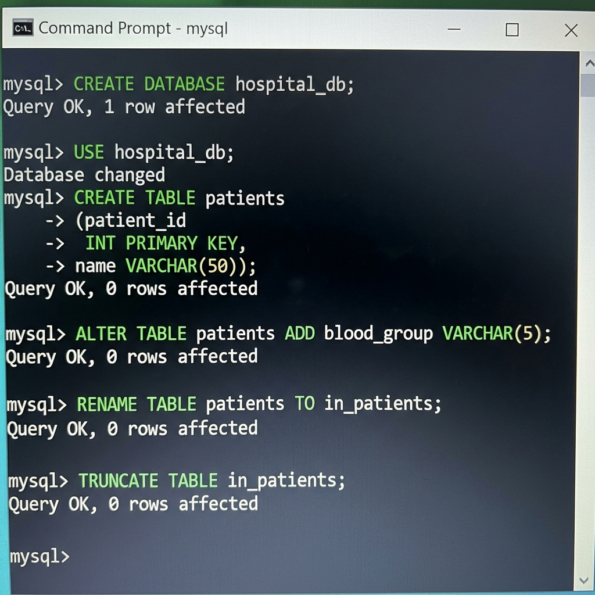
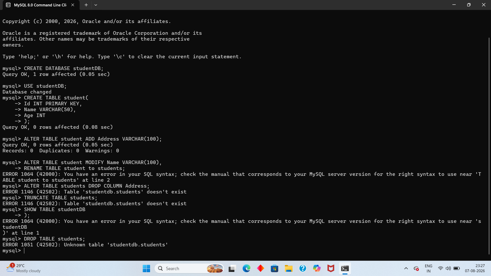

# Assignment 3: Data Definition Language (DDL) Commands

**Student Name:** K. Ramya  
**Course:** Database Management Systems (DBMS)  
**Topic:** Data Definition Language (DDL) Commands  

---

## 1. Overview & Definition

**Data Definition Language (DDL)** is a core subset of SQL used by database architects and developers to build, modify, and manage the structure (schema) of database objects such as databases, tables, columns, indexes, and views. 

Unlike Data Manipulation Language (DML) which manipulates records within tables, DDL commands alter the actual database blueprint.

> [!IMPORTANT]
> **Key Characteristic:** DDL commands are **Auto-Committed**. Once executed in MySQL/Relational DBMS, the structure change is committed to the disk permanently and **cannot be rolled back** using transaction control commands.

---

## 2. Key DDL Commands & Syntax Reference

### A. `CREATE` Command
Defines a new database or table structure.

```sql
-- Create database
CREATE DATABASE student_db;
USE student_db;

-- Create table
CREATE TABLE students (
    student_id INT PRIMARY KEY,
    first_name VARCHAR(50),
    last_name VARCHAR(50),
    email VARCHAR(100),
    enrollment_date DATE
);
```

### B. `ALTER` Command
Modifies an existing table structure without removing existing table data.

```sql
-- 1. ADD Column
ALTER TABLE students ADD phone_number VARCHAR(15);

-- 2. MODIFY Column Data Type / Constraints
ALTER TABLE students MODIFY email VARCHAR(150);

-- 3. RENAME Column
ALTER TABLE students RENAME COLUMN phone_number TO contact_no;

-- 4. DROP Column
ALTER TABLE students DROP COLUMN contact_no;
```

### C. `RENAME` Command
Changes the identifier of an existing table.

```sql
RENAME TABLE students TO student_records;
```

### D. `TRUNCATE` Command
Removes all records from a table instantly while preserving table schema and resetting auto-increment counters.

```sql
TRUNCATE TABLE student_records;
```

### E. `DROP` Command
Permanently deletes a table or database along with its metadata and data.

```sql
-- Drop table
DROP TABLE student_records;

-- Drop database
DROP DATABASE student_db;
```

---

## 3. Detailed Solutions to Assignment Questions

### Question 1: Theoretical Concept
**Draw a comparison between DDL and DML. Explain why DDL commands do not use the `WHERE` clause.**

#### Comparison Diagram / Overview:
```
+-------------------------------------------------------------------+
|                        RELATIONAL DBMS                            |
+-------------------------------------------------------------------+
|                                                                   |
|   +--------------------------+     +--------------------------+   |
|   |       DDL COMMANDS       |     |       DML COMMANDS       |   |
|   | (CREATE, ALTER, DROP...) |     | (INSERT, UPDATE, DELETE) |   |
|   +--------------------------+     +--------------------------+   |
|                |                                |                 |
|                v                                v                 |
|      Modifies SCHEMA /            Manipulates DATA ROWS           |
|      STRUCTURE of Database        INSIDE the tables               |
|                                                                   |
+-------------------------------------------------------------------+
```

#### Why DDL commands do not use `WHERE`:
The `WHERE` clause is designed to filter individual data rows based on conditional logic. Since DDL commands operate on whole database objects (such as entire tables, schemas, or column definitions) rather than individual rows of data, filtering rows using `WHERE` is syntactically and logically invalid for DDL operations.

---

### Question 2: Performance Analysis
**You have a table with 10 million rows. Compare `DELETE FROM table;` vs `TRUNCATE TABLE table;`. Which is better and why?**

| Criteria | `DELETE FROM table;` (DML) | `TRUNCATE TABLE table;` (DDL) |
| :--- | :--- | :--- |
| **Operation Mechanism** | Deletes rows sequentially one by one | Deallocates data pages directly |
| **Logging** | Writes undo/redo logs for every single row | Logs only data page deallocations |
| **Locks** | Row-level or full exclusive table lock during traversal | Minimal table lock (metadata update) |
| **Performance** | Extremely slow (takes minutes/hours for 10M rows) | Blazing fast (completes in milliseconds) |
| **Auto-Increment** | Does NOT reset counter | Resets auto-increment counter to 1 |

**Conclusion:** `TRUNCATE TABLE` is vastly superior for clearing large tables (10 million rows) because it bypasses individual row deletion logging and directly frees the disk allocation pages.

---

### Question 3: Syntax Validation
**Identify the errors in this query and fix them:**  
`ALTER TABLE students INSERT COLUMN age INT;`

#### Analysis of Errors:
1. `INSERT` is a DML keyword used for inserting data rows into a table. For adding a column in DDL, `ADD` must be used.
2. The keyword `COLUMN` is optional or disallowed depending on SQL dialect when adding columns with `ALTER TABLE`.

#### Corrected SQL Query:
```sql
ALTER TABLE students 
ADD age INT;
```

---

### Question 4: Data Type Modification
**A `phone_number` column is defined as `INT`. Phone numbers can have leading zeros (e.g. `09876`). Fix this design flaw using `ALTER`.**

#### Explanation:
Numeric data types (`INT`) truncate leading zeros (e.g., `09876` becomes `9876`) and cannot hold special characters like `+` or country codes. Changing to `VARCHAR(15)` preserves leading zeros and formatting.

#### Corrected SQL Query:
```sql
ALTER TABLE students 
MODIFY phone_number VARCHAR(15);
```

---

### Question 5: Practical Script Execution
**Write a script containing DDL commands that creates a database `Hospital_DB`, creates a `patients` table, adds a column `blood_group`, renames the table to `in_patients`, and then truncates it.**

```sql
-- Step 1: Create Database
CREATE DATABASE Hospital_DB;
USE Hospital_DB;

-- Step 2: Create Table
CREATE TABLE patients (
    patient_id INT PRIMARY KEY,
    name VARCHAR(50),
    age INT
);

-- Step 3: Add Column blood_group
ALTER TABLE patients 
ADD blood_group VARCHAR(5);

-- Step 4: Rename Table to in_patients
RENAME TABLE patients TO in_patients;

-- Step 5: Truncate in_patients
TRUNCATE TABLE in_patients;
```

---

### Question 6: System Design
**Design the DDL commands to create a `Library_System`. Include tables for `books`, `members`, and `borrow_records`.**

```sql
CREATE DATABASE Library_System;
USE Library_System;

-- 1. Books Table
CREATE TABLE books (
    book_id INT PRIMARY KEY,
    title VARCHAR(150) NOT NULL,
    author VARCHAR(100),
    isbn VARCHAR(20) UNIQUE,
    published_year INT
);

-- 2. Members Table
CREATE TABLE members (
    member_id INT PRIMARY KEY,
    full_name VARCHAR(100) NOT NULL,
    email VARCHAR(100) UNIQUE,
    join_date DATE
);

-- 3. Borrow Records Table
CREATE TABLE borrow_records (
    borrow_id INT PRIMARY KEY,
    book_id INT,
    member_id INT,
    borrow_date DATE,
    return_date DATE,
    FOREIGN KEY (book_id) REFERENCES books(book_id),
    FOREIGN KEY (member_id) REFERENCES members(member_id)
);
```

---

### Question 7: Alter Scenario
**A table `products` has a column `price` of type `INT`. Modify it to store floating-point prices like `99.99`.**

```sql
ALTER TABLE products 
MODIFY price DECIMAL(10,2);
```

---

### Question 8: Debugging
**A developer wrote `TRUNCATE TABLE employees WHERE department = 'HR';`. Explain why this generates an error and rewrite it using the correct DML command.**

#### Error Explanation:
`TRUNCATE TABLE` is a DDL command that deallocates all data pages for the entire table. It does not scan individual rows and therefore does **NOT** support a `WHERE` clause.

#### Correct DML Solution:
```sql
DELETE FROM employees 
WHERE department = 'HR';
```

---

### Question 9: Internal Impact Analysis
**Explain what happens behind the scenes when a `DROP TABLE` command is executed.**

1. **Locking:** The storage engine acquires an exclusive metadata lock (MDL) on the target table.
2. **Metadata Removal:** The data dictionary / system catalog entries for the table definition, columns, constraints, and indexes are deleted.
3. **Data File Deallocation:** Physical disk blocks allocated for table data pages and index trees are unlinked/freed.
4. **Buffer Pool Cache Flush:** Dirty pages and cached indexes for the table in the buffer pool are invalidated.
5. **Auto-Commit Execution:** The transaction catalog registers an auto-commit event, making the drop irreversible.

---

### Question 10: Final Project Schema
**Recreate the entire schema for the Student Management System (7 tables) and apply 3 `ALTER` commands to improve the structure.**

```sql
CREATE DATABASE student_management_system;
USE student_management_system;

-- 1. Departments Table
CREATE TABLE departments (
    dept_id INT PRIMARY KEY,
    dept_name VARCHAR(100) NOT NULL
);

-- 2. Courses Table
CREATE TABLE courses (
    course_id INT PRIMARY KEY,
    course_name VARCHAR(100) NOT NULL,
    credits INT
);

-- 3. Students Table
CREATE TABLE students (
    student_id INT PRIMARY KEY,
    first_name VARCHAR(50),
    last_name VARCHAR(50),
    dob DATE,
    dept_id INT,
    FOREIGN KEY (dept_id) REFERENCES departments(dept_id)
);

-- 4. Faculty Table
CREATE TABLE faculty (
    faculty_id INT PRIMARY KEY,
    faculty_name VARCHAR(100),
    specialization VARCHAR(100),
    dept_id INT,
    FOREIGN KEY (dept_id) REFERENCES departments(dept_id)
);

-- 5. Enrollments Table
CREATE TABLE enrollments (
    enrollment_id INT PRIMARY KEY,
    student_id INT,
    course_id INT,
    FOREIGN KEY (student_id) REFERENCES students(student_id),
    FOREIGN KEY (course_id) REFERENCES courses(course_id)
);

-- 6. Marks Table
CREATE TABLE marks (
    mark_id INT PRIMARY KEY,
    student_id INT,
    score DECIMAL(5,2),
    FOREIGN KEY (student_id) REFERENCES students(student_id)
);

-- 7. Attendance Table
CREATE TABLE attendance (
    attendance_id INT PRIMARY KEY,
    student_id INT,
    date DATE,
    status CHAR(1),
    FOREIGN KEY (student_id) REFERENCES students(student_id)
);

-- Structural Improvement ALTER Commands:
-- 1. Add email column with UNIQUE constraint to students
ALTER TABLE students ADD email VARCHAR(100) UNIQUE;

-- 2. Modify status in attendance to default to 'P' (Present)
ALTER TABLE attendance MODIFY status CHAR(1) DEFAULT 'P';

-- 3. Add experience_years column to faculty
ALTER TABLE faculty ADD experience_years INT DEFAULT 0;
```

---

## 4. Proof of Work

Below are the terminal execution screenshots demonstrating the DDL commands:

### Clean DDL Command Execution


### MySQL CLI Session Log


---

## 5. Summary

- **`CREATE`**: Defines new database objects (tables/databases).
- **`ALTER`**: Modifies existing structures (`ADD`, `MODIFY`, `RENAME COLUMN`, `DROP COLUMN`).
- **`RENAME`**: Updates object identifiers.
- **`TRUNCATE`**: Fast DDL operation to empty tables while keeping schemas.
- **`DROP`**: Complete and permanent removal of table schemas and disk pages.