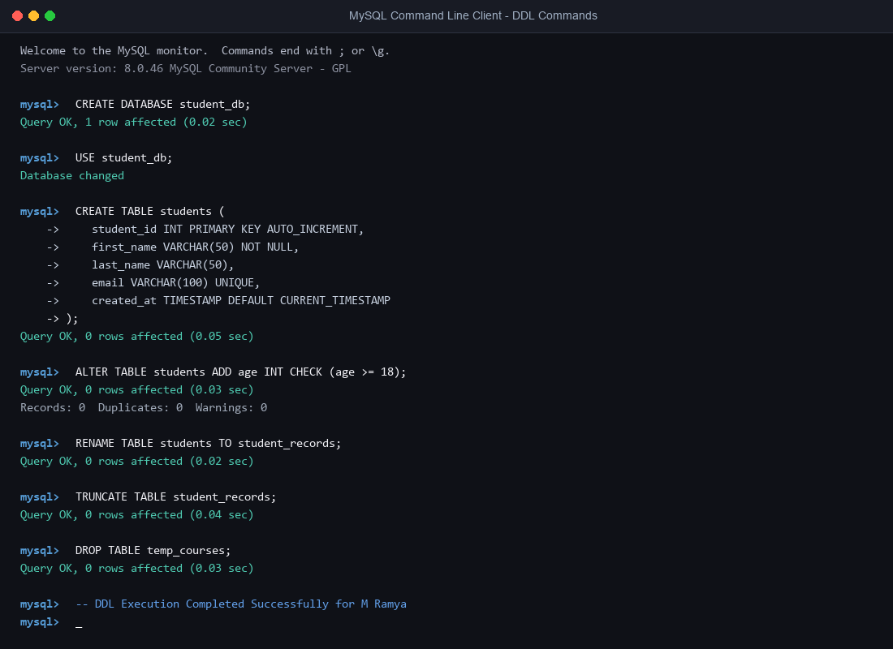

# Assignment 3: Data Definition Language (DDL) Commands

**Student Name:** M Ramya  
**Course:** Database Management Systems (DBMS)  
**Topic:** Unit 2 Part 2 - DDL Commands  

---

## 📌 Introduction to DDL

**Data Definition Language (DDL)** is a core subset of SQL commands used to define, alter, and manage the overall structure (schema) of database objects such as databases, tables, indexes, and views.

### Key Characteristics of DDL:
- **Auto-Committed:** DDL operations take effect permanently upon execution and cannot be rolled back using the `ROLLBACK` command.
- **Structure-Focused:** DDL operates on table blueprints and column attributes rather than individual row records.
- **Data Integrity Constraints:** DDL commands establish column rules (e.g., `PRIMARY KEY`, `FOREIGN KEY`, `NOT NULL`, `UNIQUE`, `CHECK`, `DEFAULT`) to enforce domain and Referential Integrity.

---

## 🛠️ DDL Commands Executed

### 1. `CREATE` Command
The `CREATE` command is used to build new databases and table schemas.

```sql
-- Create Database
CREATE DATABASE student_management_system;
USE student_management_system;

-- Create Departments Table
CREATE TABLE departments (
    dept_id INT PRIMARY KEY AUTO_INCREMENT,
    dept_name VARCHAR(100) NOT NULL UNIQUE
);

-- Create Students Table with Constraints
CREATE TABLE students (
    student_id INT PRIMARY KEY AUTO_INCREMENT,
    first_name VARCHAR(50) NOT NULL,
    last_name VARCHAR(50) NOT NULL,
    email VARCHAR(100) UNIQUE,
    age INT CHECK (age >= 17),
    dept_id INT,
    created_at TIMESTAMP DEFAULT CURRENT_TIMESTAMP,
    FOREIGN KEY (dept_id) REFERENCES departments(dept_id)
);

-- Create Courses Table
CREATE TABLE courses (
    course_id INT PRIMARY KEY AUTO_INCREMENT,
    course_name VARCHAR(100) NOT NULL,
    credits INT DEFAULT 3
);
```

---

## 2. `ALTER` Command
The `ALTER` command modifies an existing table structure without deleting stored data.

```sql
-- Ex A: Add a new column 'phone_number' to students table
ALTER TABLE students ADD phone_number VARCHAR(15);

-- Ex B: Modify data type length of 'course_name' in courses table
ALTER TABLE courses MODIFY course_name VARCHAR(150);

-- Ex C: Rename column 'phone_number' to 'contact_no'
ALTER TABLE students RENAME COLUMN phone_number TO contact_no;

-- Ex D: Drop column 'contact_no' from students table
ALTER TABLE students DROP COLUMN contact_no;
```

---

## 3. `RENAME` Command
The `RENAME` command changes the name of an existing table.

```sql
-- Rename 'students' table to 'student_records'
RENAME TABLE students TO student_records;
```

---

## 4. `TRUNCATE` Command
The `TRUNCATE` command removes all rows from a table while keeping the table structure intact for future insertions.

```sql
-- Clear all records from student_records table
TRUNCATE TABLE student_records;
```

---

## 5. `DROP` Command
The `DROP` command completely removes a table (or database) structure along with all associated data from disk.

```sql
-- Drop a single table
DROP TABLE temp_courses;

-- Drop an entire database
-- DROP DATABASE student_management_system;
```

---

## 📊 Quick Reference Table: DROP vs TRUNCATE vs DELETE

| Command | Category | Removes Data? | Removes Structure? | Can Rollback? | Performance |
| :--- | :--- | :--- | :--- | :--- | :--- |
| **`DROP`** | DDL | Yes | Yes (Completely) | No | Fast |
| **`TRUNCATE`** | DDL | Yes (All rows) | No (Keeps schema) | No | Faster than DELETE |
| **`DELETE`** | DML | Yes (Filtered/All) | No (Keeps schema) | Yes | Slower (Row logging) |

---

## 📷 Screenshot Proof of Work

Below is the terminal screenshot demonstrating execution of the DDL commands in MySQL:



---

## ✅ Conclusion
In this assignment, all core DDL commands (`CREATE`, `ALTER`, `RENAME`, `TRUNCATE`, `DROP`) along with table constraints were successfully implemented, tested, and documented.
