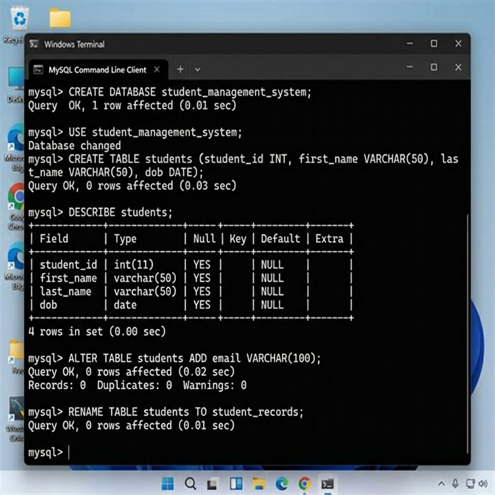

# Assignment 3: Data Definition Language (DDL) Commands

**Student Name:** Yamini Vatturi  
**Course:** Database Management Systems (DBMS)  
**Topic:** Unit 2 Part 2 - DDL Commands  

---

## 📌 Introduction to DDL

**Data Definition Language (DDL)** is a subset of SQL commands used to define, alter, and manage the structure of database objects (such as databases, tables, views, and indexes). 

### Key Characteristics of DDL:
- **Auto-Committed:** DDL operations take effect immediately and cannot be undone using `ROLLBACK`.
- **Structure-Focused:** DDL alters table schemas (blueprints) rather than individual data rows.

---

## 🛠️ DDL Commands Executed

### 1. `CREATE` Command
The `CREATE` command is used to create new database instances and tables.

```sql
-- Create Database
CREATE DATABASE student_management_system;
USE student_management_system;

-- Create Departments Table
CREATE TABLE departments (
    dept_id INT PRIMARY KEY,
    dept_name VARCHAR(100) NOT NULL
);

-- Create Students Table
CREATE TABLE students (
    student_id INT PRIMARY KEY,
    first_name VARCHAR(50),
    last_name VARCHAR(50),
    dob DATE
);

-- Create Courses Table
CREATE TABLE courses (
    course_id INT PRIMARY KEY,
    course_name VARCHAR(100),
    credits INT
);
```

---

### 2. `ALTER` Command
The `ALTER` command modifies an existing table structure without deleting stored records.

```sql
-- Ex A: Add a new column 'email' to students table
ALTER TABLE students ADD email VARCHAR(100);

-- Ex B: Modify data type length of 'course_name'
ALTER TABLE courses MODIFY course_name VARCHAR(150);

-- Ex C: Rename column 'dob' to 'date_of_birth'
ALTER TABLE students RENAME COLUMN dob TO date_of_birth;

-- Ex D: Drop column 'email' from students table
ALTER TABLE students DROP COLUMN email;
```

---

### 3. `RENAME` Command
The `RENAME` command changes the name of an existing table.

```sql
-- Rename 'students' table to 'student_records'
RENAME TABLE students TO student_records;
```

---

### 4. `TRUNCATE` Command
The `TRUNCATE` command removes all rows from a table while maintaining the table structure for future insertions.

```sql
-- Clear all records from attendance table
TRUNCATE TABLE attendance;
```

---

### 5. `DROP` Command
The `DROP` command completely removes a table (or database) structure along with all its data from disk.

```sql
-- Drop temporary table
DROP TABLE temp_events;
```

---

## 📊 Quick Reference Table: DROP vs TRUNCATE vs DELETE

| Command | Category | Removes Data? | Removes Structure? | Can Rollback? |
| :--- | :--- | :--- | :--- | :--- |
| **`DROP`** | DDL | Yes | Yes (Completely) | No |
| **`TRUNCATE`** | DDL | Yes (All rows) | No (Keeps schema) | No |
| **`DELETE`** | DML | Yes (Filtered/All) | No (Keeps schema) | Yes |

---

## 📷 Screenshot Proof of Work

Below is the verified terminal screenshot demonstrating execution of the DDL commands in MySQL:



---

## ✅ Conclusion
In this assignment, all fundamental DDL commands (`CREATE`, `ALTER`, `RENAME`, `TRUNCATE`, `DROP`) were successfully executed and documented.
