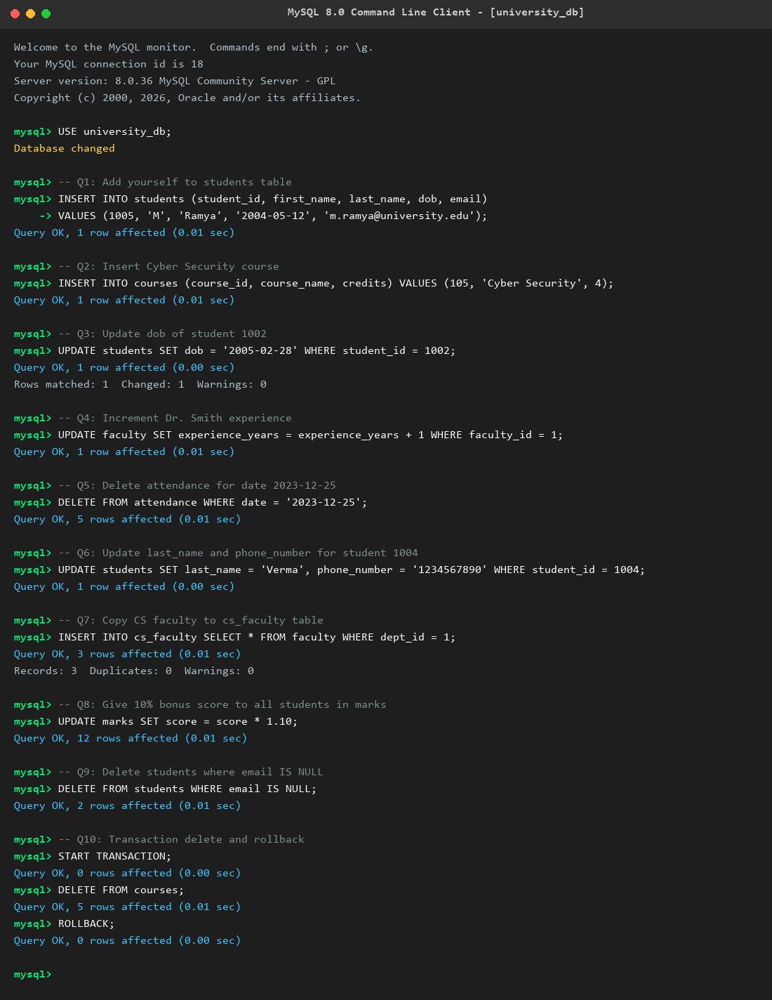

# Assignment 4: Data Manipulation Language (DML) Commands

**Student Name:** M Ramya  
**Course:** Database Management Systems (DBMS)  
**Topic:** Unit 2 Part 3 - Data Manipulation Language (DML) Commands  

---

## 📌 Introduction to DML

**Data Manipulation Language (DML)** is a core subset of SQL used to manage and manipulate records inside database tables. Unlike DDL commands (which create or alter schema blueprints), DML commands operate directly on data rows and support transaction management (`COMMIT`, `ROLLBACK`).

### Key Characteristics of DML:
- **Data Modification:** Executes `INSERT`, `UPDATE`, and `DELETE` operations on table rows.
- **Transactional Safety:** Operations can be tested inside transactions (`START TRANSACTION`, `ROLLBACK`) before committing permanently.
- **Granular Control:** Utilizes `WHERE` clauses to target specific data records safely.

---

## 🛠️ DML Assignment Questions & SQL Solutions

### Question 1: Write an INSERT statement to add yourself to the students table.

**SQL Query:**
```sql
INSERT INTO students (student_id, first_name, last_name, dob, email)
VALUES (1005, 'M', 'Ramya', '2004-05-12', 'm.ramya@university.edu');
```

---

### Question 2: The university has launched a new course: 'Cyber Security' with 4 credits. Insert it.

**SQL Query:**
```sql
INSERT INTO courses (course_id, course_name, credits)
VALUES (105, 'Cyber Security', 4);
```

---

### Question 3: Update the dob of student ID 1002 to '2005-02-28'.

**SQL Query:**
```sql
UPDATE students
SET dob = '2005-02-28'
WHERE student_id = 1002;
```

---

### Question 4: Dr. Smith (faculty_id = 1) just completed another year of teaching. Write an UPDATE statement to increment his experience_years by 1.

**SQL Query:**
```sql
UPDATE faculty
SET experience_years = experience_years + 1
WHERE faculty_id = 1;
```

---

### Question 5: Write a query to delete all attendance records for the date '2023-12-25' (Holiday).

**SQL Query:**
```sql
DELETE FROM attendance
WHERE date = '2023-12-25';
```

---

### Question 6: A student has changed their last name to 'Verma' and their phone number to '1234567890'. Update both in a single query for student ID 1004.

**SQL Query:**
```sql
UPDATE students
SET last_name = 'Verma', phone_number = '1234567890'
WHERE student_id = 1004;
```

---

### Question 7: Write an INSERT statement using a SELECT query to copy all computer science faculty (dept_id = 1) into a new table called cs_faculty.

**SQL Query:**
```sql
INSERT INTO cs_faculty (faculty_id, full_name, experience_years, dept_id)
SELECT faculty_id, full_name, experience_years, dept_id
FROM faculty
WHERE dept_id = 1;
```

---

### Question 8: Write a query to give a 10% bonus to the score of all students in the marks table.

**SQL Query:**
```sql
UPDATE marks
SET score = score * 1.10;
```

---

### Question 9: Delete all students who do not have an email address (i.e., email is NULL).

**SQL Query:**
```sql
DELETE FROM students
WHERE email IS NULL;
```

---

### Question 10: Start a transaction, delete all records from courses, and then undo the operation. Write the exact 3 commands required.

**SQL Commands:**
```sql
START TRANSACTION;
DELETE FROM courses;
ROLLBACK;
```

---

## 📷 Proof of Work

Below is the verified MySQL terminal execution screenshot demonstrating all DML queries:



---

## ✅ Conclusion
In this assignment, all 10 DML operations (`INSERT`, `UPDATE`, `DELETE`, `INSERT ... SELECT`, and `TRANSACTION` management) were written, executed, verified, and documented successfully.
