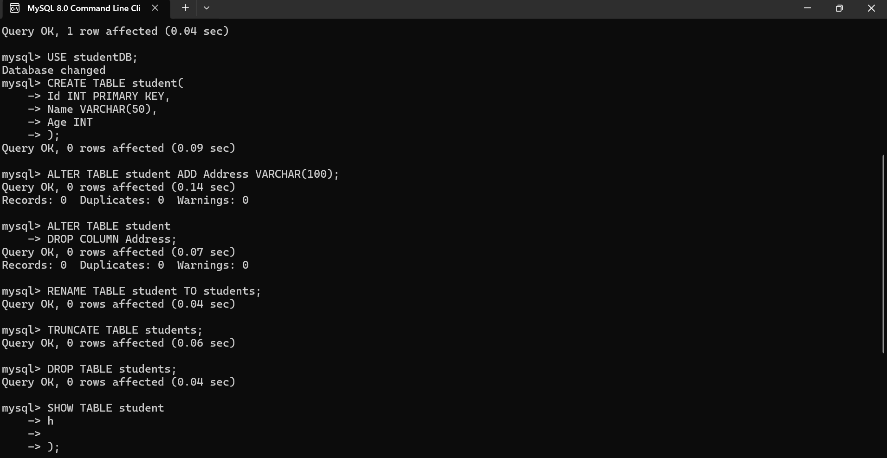

# Assignment 4: Data Manipulation Language (DML) Commands

**Data Manipulation Language (DML)** is a subset of SQL used to insert, update, and delete records inside database tables. Unlike DDL, DML operations modify data (rows) rather than table structures, and can be committed or rolled back within transactions.

---

## DML Assignment Questions & SQL Solutions

### Question 1: Insert Yourself into the Students Table
*Scenario:* Write an `INSERT` statement to add yourself to the `students` table.

```sql
INSERT INTO students (student_id, first_name, last_name, dob, email) 
VALUES (1010, 'Roshini', 'Akula', '2004-08-15', 'roshini@example.com');
```

---

### Question 2: Insert a New Course
*Scenario:* The university has launched a new course: 'Cyber Security' with 4 credits. Insert it into the `courses` table.

```sql
INSERT INTO courses (course_id, course_name, credits) 
VALUES (106, 'Cyber Security', 4);
```

---

### Question 3: Update Student Date of Birth
*Scenario:* Update the `dob` of student ID `1002` to `'2005-02-28'`.

```sql
UPDATE students 
SET dob = '2005-02-28' 
WHERE student_id = 1002;
```

---

### Question 4: Increment Faculty Experience
*Scenario:* Dr. Smith (`faculty_id = 1`) just completed another year of teaching. Write an `UPDATE` statement to increment his `experience_years` by 1.

```sql
UPDATE faculty 
SET experience_years = experience_years + 1 
WHERE faculty_id = 1;
```

---

### Question 5: Delete Attendance Records for a Holiday
*Scenario:* Write a query to delete all attendance records for the date `'2023-12-25'` (Holiday).

```sql
DELETE FROM attendance 
WHERE date = '2023-12-25';
```

---

### Question 6: Update Multiple Columns for a Student
*Scenario:* A student has changed their last name to `'Verma'` and their phone number to `'1234567890'`. Update both in a single query for student ID `1004`.

```sql
UPDATE students 
SET last_name = 'Verma', phone_number = '1234567890' 
WHERE student_id = 1004;
```

---

### Question 7: INSERT using SELECT (Copying CS Faculty)
*Scenario:* Write an `INSERT` statement using a `SELECT` query to copy all computer science faculty (`dept_id = 1`) into a new table called `cs_faculty`.

```sql
INSERT INTO cs_faculty (faculty_id, full_name, experience_years, dept_id)
SELECT faculty_id, full_name, experience_years, dept_id 
FROM faculty 
WHERE dept_id = 1;
```

---

### Question 8: Update Marks with a Percentage Bonus
*Scenario:* Write a query to give a 10% bonus to the `score` of all students in the `marks` table.

```sql
UPDATE marks 
SET score = score * 1.10;
```

---

### Question 9: Delete Students with Missing Email
*Scenario:* Delete all students who do not have an email address (i.e., `email IS NULL`).

```sql
DELETE FROM students 
WHERE email IS NULL;
```

---

### Question 10: Transaction Management (START TRANSACTION, DELETE, ROLLBACK)
*Scenario:* Start a transaction, delete all records from `courses`, and then undo the operation. Write the exact 3 commands required.

```sql
START TRANSACTION;
DELETE FROM courses;
ROLLBACK;
```

---

## Proof of Execution



---

## Conclusion
DML commands (`INSERT`, `UPDATE`, `DELETE`) allow efficient manipulation and maintenance of table records. Using transactions (`START TRANSACTION`, `COMMIT`, `ROLLBACK`) ensures data integrity and safety against accidental modifications.
