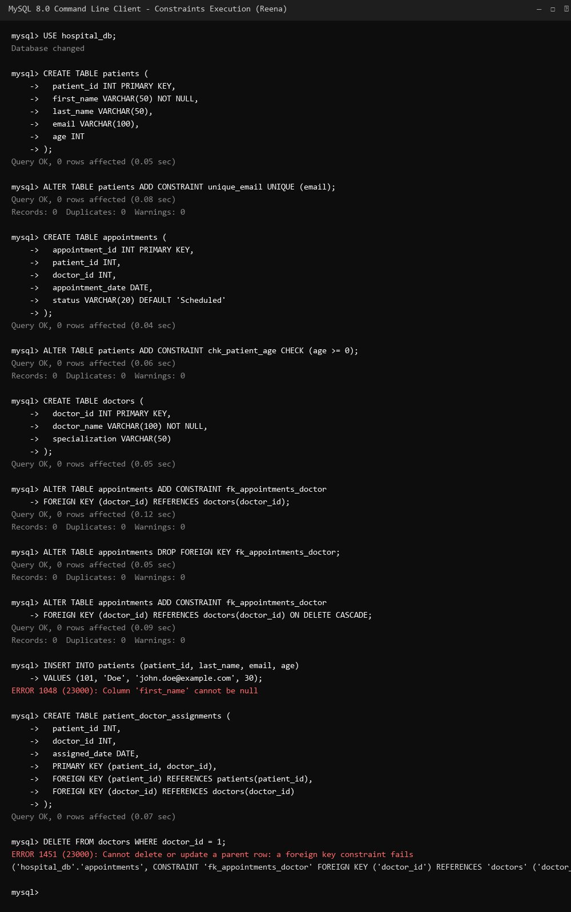

# Assignment 5: Constraints & Referential Integrity

**Student Name:** Reena

Please write the SQL queries for the following questions below each question.

### Questions:

**1. Create a table named `patients` with a primary key `patient_id` and a `NOT NULL` constraint on `first_name`.**
```sql
CREATE TABLE patients (
    patient_id INT PRIMARY KEY,
    first_name VARCHAR(50) NOT NULL,
    last_name VARCHAR(50),
    email VARCHAR(100),
    age INT
);
```

**2. Add a `UNIQUE` constraint to the `email` column in the `patients` table.**
```sql
ALTER TABLE patients 
ADD CONSTRAINT unique_email UNIQUE (email);
```

**3. Create a table `appointments` with a `DEFAULT` constraint setting the `status` to 'Scheduled'.**
```sql
CREATE TABLE appointments (
    appointment_id INT PRIMARY KEY,
    patient_id INT,
    doctor_id INT,
    appointment_date DATE,
    status VARCHAR(20) DEFAULT 'Scheduled'
);
```

**4. Add a `CHECK` constraint to the `patients` table to ensure `age` is greater than or equal to 0.**
```sql
ALTER TABLE patients 
ADD CONSTRAINT chk_patient_age CHECK (age >= 0);
```

**5. Create a table `doctors` with a primary key `doctor_id`. Then add a `FOREIGN KEY` in `appointments` that references `doctor_id` in `doctors`.**
```sql
-- Step 1: Create table doctors
CREATE TABLE doctors (
    doctor_id INT PRIMARY KEY,
    doctor_name VARCHAR(100) NOT NULL,
    specialization VARCHAR(50)
);

-- Step 2: Add foreign key constraint to appointments
ALTER TABLE appointments 
ADD CONSTRAINT fk_appointments_doctor 
FOREIGN KEY (doctor_id) REFERENCES doctors(doctor_id);
```

**6. Write a query to drop the `FOREIGN KEY` constraint from the `appointments` table.**
```sql
ALTER TABLE appointments 
DROP FOREIGN KEY fk_appointments_doctor;
```

**7. Re-add the `FOREIGN KEY` constraint to `appointments` with `ON DELETE CASCADE`.**
```sql
ALTER TABLE appointments 
ADD CONSTRAINT fk_appointments_doctor 
FOREIGN KEY (doctor_id) REFERENCES doctors(doctor_id) 
ON DELETE CASCADE;
```

**8. Attempt to insert a patient without a `first_name`. (Write the query that would cause this error).**
```sql
-- Query that fails due to missing NOT NULL column 'first_name':
INSERT INTO patients (patient_id, last_name, email, age) 
VALUES (101, 'Doe', 'john.doe@example.com', 30);
```

**9. Create a table with a Composite Primary Key using `patient_id` and `doctor_id`.**
```sql
CREATE TABLE patient_doctor_assignments (
    patient_id INT,
    doctor_id INT,
    assigned_date DATE,
    PRIMARY KEY (patient_id, doctor_id),
    FOREIGN KEY (patient_id) REFERENCES patients(patient_id),
    FOREIGN KEY (doctor_id) REFERENCES doctors(doctor_id)
);
```

**10. What happens if you try to delete a doctor who has existing appointments (without CASCADE)? (Write the DELETE query that would fail).**
```sql
-- Query that fails because dependent appointment records reference doctor_id:
DELETE FROM doctors WHERE doctor_id = 1;
```

---

### Proof of Work
*(Replace the image link below with your actual screenshot from the `images` folder)*


