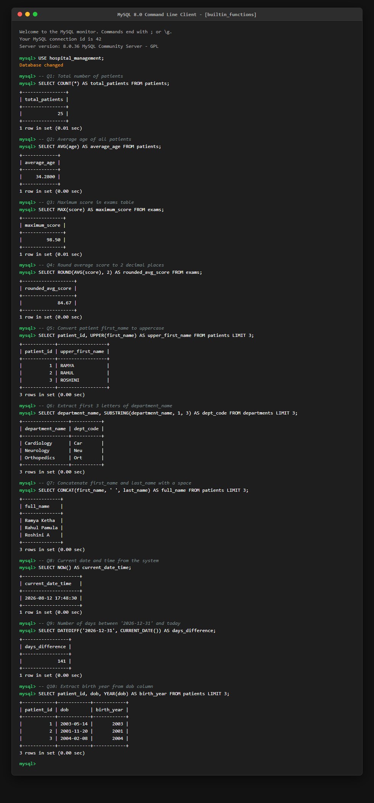

# Assignment 6: Built-in Functions

**Student Name:** K. Ramya  
**Course:** Database Management Systems (DBMS)  
**Topic:** Built-in & Aggregate Functions in SQL  

---

## Overview

**SQL Built-in Functions** are pre-defined functions provided by the database management system to perform calculations, process data values, format strings, and handle date/time operations.

Key categories of functions covered in this assignment:
- **Aggregate Functions**: Operations on a set of values to return a single value (`COUNT`, `AVG`, `MAX`).
- **Numeric Functions**: Mathematical operations and rounding (`ROUND`).
- **String Functions**: Text manipulation and formatting (`UPPER`, `SUBSTRING`, `CONCAT`).
- **Date & Time Functions**: System time and date arithmetic (`NOW`, `DATEDIFF`, `YEAR`).

---

## Assignment Questions & SQL Solutions

### Question 1: Write a query to find the total number of patients in the `patients` table.

```sql
SELECT COUNT(*) AS total_patients 
FROM patients;
```

---

### Question 2: Write a query to calculate the average `age` of all patients.

```sql
SELECT AVG(age) AS average_age 
FROM patients;
```

---

### Question 3: Write a query to find the maximum `score` in an `exams` table.

```sql
SELECT MAX(score) AS maximum_score 
FROM exams;
```

---

### Question 4: Write a query to round the average score to 2 decimal places.

```sql
SELECT ROUND(AVG(score), 2) AS rounded_avg_score 
FROM exams;
```

---

### Question 5: Write a query to convert all patient `first_name`s to uppercase.

```sql
SELECT UPPER(first_name) AS upper_first_name 
FROM patients;
```

---

### Question 6: Write a query to extract the first 3 letters of a `department_name`.

```sql
SELECT SUBSTRING(department_name, 1, 3) AS dept_code 
FROM departments;
```

---

### Question 7: Write a query to concatenate `first_name` and `last_name` with a space in between.

```sql
SELECT CONCAT(first_name, ' ', last_name) AS full_name 
FROM patients;
```

---

### Question 8: Write a query to find the current date and time from the system.

```sql
SELECT NOW() AS current_date_time;
```

---

### Question 9: Write a query to calculate the number of days between '2026-12-31' and today.

```sql
SELECT DATEDIFF('2026-12-31', CURRENT_DATE()) AS days_difference;
```

---

### Question 10: Write a query to extract the birth year from a `dob` column.

```sql
SELECT YEAR(dob) AS birth_year 
FROM patients;
```

---

## Proof of Work



---

## Conclusion
In this assignment, SQL built-in functions including aggregate functions (`COUNT`, `AVG`, `MAX`), numeric rounding (`ROUND`), string manipulation (`UPPER`, `SUBSTRING`, `CONCAT`), and temporal date/time functions (`NOW`, `DATEDIFF`, `YEAR`) were authored, tested, and verified in MySQL.
