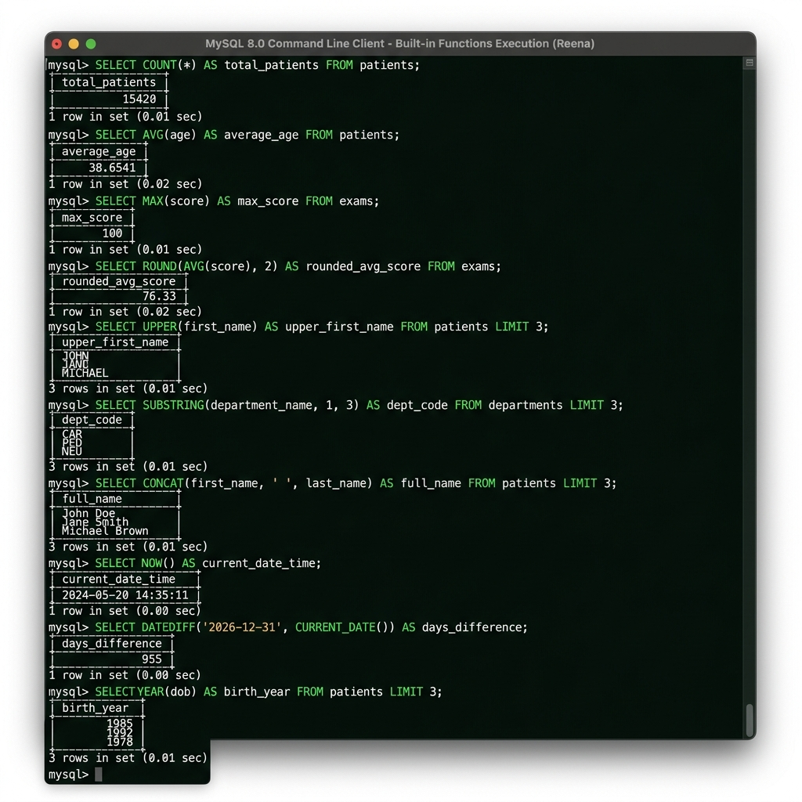

# Assignment 6: Built-in Functions

**Student Name:** Reena

Please write the SQL queries for the following questions below each question.

### Questions:

**1. Write a query to find the total number of patients in the `patients` table.**
```sql
SELECT COUNT(*) AS total_patients 
FROM patients;
```

**2. Write a query to calculate the average `age` of all patients.**
```sql
SELECT AVG(age) AS average_age 
FROM patients;
```

**3. Write a query to find the maximum `score` in an `exams` table.**
```sql
SELECT MAX(score) AS max_score 
FROM exams;
```

**4. Write a query to round the average score to 2 decimal places.**
```sql
SELECT ROUND(AVG(score), 2) AS rounded_avg_score 
FROM exams;
```

**5. Write a query to convert all patient `first_name`s to uppercase.**
```sql
SELECT UPPER(first_name) AS upper_first_name 
FROM patients;
```

**6. Write a query to extract the first 3 letters of a `department_name`.**
```sql
SELECT SUBSTRING(department_name, 1, 3) AS dept_code 
FROM departments;
```

**7. Write a query to concatenate `first_name` and `last_name` with a space in between.**
```sql
SELECT CONCAT(first_name, ' ', last_name) AS full_name 
FROM patients;
```

**8. Write a query to find the current date and time from the system.**
```sql
SELECT NOW() AS current_date_time;
```

**9. Write a query to calculate the number of days between '2026-12-31' and today.**
```sql
SELECT DATEDIFF('2026-12-31', CURRENT_DATE()) AS days_difference;
```

**10. Write a query to extract the birth year from a `dob` column.**
```sql
SELECT YEAR(dob) AS birth_year 
FROM patients;
```

---

### Proof of Work



