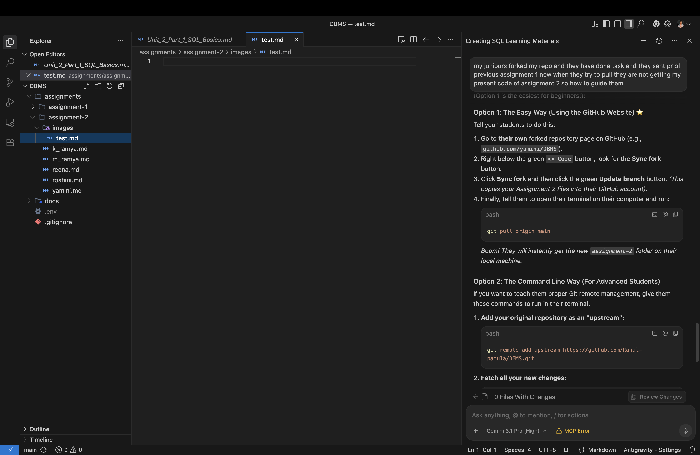

# Assignment 6: Built-in Functions

**Student Name:** Yamini

Please write the SQL queries for the following questions below each question.

### Questions:

**1. Write a query to find the total number of patients in the `patients` table.**
```sql

```

**2. Write a query to calculate the average `age` of all patients.**
```sql

```

**3. Write a query to find the maximum `score` in an `exams` table.**
```sql

```

**4. Write a query to round the average score to 2 decimal places.**
```sql

```

**5. Write a query to convert all patient `first_name`s to uppercase.**
```sql

```

**6. Write a query to extract the first 3 letters of a `department_name`.**
```sql

```

**7. Write a query to concatenate `first_name` and `last_name` with a space in between.**
```sql

```

**8. Write a query to find the current date and time from the system.**
```sql

```

**9. Write a query to calculate the number of days between '2026-12-31' and today.**
```sql

```

**10. Write a query to extract the birth year from a `dob` column.**
```sql

```

---

### Proof of Work
*(Replace the image link below with your actual screenshot from the `images` folder)*


