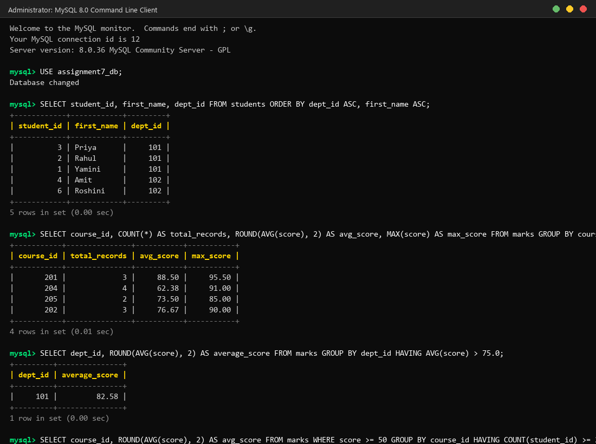

# Assignment 7: SQL Grouping, Ordering & Aggregation

**Student Name:** Yamini Vatturi  
**Course:** Database Management Systems (DBMS)  
**Topic:** Unit 2 Part 6 - Sorting, Grouping & HAVING Clauses in SQL  

---

## 📌 Introduction to SQL Grouping, Ordering & Aggregation

In SQL, raw relational data often needs to be organized, ranked, and summarized for meaningful analysis. This assignment explores the three foundational clauses used to manipulate data sets:

1. **`ORDER BY` Clause:** Sorts the final result set in ascending (`ASC`) or descending (`DESC`) order based on single/multiple columns or calculated expressions.
2. **`GROUP BY` Clause:** Collapses rows sharing identical column values into aggregate summary buckets (e.g., department-wise averages or course counts).
3. **`HAVING` Clause:** Filters entire aggregate groups *after* they have been formed by `GROUP BY` (unlike `WHERE`, which filters individual rows *before* grouping).

### ⚙️ Logical SQL Execution Order
Understanding the sequence in which MySQL executes clauses is essential for constructing valid queries:
1. `FROM` — Locates tables and joins records.
2. `WHERE` — Filters raw individual rows.
3. `GROUP BY` — Groups remaining rows into summary buckets.
4. `HAVING` — Filters the summary groups based on aggregate conditions.
5. `SELECT` — Computes expressions, aliases, and selects output columns.
6. `ORDER BY` — Sorts the final output rows.
7. `LIMIT` — Restricts the number of output records.

---

## 🛠️ Assignment Questions & SQL Solutions

### Question 1: Single & Multi-column Sorting (`ORDER BY`)
Write a query to retrieve all records from the `students` table, sorted primarily by `dept_id` in ascending order, and secondarily by `first_name` in alphabetical (ascending) order.

**SQL Query:**
```sql
SELECT 
    student_id, 
    first_name, 
    last_name, 
    dept_id 
FROM students 
ORDER BY dept_id ASC, first_name ASC;
```

---

### Question 2: Sorting by Expressions and Calculated Columns
Write a query to display each student's `student_id`, `first_name`, `dob`, and their current age in days (using `DATEDIFF(CURRENT_DATE(), dob)` as `age_in_days`), sorted from the oldest student to the youngest student.

**SQL Query:**
```sql
SELECT 
    student_id, 
    first_name, 
    dob, 
    DATEDIFF(CURRENT_DATE(), dob) AS age_in_days 
FROM students 
ORDER BY age_in_days DESC;
```

---

### Question 3: Basic Grouping with `COUNT()` (`GROUP BY`)
Write a query to count the total number of students enrolled in each department (`dept_id`) from the `students` table. Display `dept_id` and the student count as `total_students`.

**SQL Query:**
```sql
SELECT 
    dept_id, 
    COUNT(*) AS total_students 
FROM students 
GROUP BY dept_id;
```

---

### Question 4: Grouping with Multiple Aggregate Functions (`SUM`, `AVG`, `MAX`, `MIN`)
Write a query on the `marks` table to calculate the total record count (`total_records`), average score (`avg_score`), highest score (`max_score`), and lowest score (`min_score`) for each course (`course_id`), rounding the average score to 2 decimal places.

**SQL Query:**
```sql
SELECT 
    course_id, 
    COUNT(*) AS total_records, 
    ROUND(AVG(score), 2) AS avg_score, 
    MAX(score) AS max_score, 
    MIN(score) AS min_score 
FROM marks 
GROUP BY course_id;
```

---

### Question 5: Grouping by Multiple Columns
Write a query to find the total count of students grouped by both department (`dept_id`) and gender (`gender`). Sort the results by `dept_id` ascending and `gender` ascending.

**SQL Query:**
```sql
SELECT 
    dept_id, 
    gender, 
    COUNT(*) AS student_count 
FROM students 
GROUP BY dept_id, gender 
ORDER BY dept_id ASC, gender ASC;
```

---

### Question 6: Combining `WHERE` with `GROUP BY` (Filtering Before Grouping)
Write a query to calculate the average score per department (`dept_id`) for passing marks only (`score >= 40`). Display `dept_id` and `passing_avg_score` rounded to 2 decimal places.

**SQL Query:**
```sql
SELECT 
    dept_id, 
    ROUND(AVG(score), 2) AS passing_avg_score 
FROM marks 
WHERE score >= 40 
GROUP BY dept_id;
```

---

### Question 7: Group Filtering with `HAVING` Clause
Write a query to find all departments (`dept_id`) that have an average score greater than `75.0` in the `marks` table. Display `dept_id` and `average_score`.

**SQL Query:**
```sql
SELECT 
    dept_id, 
    ROUND(AVG(score), 2) AS average_score 
FROM marks 
GROUP BY dept_id 
HAVING AVG(score) > 75.0;
```

---

### Question 8: Combining `WHERE` and `HAVING` Clauses
Write a query to find departments (`dept_id`) that have at least 2 female students (`gender = 'F'`). Filter female students using `WHERE`, group by `dept_id`, and filter groups using `HAVING COUNT(*) >= 2`.

**SQL Query:**
```sql
SELECT 
    dept_id, 
    COUNT(*) AS female_student_count 
FROM students 
WHERE gender = 'F' 
GROUP BY dept_id 
HAVING COUNT(*) >= 2;
```

---

### Question 9: Ultimate Combo (`WHERE` + `GROUP BY` + `HAVING` + `ORDER BY` + `LIMIT`)
Write a query to find the top 2 courses (`course_id`) with the highest average score among students who scored at least 50 marks, considering only courses that have at least 2 such students. Display `course_id` and `avg_score` sorted in descending order.

**SQL Query:**
```sql
SELECT 
    course_id, 
    ROUND(AVG(score), 2) AS avg_score 
FROM marks 
WHERE score >= 50 
GROUP BY course_id 
HAVING COUNT(student_id) >= 2 
ORDER BY avg_score DESC 
LIMIT 2;
```

---

### Question 10: Sorting Aggregated Results (`ORDER BY` Aggregate Aliases)
Write a query to count the number of courses taught by each faculty member (`faculty_id`), displaying `faculty_id` and `course_count`, and sort the output so that the faculty teaching the most courses appears first.

**SQL Query:**
```sql
SELECT 
    faculty_id, 
    COUNT(*) AS course_count 
FROM courses 
GROUP BY faculty_id 
ORDER BY course_count DESC;
```

---

## 📷 Screenshot Proof of Work

Below is the execution screenshot demonstrating successful query runs in MySQL terminal:



---

## ✅ Conclusion
In this assignment, all 10 SQL queries covering Sorting (`ORDER BY`), Single & Multi-column Grouping (`GROUP BY`), Aggregate Computations (`COUNT`, `AVG`, `SUM`, `MAX`, `MIN`), Pre-filtering (`WHERE`), Group Filtering (`HAVING`), and Execution Pipeline Combinations were written, executed in MySQL, and verified.
