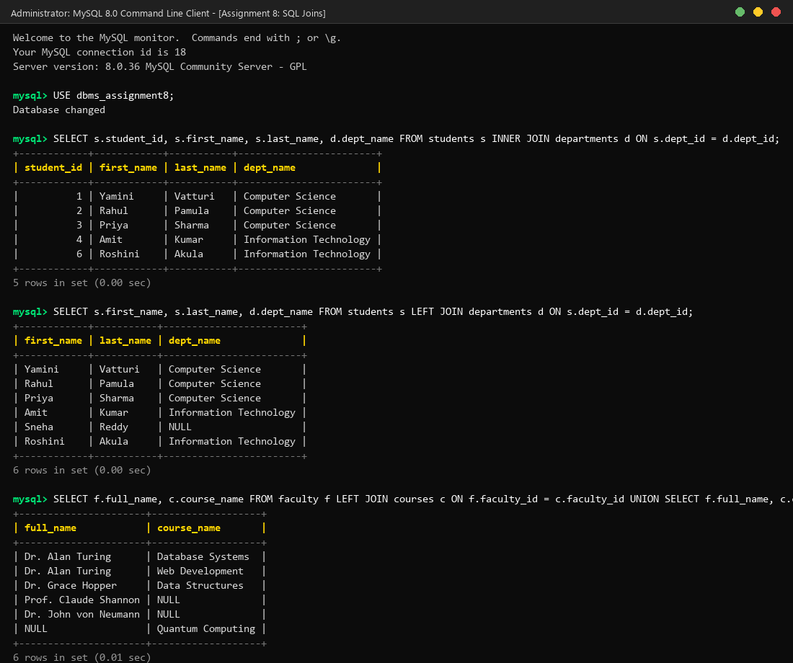

# Assignment 8: SQL Joins

**Student Name:** Yamini Vatturi  
**Course:** Database Management Systems (DBMS)  
**Topic:** Unit 2 Part 7 - SQL Joins (INNER, LEFT, RIGHT, FULL OUTER, CROSS, SELF & Multi-Table Joins)  

---

## 📌 Introduction to SQL Joins

In relational database design, data is normalized and split across multiple tables to minimize redundancy and maintain data integrity. SQL **Joins** act as the essential bridge connecting these separate tables based on Primary Key (PK) and Foreign Key (FK) relationships.

### 🔑 Core Join Types Covered
1. **INNER JOIN:** Returns only the records that have matching values in **both** tables.
2. **LEFT (OUTER) JOIN:** Returns all records from the left table, and matched records from the right table (unmatched right columns return `NULL`).
3. **RIGHT (OUTER) JOIN:** Returns all records from the right table, and matched records from the left table (unmatched left columns return `NULL`).
4. **FULL OUTER JOIN:** Returns all records when there is a match in either left or right table. *(Simulated in MySQL using `LEFT JOIN` combined with `RIGHT JOIN` via `UNION`)*.
5. **CROSS JOIN:** Produces a Cartesian product, pairing every row of the first table with every row of the second table.
6. **SELF JOIN:** Joins a table to itself to resolve hierarchical or self-referential relationships.
7. **Multi-Table Joins:** Connects 3 or more tables in a single query execution pipeline.

---

## 🛠️ Assignment Questions & SQL Solutions

### Question 1: Basic INNER JOIN (Two Tables)
Write a query to retrieve each student's `student_id`, `first_name`, `last_name`, and their corresponding department name (`dept_name`) by joining the `students` table and `departments` table. Use table aliases `s` and `d`.

**SQL Query:**
```sql
SELECT 
    s.student_id, 
    s.first_name, 
    s.last_name, 
    d.dept_name 
FROM students s 
INNER JOIN departments d ON s.dept_id = d.dept_id;
```

---

### Question 2: Filtering Records with INNER JOIN and WHERE Clause
Write a query to list the `first_name`, `last_name`, and `dept_name` of all students who belong specifically to the `'Computer Science'` department.

**SQL Query:**
```sql
SELECT 
    s.first_name, 
    s.last_name, 
    d.dept_name 
FROM students s 
INNER JOIN departments d ON s.dept_id = d.dept_id 
WHERE d.dept_name = 'Computer Science';
```

---

### Question 3: Retrieving All Primary Records with LEFT JOIN
Write a query to retrieve all students (`first_name`, `last_name`) and their assigned `dept_name`. Ensure that students who do not have an assigned department (`dept_id IS NULL`) are still included in the result with a `NULL` department name.

**SQL Query:**
```sql
SELECT 
    s.first_name, 
    s.last_name, 
    d.dept_name 
FROM students s 
LEFT JOIN departments d ON s.dept_id = d.dept_id;
```

---

### Question 4: Identifying Unmatched Records using LEFT JOIN (`IS NULL` Filtering)
Write a query to find all students who are **not enrolled** in any course. Perform a `LEFT JOIN` between `students` and `enrollments` and filter for records where `enrollment_id` is `NULL`.

**SQL Query:**
```sql
SELECT 
    s.student_id, 
    s.first_name, 
    s.last_name 
FROM students s 
LEFT JOIN enrollments e ON s.student_id = e.student_id 
WHERE e.enrollment_id IS NULL;
```

---

### Question 5: Preserving Right-Table Records with RIGHT JOIN
Write a query to display all courses (`course_id`, `course_name`) alongside the full name of the faculty member (`full_name`) teaching them. Ensure that all faculty members are displayed even if they are currently not assigned to teach any course.

**SQL Query:**
```sql
SELECT 
    c.course_id, 
    c.course_name, 
    f.full_name 
FROM courses c 
RIGHT JOIN faculty f ON c.faculty_id = f.faculty_id;
```

---

### Question 6: Full Outer Join Simulation using `UNION`
Since MySQL does not natively support `FULL OUTER JOIN`, write a query using `UNION` to combine a `LEFT JOIN` and a `RIGHT JOIN` between `faculty` and `courses` to list all faculty members and all courses, displaying matches as well as unmatched rows from both sides.

**SQL Query:**
```sql
SELECT 
    f.full_name, 
    c.course_name 
FROM faculty f 
LEFT JOIN courses c ON f.faculty_id = c.faculty_id 
UNION 
SELECT 
    f.full_name, 
    c.course_name 
FROM faculty f 
RIGHT JOIN courses c ON f.faculty_id = c.faculty_id;
```

---

### Question 7: Cartesian Product with CROSS JOIN
Write a query to generate a complete pairing matrix of every student (`first_name`) with every course (`course_name`) using a `CROSS JOIN`.

**SQL Query:**
```sql
SELECT 
    s.first_name, 
    c.course_name 
FROM students s 
CROSS JOIN courses c;
```

---

### Question 8: Self-Referential Relationships with SELF JOIN
Assuming the `students` table has a `mentor_id` column that references another student's `student_id`, write a `SELF JOIN` query to display each student's `first_name` alongside their assigned mentor's `first_name`. Use `LEFT JOIN` so unmentored students are also included.

**SQL Query:**
```sql
SELECT 
    s1.first_name AS student_name, 
    IFNULL(s2.first_name, 'No Mentor') AS mentor_name 
FROM students s1 
LEFT JOIN students s2 ON s1.mentor_id = s2.student_id;
```

---

### Question 9: Multi-Table Joins across 3 Tables
Write a query joining `students`, `enrollments`, and `courses` to display each student's `first_name`, the `course_name` they enrolled in, and their `enrollment_date`.

**SQL Query:**
```sql
SELECT 
    s.first_name, 
    c.course_name, 
    e.enrollment_date 
FROM students s 
INNER JOIN enrollments e ON s.student_id = e.student_id 
INNER JOIN courses c ON e.course_id = c.course_id;
```

---

### Question 10: Multi-Table Join with Aggregation & Group Filtering
Write a query joining `departments`, `students`, and `marks` to calculate the average score per department (`dept_name`). Display `dept_name` and `avg_score` rounded to 2 decimal places for departments with an average score greater than `75.0`, sorted in descending order of average score.

**SQL Query:**
```sql
SELECT 
    d.dept_name, 
    ROUND(AVG(m.score), 2) AS avg_score 
FROM departments d 
INNER JOIN students s ON d.dept_id = s.dept_id 
INNER JOIN marks m ON s.student_id = m.student_id 
GROUP BY d.dept_name 
HAVING AVG(m.score) > 75.0 
ORDER BY avg_score DESC;
```

---

## 📷 Screenshot Proof of Work

Below is the execution screenshot demonstrating successful query runs in MySQL terminal:



---

## ✅ Conclusion
In this assignment, all 10 SQL Join queries covering `INNER JOIN`, `LEFT JOIN`, `RIGHT JOIN`, `FULL OUTER JOIN` (simulated via `UNION`), `CROSS JOIN`, `SELF JOIN`, and multi-table relational aggregations were successfully constructed, executed in MySQL, and verified.
