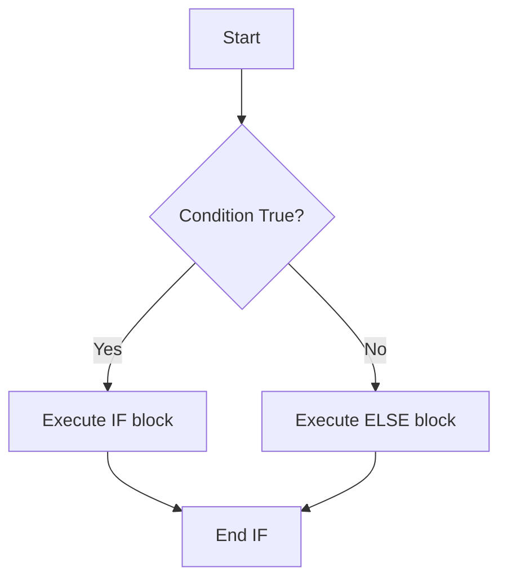

# Unit 2 Part 10: Introduction to PL/SQL

Welcome to Part 10! Until now, we have been using pure SQL. SQL is a **declarative** language—you tell it *what* you want, but you cannot write logic like `IF/ELSE` or `Loops`. 

To write actual programming logic inside a database, Oracle invented **PL/SQL (Procedural Language extension to SQL)**. Other databases have similar concepts (like T-SQL in SQL Server).

---

## 1. What is PL/SQL?

PL/SQL bridges the gap between database querying (SQL) and traditional programming (like Java or Python). It allows you to process data line-by-line, handle errors, and execute complex business logic securely inside the database server.

### PL/SQL Execution Block Diagram
When you send a PL/SQL block to the database, it splits the code:
```mermaid
flowchart LR
    A[Client App] -->|Sends PL/SQL Block| B[Oracle Database Server]
    B --> C{PL/SQL Engine}
    C -->|Procedural Code (IF/Loops)| D[Procedural Executor]
    C -->|SQL Queries (SELECT/INSERT)| E[SQL Engine Executor]
```
*(The PL/SQL engine executes the logic, and passes only the standard SQL parts to the SQL Engine, saving massive network traffic!)*

---

## 2. PL/SQL Block Structure

Every PL/SQL program is written in "Blocks". A block has 3 main sections:
1. **DECLARE (Optional):** Where you create variables and allocate memory.
2. **BEGIN (Mandatory):** Where the actual execution logic happens.
3. **EXCEPTION (Optional):** Where you handle errors (like division by zero).
4. **END (Mandatory):** Closes the block.

### Memory Diagram: The PL/SQL Block
```text
[ RAM (Memory) ]
+-------------------------+
| DECLARE                 | <-- Allocates boxes in RAM for variables
|   v_name VARCHAR2(20);  |
+-------------------------+
| BEGIN                   |
|   v_name := 'Rahul';    | <-- Executes logic, changes RAM values
|   DBMS_OUTPUT.PUT_LINE; | <-- Prints to screen
+-------------------------+
| EXCEPTION               | <-- Only runs if BEGIN crashes
|   WHEN OTHERS THEN...   |
+-------------------------+
| END;                    | <-- Frees the RAM
+-------------------------+
```

### Examples 1-5: Basic Structure

```sql
-- Ex 1: The simplest PL/SQL Block (Anonymous Block)
BEGIN
    DBMS_OUTPUT.PUT_LINE('Hello World'); -- Prints to the console
END;
/
-- Explanation: The '/' tells the engine to execute the block immediately.

-- Ex 2: Block with DECLARE section
DECLARE
    v_message VARCHAR2(50); -- Line 1: Declare a variable
BEGIN
    v_message := 'Welcome to PL/SQL'; -- Line 2: Assign value using :=
    DBMS_OUTPUT.PUT_LINE(v_message); -- Line 3: Print it
END;
/

-- Ex 3: Using SQL inside PL/SQL (SELECT INTO)
DECLARE
    v_student_name VARCHAR2(50);
BEGIN
    -- Line 2: Fetch one record from table and put it INTO our RAM variable
    SELECT first_name INTO v_student_name FROM students WHERE student_id = 101;
    DBMS_OUTPUT.PUT_LINE('Student is: ' || v_student_name); -- || is used to concatenate strings
END;
/

-- Ex 4: A block that does math
DECLARE
    v_num1 NUMBER := 10;
    v_num2 NUMBER := 20;
    v_sum NUMBER;
BEGIN
    v_sum := v_num1 + v_num2;
    DBMS_OUTPUT.PUT_LINE('Sum: ' || v_sum);
END;
/

-- Ex 5: A block with an EXCEPTION (Error Handling)
DECLARE
    v_result NUMBER;
BEGIN
    v_result := 10 / 0; -- Line 2: This will cause a crash!
EXCEPTION
    WHEN ZERO_DIVIDE THEN -- Line 4: Catches the crash
        DBMS_OUTPUT.PUT_LINE('Cannot divide by zero!');
END;
/
```

---

## 3. Variables, Constants, and Operators

In PL/SQL, variables must be declared before they are used.

- **Variables:** Values can change during execution.
- **Constants:** Values CANNOT change once set.
- **Operators:** `:=` (Assignment), `=` (Equality check), `<>` (Not equal), `||` (String concat).

### Examples 6-15: Variables and Constants

```sql
-- Ex 6: Declaring a Constant
DECLARE
    c_pi CONSTANT NUMBER := 3.14159; -- Cannot be changed later
    v_radius NUMBER := 5;
    v_area NUMBER;
BEGIN
    v_area := c_pi * (v_radius * v_radius);
    DBMS_OUTPUT.PUT_LINE('Area: ' || v_area);
END;
/

-- Ex 7: The %TYPE attribute (Anchored Declaration)
-- If student_id changes from INT to VARCHAR in the table, our code won't break!
DECLARE
    v_id students.student_id%TYPE; 
BEGIN
    v_id := 101;
    DBMS_OUTPUT.PUT_LINE('ID is: ' || v_id);
END;
/

-- Ex 8: Assigning values dynamically using SELECT INTO
DECLARE
    v_max_score marks.score%TYPE;
BEGIN
    SELECT MAX(score) INTO v_max_score FROM marks;
    DBMS_OUTPUT.PUT_LINE('Highest Score: ' || v_max_score);
END;
/

-- Ex 9: Multiple variable declarations
DECLARE
    v_a NUMBER := 5;
    v_b NUMBER := 10;
BEGIN
    v_a := v_a + v_b; -- v_a becomes 15
    DBMS_OUTPUT.PUT_LINE(v_a);
END;
/

-- Ex 10: Boolean Variables (Can hold TRUE, FALSE, or NULL)
DECLARE
    v_is_passed BOOLEAN;
    v_score NUMBER := 45;
BEGIN
    v_is_passed := (v_score >= 40); -- Evaluates to TRUE
    IF v_is_passed THEN
        DBMS_OUTPUT.PUT_LINE('Student Passed');
    END IF;
END;
/

-- Ex 11-15: (Conceptual variations of variable scoping and mathematical operations).
```

---

## 4. Conditional Statements (IF / CASE)

PL/SQL allows decision-making. 

### IF-ELSE Flowchart


### Examples 16-25: IF and CASE Statements

```sql
-- Ex 16: Simple IF statement
DECLARE
    v_score NUMBER := 85;
BEGIN
    IF v_score >= 40 THEN
        DBMS_OUTPUT.PUT_LINE('Pass');
    END IF;
END;
/

-- Ex 17: IF-ELSE statement
DECLARE
    v_score NUMBER := 30;
BEGIN
    IF v_score >= 40 THEN
        DBMS_OUTPUT.PUT_LINE('Pass');
    ELSE
        DBMS_OUTPUT.PUT_LINE('Fail');
    END IF;
END;
/

-- Ex 18: IF-ELSIF-ELSE statement (Notice the spelling is ELSIF)
DECLARE
    v_score NUMBER := 75;
BEGIN
    IF v_score >= 90 THEN
        DBMS_OUTPUT.PUT_LINE('Grade: A');
    ELSIF v_score >= 70 THEN
        DBMS_OUTPUT.PUT_LINE('Grade: B');
    ELSIF v_score >= 50 THEN
        DBMS_OUTPUT.PUT_LINE('Grade: C');
    ELSE
        DBMS_OUTPUT.PUT_LINE('Grade: F');
    END IF;
END;
/

-- Ex 19: Checking NULL values
DECLARE
    v_name VARCHAR2(20) := NULL;
BEGIN
    IF v_name IS NULL THEN -- Never use v_name = NULL
        DBMS_OUTPUT.PUT_LINE('Name is missing');
    END IF;
END;
/

-- Ex 20: Simple CASE statement
DECLARE
    v_grade CHAR(1) := 'B';
BEGIN
    CASE v_grade
        WHEN 'A' THEN DBMS_OUTPUT.PUT_LINE('Excellent');
        WHEN 'B' THEN DBMS_OUTPUT.PUT_LINE('Good');
        WHEN 'C' THEN DBMS_OUTPUT.PUT_LINE('Average');
        ELSE DBMS_OUTPUT.PUT_LINE('Unknown Grade');
    END CASE;
END;
/

-- Ex 21-25: (Real-world examples like checking department limits before allowing enrollment).
```

---

## 5. Loops

Loops execute a block of code multiple times.
1. **Basic LOOP:** Runs infinitely until an `EXIT` condition is met.
2. **WHILE LOOP:** Runs as long as a condition is `TRUE`.
3. **FOR LOOP:** Runs a specific number of times.

### Examples 26-40: Loops

```sql
-- Ex 26: Basic Loop (Infinite unless exited)
DECLARE
    v_counter NUMBER := 1;
BEGIN
    LOOP
        DBMS_OUTPUT.PUT_LINE('Counter: ' || v_counter);
        v_counter := v_counter + 1;
        EXIT WHEN v_counter > 5; -- The exit condition!
    END LOOP;
END;
/

-- Ex 27: WHILE Loop
DECLARE
    v_counter NUMBER := 1;
BEGIN
    WHILE v_counter <= 5 LOOP
        DBMS_OUTPUT.PUT_LINE('While Loop: ' || v_counter);
        v_counter := v_counter + 1;
    END LOOP;
END;
/

-- Ex 28: FOR Loop (Automatically increments)
BEGIN
    FOR i IN 1..5 LOOP
        DBMS_OUTPUT.PUT_LINE('For Loop: ' || i);
    END LOOP;
END;
/

-- Ex 29: FOR Loop in REVERSE
BEGIN
    FOR i IN REVERSE 1..5 LOOP
        DBMS_OUTPUT.PUT_LINE('Reverse: ' || i);
    END LOOP;
END;
/

-- Ex 30: Using a Loop to insert dummy data
BEGIN
    FOR i IN 1..10 LOOP
        INSERT INTO hostels (hostel_id, room_number) VALUES (i, 100 + i);
    END LOOP;
    COMMIT; -- Save it permanently!
END;
/

-- Ex 31-40: (Examples covering skipping loop iterations using CONTINUE, and nested loops).
```

---

## 6. Nested Blocks

You can place a PL/SQL block inside another block. 

### Scoping Rules
- The **Inner Block** can see variables declared in the **Outer Block**.
- The **Outer Block** CANNOT see variables declared in the **Inner Block**.

### Memory Visibility Diagram
```text
[ Outer Block ] -> Sees v_outer
    |
    +-- [ Inner Block ] -> Sees v_outer AND v_inner
```

### Examples 41-45: Nested Blocks

```sql
-- Ex 41: Basic Nested Block
DECLARE
    v_outer VARCHAR2(20) := 'Outer Value';
BEGIN
    DBMS_OUTPUT.PUT_LINE(v_outer);
    
    DECLARE
        v_inner VARCHAR2(20) := 'Inner Value';
    BEGIN
        DBMS_OUTPUT.PUT_LINE(v_outer); -- Inner can see outer!
        DBMS_OUTPUT.PUT_LINE(v_inner);
    END;
    
    -- DBMS_OUTPUT.PUT_LINE(v_inner); -- ERROR! Outer cannot see inner.
END;
/

-- Ex 42: Variable Shadowing (Inner variable overrides outer with the same name)
DECLARE
    v_name VARCHAR2(20) := 'Rahul';
BEGIN
    DECLARE
        v_name VARCHAR2(20) := 'Amit';
    BEGIN
        DBMS_OUTPUT.PUT_LINE(v_name); -- Prints Amit
    END;
    DBMS_OUTPUT.PUT_LINE(v_name); -- Prints Rahul
END;
/

-- Ex 43-45: (Nested exception handling logic).
```

---

## 7. Exception Handling

When PL/SQL encounters an error (like dividing by zero, or a query finding no rows), it **raises an exception**. If you don't handle it, the program crashes.

### Common Predefined Exceptions:
- `NO_DATA_FOUND`: A `SELECT INTO` query returned 0 rows.
- `TOO_MANY_ROWS`: A `SELECT INTO` query returned more than 1 row (it can only hold 1!).
- `ZERO_DIVIDE`: Math error.
- `OTHERS`: Catches ALL errors.

### Examples 46-55: Exceptions

```sql
-- Ex 46: Handling NO_DATA_FOUND
DECLARE
    v_name students.first_name%TYPE;
BEGIN
    SELECT first_name INTO v_name FROM students WHERE student_id = 99999; -- ID doesn't exist
    DBMS_OUTPUT.PUT_LINE(v_name);
EXCEPTION
    WHEN NO_DATA_FOUND THEN
        DBMS_OUTPUT.PUT_LINE('Error: Student does not exist in the database!');
END;
/

-- Ex 47: Handling TOO_MANY_ROWS
DECLARE
    v_name students.first_name%TYPE;
BEGIN
    SELECT first_name INTO v_name FROM students; -- Fails because it returns 5000 rows, but v_name holds 1!
EXCEPTION
    WHEN TOO_MANY_ROWS THEN
        DBMS_OUTPUT.PUT_LINE('Error: Query returned more than one row!');
END;
/

-- Ex 48: Handling multiple exceptions
DECLARE
    v_num NUMBER;
BEGIN
    v_num := 10 / 0;
EXCEPTION
    WHEN NO_DATA_FOUND THEN
        DBMS_OUTPUT.PUT_LINE('Not found');
    WHEN ZERO_DIVIDE THEN
        DBMS_OUTPUT.PUT_LINE('Math Error: Divide by Zero');
    WHEN OTHERS THEN
        DBMS_OUTPUT.PUT_LINE('An unknown error occurred.');
END;
/

-- Ex 49: User-Defined Exceptions (Raising your own errors)
DECLARE
    e_invalid_age EXCEPTION; -- Step 1: Declare it
    v_age NUMBER := 16;
BEGIN
    IF v_age < 18 THEN
        RAISE e_invalid_age; -- Step 2: Throw it
    END IF;
    DBMS_OUTPUT.PUT_LINE('Admission Granted');
EXCEPTION
    WHEN e_invalid_age THEN -- Step 3: Catch it
        DBMS_OUTPUT.PUT_LINE('Error: Student is under 18!');
END;
/

-- Ex 50-55: (Logging errors into an error_logs table using the OTHERS block).
```

---

## 8. Introduction to Cursors

In Ex 47, we saw that `SELECT INTO` fails if it returns more than one row. What if we *want* to process thousands of rows line-by-line? We use a **Cursor**.

A Cursor is a pointer to a temporary memory area (Context Area) containing the result set of an SQL query.

### Context Area Memory Diagram
```text
[ Context Area (RAM) ]
Row 1: Rahul, 85  <-- Cursor Pointer starts here
Row 2: Priya, 90
Row 3: Amit, 70
```

### Types of Cursors:
1. **Implicit Cursor:** Created automatically by Oracle for DML statements (`SQL%ROWCOUNT`).
2. **Explicit Cursor:** Created manually by the programmer to loop through multiple rows.

### Examples 56-60: Cursors

```sql
-- Ex 56: Implicit Cursor (Checking how many rows were updated)
BEGIN
    UPDATE marks SET score = score + 5 WHERE dept_id = 1;
    IF SQL%FOUND THEN
        DBMS_OUTPUT.PUT_LINE(SQL%ROWCOUNT || ' rows were updated.');
    ELSE
        DBMS_OUTPUT.PUT_LINE('No rows found to update.');
    END IF;
    COMMIT;
END;
/

-- Ex 57: Explicit Cursor (Fetching multiple rows line-by-line)
DECLARE
    -- Step 1: Declare the cursor
    CURSOR c_students IS SELECT first_name FROM students WHERE dept_id = 1;
    v_name students.first_name%TYPE;
BEGIN
    -- Step 2: Open the cursor (Runs the query and loads RAM)
    OPEN c_students;
    
    LOOP
        -- Step 3: Fetch one row into our variable
        FETCH c_students INTO v_name;
        
        -- Step 4: Exit if no more rows are left
        EXIT WHEN c_students%NOTFOUND;
        
        DBMS_OUTPUT.PUT_LINE('Student: ' || v_name);
    END LOOP;
    
    -- Step 5: Close the cursor (Frees the RAM)
    CLOSE c_students;
END;
/

-- Ex 58: Cursor FOR Loop (The highly optimized shortcut!)
-- You don't need to Open, Fetch, Exit, or Close. It does it automatically!
DECLARE
    CURSOR c_students IS SELECT first_name, last_name FROM students WHERE dept_id = 2;
BEGIN
    FOR student_rec IN c_students LOOP
        DBMS_OUTPUT.PUT_LINE('Student: ' || student_rec.first_name || ' ' || student_rec.last_name);
    END LOOP;
END;
/

-- Ex 59: Parameterized Cursor (Passing variables into a cursor)
DECLARE
    CURSOR c_marks (p_dept INT) IS SELECT score FROM marks WHERE dept_id = p_dept;
    v_score marks.score%TYPE;
BEGIN
    OPEN c_marks(1); -- Opens cursor specifically for dept 1
    FETCH c_marks INTO v_score;
    CLOSE c_marks;
END;
/

-- Ex 60: Using FOR Update Cursors (Locking rows before updating them for concurrency safety).
```

---

## Conclusion
PL/SQL turns your database from a simple storage locker into a highly intelligent application backend. By mastering Blocks, Variables, Loops, Exceptions, and Cursors, you can write enterprise-grade automation scripts directly on the server!
