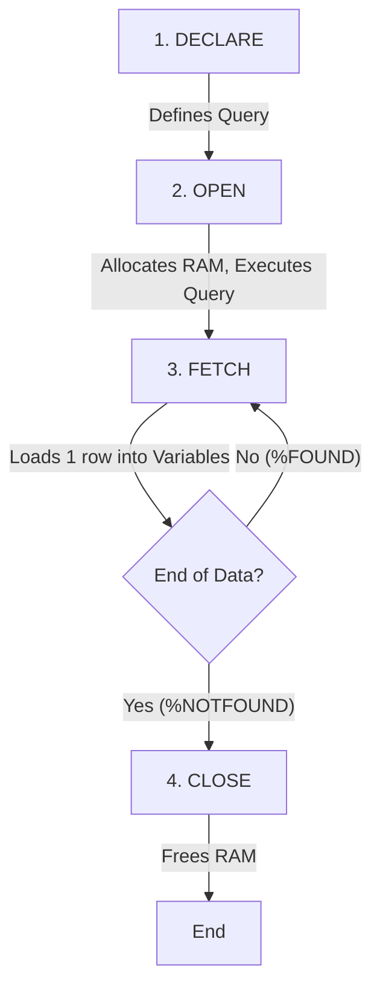

# Unit 2 Part 11: Deep Dive into Cursors

Welcome to Part 11! In the previous unit, we got a tiny taste of **Cursors**. If a `SELECT INTO` query returns more than one row, PL/SQL throws a `TOO_MANY_ROWS` error. 

To process multi-row queries line-by-line (like reading a spreadsheet row by row), we MUST use a Cursor. In this unit, we will explore the internal lifecycle of cursors, memory allocation, and advanced cursor types.

---

## 1. What is a Cursor? (Memory Allocation)

When Oracle executes a SQL query, it needs a temporary workspace in RAM to store the data retrieved from the hard drive. This private memory area is called the **Context Area**.

A **Cursor** is simply a pointer (or a label) to this Context Area. The subset of rows stored inside this memory is called the **Active Set**.

### Visualizing Memory Allocation
```text
[ Hard Drive (Database Tables) ]
       | (SELECT * FROM marks)
       v
[ RAM: Context Area ] <-- The "Cursor" points here!
+-------------------+
| Row 1: Rahul, 85  | <--- Active Row Pointer (Currently fetching)
| Row 2: Priya, 90  |
| Row 3: Amit, 70   |
+-------------------+
```

---

## 2. Cursor Attributes

Every cursor has four built-in attributes (variables) that tell you the state of the cursor at any given moment.

| Attribute | Returns TRUE if... | Returns FALSE if... | Use Case |
| :--- | :--- | :--- | :--- |
| **`%FOUND`** | The last fetch successfully retrieved a row. | No row was retrieved. | Checking if an update worked. |
| **`%NOTFOUND`** | No row was retrieved (end of data). | A row was successfully fetched. | Exiting a loop. |
| **`%ROWCOUNT`** | *(Returns an Integer, not Boolean)* | The number of rows processed so far. | Counting updated/fetched rows. |
| **`%ISOPEN`** | The cursor is currently open in RAM. | The cursor is closed. | Preventing "cursor already open" errors. |

---

## 3. Implicit Cursors

Whenever you run a standard DML command (`INSERT`, `UPDATE`, `DELETE`) or a single-row `SELECT INTO`, Oracle automatically creates and manages a cursor in the background. This is called an **Implicit Cursor**. 

It is named `SQL`. You can access its attributes using `SQL%ROWCOUNT` or `SQL%FOUND`.

### Examples 1-10: Implicit Cursors

```sql
-- Ex 1: Using SQL%ROWCOUNT to see how many rows were updated
BEGIN
    UPDATE students SET status = 'Active' WHERE dept_id = 1;
    DBMS_OUTPUT.PUT_LINE(SQL%ROWCOUNT || ' students updated.');
    COMMIT;
END;
/

-- Ex 2: Using SQL%FOUND
BEGIN
    DELETE FROM marks WHERE score = 0;
    IF SQL%FOUND THEN
        DBMS_OUTPUT.PUT_LINE('Deleted some zero-score records.');
    ELSE
        DBMS_OUTPUT.PUT_LINE('No zero scores found.');
    END IF;
    COMMIT;
END;
/

-- Ex 3: Using SQL%NOTFOUND
BEGIN
    UPDATE courses SET credits = 5 WHERE course_id = 9999; -- Doesn't exist
    IF SQL%NOTFOUND THEN
        DBMS_OUTPUT.PUT_LINE('Course not found. No update made.');
    END IF;
END;
/

-- Ex 4: (Implicit Cursor with SELECT INTO)
DECLARE
    v_name students.first_name%TYPE;
BEGIN
    SELECT first_name INTO v_name FROM students WHERE student_id = 101;
    -- Note: If this fails, it throws NO_DATA_FOUND exception, it does NOT use SQL%NOTFOUND.
    DBMS_OUTPUT.PUT_LINE('Found: ' || v_name);
END;
/

-- Ex 5-10: (Variations of checking implicit cursor states during bulk inserts/deletes).
```

---

## 4. Explicit Cursors & The Cursor Lifecycle

When you expect multiple rows from a `SELECT` statement, you must declare an **Explicit Cursor**. You are in full control of its memory lifecycle.

### The Lifecycle Flowchart


### Examples 11-20: Explicit Cursors

```sql
-- Ex 11: The Standard Explicit Cursor Lifecycle
DECLARE
    -- Step 1: DECLARE
    CURSOR c_depts IS SELECT dept_id, dept_name FROM departments;
    v_id departments.dept_id%TYPE;
    v_name departments.dept_name%TYPE;
BEGIN
    -- Step 2: OPEN
    OPEN c_depts;
    
    LOOP
        -- Step 3: FETCH (Moves pointer down one row)
        FETCH c_depts INTO v_id, v_name;
        
        -- Step 4: EXIT condition checking %NOTFOUND
        EXIT WHEN c_depts%NOTFOUND;
        
        DBMS_OUTPUT.PUT_LINE('Dept: ' || v_id || ' - ' || v_name);
    END LOOP;
    
    -- Step 5: CLOSE
    CLOSE c_depts;
END;
/

-- Ex 12: Using %ROWCOUNT to stop fetching early (Top 3 students)
DECLARE
    CURSOR c_top IS SELECT first_name, score FROM marks m JOIN students s ON m.student_id = s.student_id ORDER BY score DESC;
    v_name students.first_name%TYPE;
    v_score marks.score%TYPE;
BEGIN
    OPEN c_top;
    LOOP
        FETCH c_top INTO v_name, v_score;
        EXIT WHEN c_top%NOTFOUND OR c_top%ROWCOUNT > 3; -- Stop after 3 rows!
        DBMS_OUTPUT.PUT_LINE(c_top%ROWCOUNT || '. ' || v_name || ' : ' || v_score);
    END LOOP;
    CLOSE c_top;
END;
/

-- Ex 13: Using %ISOPEN to prevent crashes
DECLARE
    CURSOR c_courses IS SELECT course_name FROM courses;
BEGIN
    IF NOT c_courses%ISOPEN THEN
        OPEN c_courses;
    END IF;
    CLOSE c_courses;
END;
/

-- Ex 14: Fetching an entire row into a RECORD variable
DECLARE
    CURSOR c_student_rec IS SELECT * FROM students WHERE dept_id = 1;
    v_rec students%ROWTYPE; -- Creates a compound variable holding all columns!
BEGIN
    OPEN c_student_rec;
    LOOP
        FETCH c_student_rec INTO v_rec;
        EXIT WHEN c_student_rec%NOTFOUND;
        DBMS_OUTPUT.PUT_LINE(v_rec.first_name || ' ' || v_rec.phone);
    END LOOP;
    CLOSE c_student_rec;
END;
/

-- Ex 15-20: (Conceptually applying explicit cursors to calculate averages, update specific rows using current cursor values, etc.)
```

---

## 5. Cursor FOR Loop (The Simplified Cursor)

The manual Explicit Cursor lifecycle requires typing `OPEN`, `FETCH`, checking `%NOTFOUND`, and `CLOSE`. 

The **Cursor FOR Loop** automates all of this. It implicitly opens the cursor, fetches rows into a record variable, handles the exit condition, and safely closes the cursor when done. **This is the preferred way to write cursors in the industry.**

### Examples 21-30: Cursor FOR Loops

```sql
-- Ex 21: The streamlined Cursor FOR Loop
DECLARE
    CURSOR c_faculty IS SELECT full_name, experience_years FROM faculty;
BEGIN
    -- No OPEN required.
    -- 'f_rec' is created implicitly as a %ROWTYPE variable.
    FOR f_rec IN c_faculty LOOP
        DBMS_OUTPUT.PUT_LINE(f_rec.full_name || ' has ' || f_rec.experience_years || ' yrs exp.');
    END LOOP;
    -- No CLOSE required. It closes automatically!
END;
/

-- Ex 22: Implicit Cursor FOR Loop (Writing the SELECT directly inside the FOR statement!)
BEGIN
    FOR dept_rec IN (SELECT dept_name FROM departments) LOOP
        DBMS_OUTPUT.PUT_LINE('Department: ' || dept_rec.dept_name);
    END LOOP;
END;
/

-- Ex 23: Using Cursor FOR Loop to calculate a running total
DECLARE
    v_total_credits NUMBER := 0;
BEGIN
    FOR c_rec IN (SELECT credits FROM courses) LOOP
        v_total_credits := v_total_credits + NVL(c_rec.credits, 0);
    END LOOP;
    DBMS_OUTPUT.PUT_LINE('Total Credits in University: ' || v_total_credits);
END;
/

-- Ex 24: Iterating over failing students to send warnings
BEGIN
    FOR s_rec IN (SELECT s.first_name, m.score FROM students s JOIN marks m ON s.student_id = m.student_id WHERE m.score < 40) LOOP
        DBMS_OUTPUT.PUT_LINE('Send warning email to: ' || s_rec.first_name);
    END LOOP;
END;
/

-- Ex 25-30: (More cursor FOR loop scenarios involving complex JOINs directly embedded in the loop definition).
```

---

## 6. Parameterized Cursors

What if you want to reuse the exact same cursor logic for Department 1, and then for Department 2? Instead of declaring two separate cursors, you can pass arguments to a cursor exactly like passing arguments to a function in Java or C++.

### Examples 31-40: Parameterized Cursors

```sql
-- Ex 31: Passing a department ID parameter
DECLARE
    -- Cursor expects a NUMBER parameter named p_dept_id
    CURSOR c_students_by_dept (p_dept_id NUMBER) IS 
        SELECT first_name FROM students WHERE dept_id = p_dept_id;
BEGIN
    -- Call the cursor passing '1' (Computer Science)
    DBMS_OUTPUT.PUT_LINE('--- Dept 1 Students ---');
    FOR rec IN c_students_by_dept(1) LOOP
        DBMS_OUTPUT.PUT_LINE(rec.first_name);
    END LOOP;

    -- Call the exact same cursor passing '2' (Mechanical)
    DBMS_OUTPUT.PUT_LINE('--- Dept 2 Students ---');
    FOR rec IN c_students_by_dept(2) LOOP
        DBMS_OUTPUT.PUT_LINE(rec.first_name);
    END LOOP;
END;
/

-- Ex 32: Cursor with multiple parameters
DECLARE
    CURSOR c_filtered_marks (p_dept NUMBER, p_min_score NUMBER) IS
        SELECT s.first_name, m.score 
        FROM students s JOIN marks m ON s.student_id = m.student_id 
        WHERE s.dept_id = p_dept AND m.score > p_min_score;
BEGIN
    -- Find students in Dept 1 who scored over 90
    FOR rec IN c_filtered_marks(1, 90) LOOP
        DBMS_OUTPUT.PUT_LINE('Star Student: ' || rec.first_name);
    END LOOP;
END;
/

-- Ex 33: Using default values for cursor parameters
DECLARE
    CURSOR c_courses (p_min_credits NUMBER DEFAULT 3) IS
        SELECT course_name FROM courses WHERE credits >= p_min_credits;
BEGIN
    -- Uses default of 3
    FOR rec IN c_courses() LOOP
        DBMS_OUTPUT.PUT_LINE('Heavy Course: ' || rec.course_name);
    END LOOP;
END;
/

-- Ex 34: Parameterized manual explicit cursor
DECLARE
    CURSOR c_fac (p_id NUMBER) IS SELECT full_name FROM faculty WHERE faculty_id = p_id;
    v_name VARCHAR2(100);
BEGIN
    OPEN c_fac(5); -- Pass parameter here
    FETCH c_fac INTO v_name;
    CLOSE c_fac;
    DBMS_OUTPUT.PUT_LINE('Faculty 5 is: ' || v_name);
END;
/

-- Ex 35-40: (Using parameters to filter date ranges, strings, and integrating them inside complex multi-table analytical loops).
```

---

## Conclusion & Visual Fetch Process

To truly master cursors, you must understand the Fetch cycle.

```text
1. OPEN c1;  
   [RAM Memory Block Created]
   Row 1 (Id: 1, Score: 80) <-- Pointer sits just BEFORE the first row.
   Row 2 (Id: 2, Score: 90)

2. FETCH c1;
   Pointer moves to Row 1. Data (1, 80) is copied to your variables.
   %FOUND = TRUE

3. FETCH c1;
   Pointer moves to Row 2. Data (2, 90) is copied.
   %FOUND = TRUE

4. FETCH c1;
   Pointer tries to move to Row 3. Does not exist!
   %NOTFOUND = TRUE. The loop exits.
```

---

## End of Unit Assessments

### Exercises

1. What is the difference between an Implicit and Explicit cursor? Who controls the lifecycle of each?
2. Which cursor attribute would you use to find out exactly how many rows an `UPDATE` statement affected? Write the snippet.
3. Draw the 4-step flowchart lifecycle of an Explicit cursor.
4. Why is the `Cursor FOR Loop` preferred over the manual Explicit Cursor? What steps does it automate?
5. What happens if you try to `FETCH` from a cursor that has already reached `%NOTFOUND`? 

### Assignments

1. **Analytical Script:** Write a PL/SQL block using a Parameterized Cursor. The parameter should be `p_gender`. The cursor should fetch the average score of all students matching that gender. Call the cursor twice in your block: once for 'M' and once for 'F', and print the comparison.
2. **Bulk Update Logic:** Write an explicit cursor that loops through all courses. If a course has 3 credits, use PL/SQL variables and logic to update it to 4 credits (do not just write a pure SQL update, manually process it via the cursor loop to practice). Keep track of how many courses were updated using a local counter variable and print the total at the end.
3. **Data Generation:** Write an implicit Cursor FOR Loop that selects all faculty members. Inside the loop, `INSERT` a dummy record into the `events` table assigning each faculty member to a "Mandatory Training" event on the current date.
