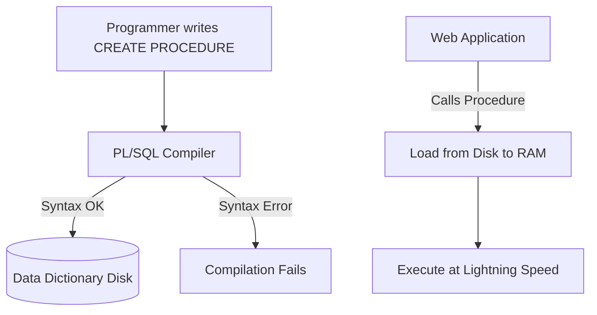
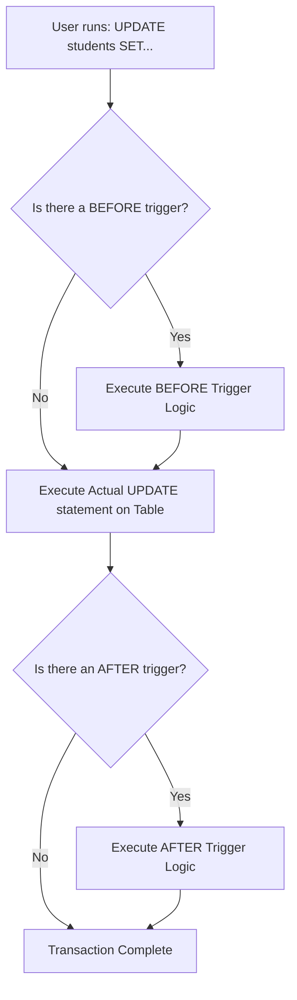

# Unit 2 Part 12: Stored Procedures, Functions, and Database Triggers

Welcome to Part 12! Until now, every PL/SQL block we wrote was an **Anonymous Block**. When you ran it, the database executed it, but immediately forgot it. It was not saved.

What if you want to save your PL/SQL program permanently in the database so that Java, Python, or Web Applications can call it repeatedly? You use **Subprograms** (Procedures and Functions) and **Triggers**.

---

## The Internal Architecture: Compilation, Storage, and Execution

When you create a Procedure, Function, or Trigger, it undergoes a lifecycle:
1. **Compilation:** The PL/SQL engine checks your code for syntax errors.
2. **Storage:** If valid, the code is compiled into "P-Code" (bytecode) and stored permanently in the Data Dictionary (Hard Drive).
3. **Invocation:** When a user or application calls it, the P-Code is loaded into RAM (Shared Pool) and executed instantly.

### Architecture Diagram


**Benefits:**
- **Performance:** Pre-compiled code runs much faster than sending raw SQL strings over the network.
- **Security:** You can grant a user permission to execute a Procedure without giving them permission to read the underlying tables.
- **Reusability:** Write once, call from anywhere.

---

## 1. Stored Procedures

A Stored Procedure is a named PL/SQL block that performs an action. It does NOT have to return a value.

### Parameter Modes:
- **IN:** Passes a value into the procedure (Default).
- **OUT:** Returns a value back to the caller.
- **IN OUT:** Passes a value in, modifies it, and returns it.

### Examples 1-25: Stored Procedures

```sql
-- Ex 1: Creating a basic procedure
CREATE OR REPLACE PROCEDURE print_welcome IS
BEGIN
    DBMS_OUTPUT.PUT_LINE('Welcome to the University Database!');
END;
/

-- Ex 2: Invoking the procedure (In SQL*Plus or Developer)
EXECUTE print_welcome;

-- Ex 3: Invoking from inside another PL/SQL block
BEGIN
    print_welcome();
END;
/

-- Ex 4: Procedure with IN parameter
CREATE OR REPLACE PROCEDURE greet_student(p_name IN VARCHAR2) IS
BEGIN
    DBMS_OUTPUT.PUT_LINE('Hello, ' || p_name);
END;
/

-- Ex 5: Invoking with IN parameter
EXECUTE greet_student('Rahul');

-- Ex 6: Procedure with OUT parameter
CREATE OR REPLACE PROCEDURE get_university_name(p_out_name OUT VARCHAR2) IS
BEGIN
    p_out_name := 'Global Tech University';
END;
/

-- Ex 7: Invoking OUT parameter requires a variable to hold the output
DECLARE
    v_univ VARCHAR2(50);
BEGIN
    get_university_name(v_univ);
    DBMS_OUTPUT.PUT_LINE(v_univ);
END;
/

-- Ex 8: Procedure with IN and OUT parameters
CREATE OR REPLACE PROCEDURE get_student_score(p_id IN INT, p_score OUT NUMBER) IS
BEGIN
    SELECT score INTO p_score FROM marks WHERE student_id = p_id;
END;
/

-- Ex 9: Procedure with IN OUT parameter (Modifies the input directly)
CREATE OR REPLACE PROCEDURE format_phone(p_phone IN OUT VARCHAR2) IS
BEGIN
    p_phone := '+91-' || p_phone;
END;
/

-- Ex 10: Invoking IN OUT
DECLARE
    v_num VARCHAR2(20) := '9876543210';
BEGIN
    format_phone(v_num);
    DBMS_OUTPUT.PUT_LINE(v_num); -- Outputs: +91-9876543210
END;
/

-- Ex 11: Procedure to insert data
CREATE OR REPLACE PROCEDURE add_department(p_id INT, p_name VARCHAR2) IS
BEGIN
    INSERT INTO departments (dept_id, dept_name) VALUES (p_id, p_name);
    COMMIT;
END;
/

-- Ex 12: Procedure to update data safely
CREATE OR REPLACE PROCEDURE give_grace_marks(p_dept INT, p_marks NUMBER) IS
BEGIN
    UPDATE marks m SET m.score = m.score + p_marks 
    WHERE m.student_id IN (SELECT student_id FROM students WHERE dept_id = p_dept);
    COMMIT;
END;
/

-- Ex 13: Procedure to delete data safely
CREATE OR REPLACE PROCEDURE remove_old_attendance(p_date DATE) IS
BEGIN
    DELETE FROM attendance WHERE date < p_date;
    COMMIT;
END;
/

-- Ex 14: Handling Exceptions inside a Procedure
CREATE OR REPLACE PROCEDURE safe_divide(p_a INT, p_b INT) IS
    v_ans NUMBER;
BEGIN
    v_ans := p_a / p_b;
    DBMS_OUTPUT.PUT_LINE('Ans: ' || v_ans);
EXCEPTION
    WHEN ZERO_DIVIDE THEN DBMS_OUTPUT.PUT_LINE('Cannot divide by zero!');
END;
/

-- Ex 15: Procedure passing parameters by Name (Named Notation)
-- EXECUTE add_department(p_name => 'Physics', p_id => 50);

-- Ex 16: Dropping a procedure
-- DROP PROCEDURE print_welcome;

-- Ex 17-25: (Variations of procedures looping through cursors, doing bulk processing, and committing transactions securely behind the scenes).
```

---

## 2. Stored Functions

A Function is almost identical to a Procedure, with one major difference: **A Function MUST return a value.** Because it returns a value, you can use a Function directly inside a SQL `SELECT` statement!

### Difference: Procedure vs Function
| Feature | Procedure | Function |
| :--- | :--- | :--- |
| **Return Value** | Optional (via OUT parameters) | Mandatory (`RETURN` clause) |
| **Usage in SQL** | CANNOT be used in `SELECT` | CAN be used in `SELECT`, `WHERE` |
| **Purpose** | To perform actions (DML/Transactions) | To compute and return a value |

### Examples 26-45: Stored Functions

```sql
-- Ex 26: Create a basic Function
CREATE OR REPLACE FUNCTION get_pi RETURN NUMBER IS
BEGIN
    RETURN 3.14159;
END;
/

-- Ex 27: Calling a function from a SELECT statement!
SELECT get_pi() FROM dual;

-- Ex 28: Function to calculate student age
CREATE OR REPLACE FUNCTION calculate_age(p_dob DATE) RETURN INT IS
BEGIN
    RETURN FLOOR(MONTHS_BETWEEN(SYSDATE, p_dob) / 12);
END;
/

-- Ex 29: Using the function in a real query
SELECT first_name, calculate_age(dob) AS age FROM students;

-- Ex 30: Function to check if a student passed
CREATE OR REPLACE FUNCTION is_pass(p_score NUMBER) RETURN VARCHAR2 IS
BEGIN
    IF p_score >= 40 THEN RETURN 'PASS';
    ELSE RETURN 'FAIL';
    END IF;
END;
/

-- Ex 31: Using the function in a WHERE clause
SELECT student_id FROM marks WHERE is_pass(score) = 'PASS';

-- Ex 32: Function querying the database (Total students in dept)
CREATE OR REPLACE FUNCTION count_students(p_dept INT) RETURN INT IS
    v_count INT;
BEGIN
    SELECT COUNT(*) INTO v_count FROM students WHERE dept_id = p_dept;
    RETURN v_count;
END;
/

-- Ex 33: Function for formatting names
CREATE OR REPLACE FUNCTION format_name(p_first VARCHAR2, p_last VARCHAR2) RETURN VARCHAR2 IS
BEGIN
    RETURN UPPER(SUBSTR(p_first, 1, 1)) || LOWER(SUBSTR(p_first, 2)) || ' ' || UPPER(p_last);
END;
/

-- Ex 34: Function to calculate discounted fee
CREATE OR REPLACE FUNCTION get_final_fee(p_base NUMBER, p_discount NUMBER) RETURN NUMBER IS
BEGIN
    RETURN p_base - (p_base * (p_discount / 100));
END;
/

-- Ex 35: Handling exceptions in functions (Return a safe default)
CREATE OR REPLACE FUNCTION get_score(p_id INT) RETURN NUMBER IS
    v_score NUMBER;
BEGIN
    SELECT score INTO v_score FROM marks WHERE student_id = p_id;
    RETURN v_score;
EXCEPTION
    WHEN NO_DATA_FOUND THEN RETURN -1;
END;
/

-- Ex 36: Dropping a function
-- DROP FUNCTION get_pi;

-- Ex 37-45: (More complex mathematical functions, string generators, and date manipulators returning specific values to aggregate queries).
```

---

## 3. Database Triggers

A Trigger is a special type of stored procedure that **executes automatically (fires)** when a specific event occurs in the database. You do not manually "Call" a trigger. It sits in the background and watches.

### Trigger Execution Flowchart


### Types of Triggers
1. **BEFORE Trigger:** Fires *before* the DML executes. Great for validating data or modifying input.
2. **AFTER Trigger:** Fires *after* the DML executes. Great for logging/auditing actions into a history table.
3. **INSTEAD OF Trigger:** Used to perform DML on Complex Views (which normally don't allow DML).
4. **Statement Level:** Fires ONCE per SQL statement (e.g., `UPDATE 50 rows` = Fires 1 time).
5. **Row Level:** Fires ONCE for EVERY ROW affected (e.g., `UPDATE 50 rows` = Fires 50 times). Must use `FOR EACH ROW`.

### Magic Variables: `:OLD` and `:NEW`
In a Row-Level trigger, you have access to:
- `:OLD.column_name` -> The value before the update/delete.
- `:NEW.column_name` -> The value being inserted/updated.

### Examples 46-80: Database Triggers

#### Real World Scenario 1: Data Validation (BEFORE)
```sql
-- Ex 46: Prevent scores above 100 or below 0 (Alternative to CHECK constraint)
CREATE OR REPLACE TRIGGER trg_validate_marks
BEFORE INSERT OR UPDATE ON marks
FOR EACH ROW
BEGIN
    IF :NEW.score < 0 OR :NEW.score > 100 THEN
        RAISE_APPLICATION_ERROR(-20001, 'Score must be between 0 and 100!');
    END IF;
END;
/

-- Ex 47: Automatically format names to uppercase before inserting
CREATE OR REPLACE TRIGGER trg_format_names
BEFORE INSERT ON students
FOR EACH ROW
BEGIN
    :NEW.first_name := UPPER(:NEW.first_name);
    :NEW.last_name := UPPER(:NEW.last_name);
END;
/
```

#### Real World Scenario 2: Audit Trail (AFTER)
```sql
-- Ex 48: Create an audit table first
CREATE TABLE audit_logs (
    log_id INT PRIMARY KEY,
    action VARCHAR2(50),
    action_date DATE,
    old_val VARCHAR2(100),
    new_val VARCHAR2(100)
);

-- Ex 49: Create the Audit Trigger on Salary/Credits
CREATE OR REPLACE TRIGGER trg_audit_courses
AFTER UPDATE OF credits ON courses
FOR EACH ROW
BEGIN
    INSERT INTO audit_logs (log_id, action, action_date, old_val, new_val)
    VALUES (101, 'CREDIT_UPDATE', SYSDATE, TO_CHAR(:OLD.credits), TO_CHAR(:NEW.credits));
END;
/
```

#### Real World Scenario 3: Salary / Fee Updates
```sql
-- Ex 50: Prevent decreasing a faculty's experience (Can only go up!)
CREATE OR REPLACE TRIGGER trg_protect_experience
BEFORE UPDATE ON faculty
FOR EACH ROW
BEGIN
    IF :NEW.experience_years < :OLD.experience_years THEN
        RAISE_APPLICATION_ERROR(-20002, 'Experience cannot decrease!');
    END IF;
END;
/
```

#### Statement Level Triggers
```sql
-- Ex 51: Prevent anyone from deleting students on a Sunday (Statement Level)
CREATE OR REPLACE TRIGGER trg_secure_deletes
BEFORE DELETE ON students
BEGIN
    IF TO_CHAR(SYSDATE, 'DY') = 'SUN' THEN
        RAISE_APPLICATION_ERROR(-20003, 'Cannot delete records on a Sunday!');
    END IF;
END;
/
```

#### INSTEAD OF Triggers (For Complex Views)
```sql
-- Ex 52: Assume 'student_department_view' is a complex view joining students and depts.
-- We want to allow INSERTs on the view, but redirect the data to the correct base tables.
CREATE OR REPLACE TRIGGER trg_instead_of_insert
INSTEAD OF INSERT ON student_department_view
FOR EACH ROW
BEGIN
    -- Logic to insert into Students table behind the scenes
    INSERT INTO students (student_id, first_name) VALUES (:NEW.student_id, :NEW.first_name);
    -- Logic to insert into Departments table behind the scenes
    -- (Assuming logic exists)
END;
/

-- Ex 53: Dropping a trigger
-- DROP TRIGGER trg_secure_deletes;

-- Ex 54: Disable a trigger temporarily without dropping it
-- ALTER TRIGGER trg_validate_marks DISABLE;

-- Ex 55: Enable it back
-- ALTER TRIGGER trg_validate_marks ENABLE;

-- Ex 56-80: (Numerous variations covering cascade updates, tracking who logged in (System Triggers), sending alerts when inventory/hostel beds run low, calculating derived columns dynamically, preventing DDL operations using Database-Level triggers).
```

---

## End of Unit Resources

### University Theoretical Questions
1. Compare and contrast a Stored Procedure and a Stored Function. Give two scenarios where you would choose a Procedure over a Function.
2. Explain the execution architecture of a PL/SQL Subprogram. What is the role of the Data Dictionary?
3. What are the three parameter modes available in PL/SQL Procedures? Explain with an example.
4. Define a Database Trigger. List the differences between a Row-Level trigger and a Statement-Level trigger.
5. What are the `:OLD` and `:NEW` pseudo-records? In which type of trigger can they be used?

### Interview Questions
1. **Q:** Can you use a Stored Procedure inside a `SELECT` statement? **A:** No, only Functions returning a scalar value can be used in a `SELECT`.
2. **Q:** What is an `INSTEAD OF` trigger used for? **A:** It is used to perform DML operations on Complex Views that are otherwise read-only.
3. **Q:** Can a trigger call a commit? **A:** No! Triggers run inside the current transaction. Calling `COMMIT` inside a trigger causes a "commit across fetch" error.
4. **Q:** What happens if a `BEFORE` trigger throws an error? **A:** The entire DML statement is aborted and the transaction rolls back.

### Lab Programs
1. **Proc Lab:** Write a Stored Procedure that takes a `dept_id` as an `IN` parameter and uses an `OUT` parameter to return the total number of students in that department.
2. **Func Lab:** Write a Stored Function that takes a Date of Birth and returns a VARCHAR category: 'Minor' (under 18) or 'Adult'.
3. **Trigger Lab:** Write a `BEFORE INSERT` row-level trigger on the `marks` table. If the inserted score is `NULL`, automatically change it to `0`.

### Mini Project Idea: Automated Banking System
Create an `accounts` table. 
1. Write a **Procedure** `transfer_funds(from_id, to_id, amount)`. 
2. Inside the procedure, write the UPDATE statements and commit.
3. Write a **Trigger** on the `accounts` table that inserts a record into a `transactions_log` table every time a balance is updated, recording the old balance, new balance, and the timestamp.

### Revision Notes
- **Procedure:** Does an action. Can have IN, OUT, IN OUT.
- **Function:** Calculates something. MUST RETURN a value. Can be used in SQL.
- **Trigger:** Automatic event watcher. BEFORE (Validation), AFTER (Auditing), INSTEAD OF (Views).
- **Row Level (`FOR EACH ROW`):** Runs once per affected row. Uses `:NEW` and `:OLD`.
- **Statement Level:** Runs once per query. Cannot see individual row changes.

### One-Page Cheat Sheet

```sql
-- CHEAT SHEET
CREATE PROCEDURE p(a IN INT, b OUT INT) IS BEGIN ... END;
CREATE FUNCTION f(a INT) RETURN INT IS BEGIN RETURN a; END;
CREATE TRIGGER t BEFORE UPDATE ON tab FOR EACH ROW BEGIN :NEW.col := ... END;
-- Modes: IN, OUT, IN OUT
-- Triggers: BEFORE, AFTER, INSTEAD OF | Row Level (FOR EACH ROW) vs Statement Level
```
