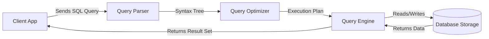

# Unit 2 Part 1: Foundations of SQL

Welcome to the exciting world of databases! In this unit, we will learn SQL from absolute scratch. By the end of this chapter, you will understand how SQL works behind the scenes, and you will be able to write your first database queries. 

Our ongoing project for this course will be a **Student Management System**. Every concept will be explained using this real-world database.

---

## 1. What is SQL?

### Definition
**SQL (Structured Query Language)** is a standardized programming language that is used to manage and manipulate relational databases. It allows you to create, read, update, and delete data stored in tables.

### Why it is needed
Imagine a university with 50,000 students. If we stored their data in a plain text file, finding a specific student's phone number would mean reading the file line by line. SQL gives us a way to "talk" to the database and instantly retrieve exactly what we want without writing complex programs.

### Real-world analogy
Think of a database as a massive library, and SQL as the **Librarian**. 
- You do not go searching for the book yourself. 
- You give an instruction to the librarian: *"Get me all books by author 'J.K. Rowling' published after 2005."*
- The librarian (SQL) understands your request, fetches the books, and hands them to you.

### Real-world database example
When you open an app like Instagram and search for a username, the app runs a SQL query in the background to fetch that user's profile from millions of records.

---

## 2. History of SQL

- **1970:** Dr. Edgar F. Codd published a paper on the Relational Database Model.
- **1974:** IBM developed the first prototype language based on Codd's model, calling it **SEQUEL** (Structured English Query Language).
- **1979:** Oracle released the first commercial relational database and introduced the SQL language to the market.
- **Why the name changed:** "SEQUEL" was a trademark of an aircraft company, so it was shortened to **SQL**.

---

## 3. Why SQL was Invented?

Before SQL, databases used the **Navigational Model**. Programmers had to write complex code specifying *how* to navigate through records memory-pointer by memory-pointer.

SQL was invented to be **Declarative**. 
- **Procedural (Before SQL):** Go to shelf A, look at book 1, if it's math keep it, else move to book 2...
- **Declarative (SQL):** Give me all math books. (You state *what* you want, not *how* to get it).

---

## 4. DBMS vs SQL

> [!CAUTION]
> **Common Mistake:** Students often confuse SQL with a DBMS (Database Management System). They are NOT the same.

| Feature | DBMS (Database Management System) | SQL (Structured Query Language) |
| :--- | :--- | :--- |
| **What is it?** | A software application used to manage data. | A language used to communicate with the DBMS. |
| **Examples** | MySQL, Oracle, PostgreSQL, SQL Server. | `SELECT`, `INSERT`, `UPDATE`, `DELETE`. |
| **Analogy** | The Engine of a car. | The Steering Wheel & Pedals used to control the engine. |

---

## 5. SQL Standard

SQL is governed by **ANSI** (American National Standards Institute) and **ISO** (International Organization for Standardization). Because it is standardized, if you learn SQL for MySQL, you already know 95% of the SQL needed for Oracle, SQL Server, or PostgreSQL. The core commands are identical!

---

## 6. Features of SQL

1. **High-Level Language:** It uses simple English words like `SELECT`, `FROM`, `WHERE`.
2. **Declarative:** You specify the desired result, not the execution steps.
3. **Interactive & Embedded:** You can run SQL directly in a terminal, or embed it inside Python/Java code.
4. **Client-Server Architecture:** SQL allows multiple users to connect to a central database simultaneously.

---

## 7. Types of SQL Commands

SQL commands are grouped into five major categories. *(We will dive deep into these in future chapters, but here is a brief overview).*

1. **DDL (Data Definition Language):** Defines the structure. (`CREATE`, `ALTER`, `DROP`)
2. **DML (Data Manipulation Language):** Manipulates the data. (`INSERT`, `UPDATE`, `DELETE`)
3. **DQL (Data Query Language):** Retrieves data. (`SELECT`)
4. **DCL (Data Control Language):** Manages permissions. (`GRANT`, `REVOKE`)
5. **TCL (Transaction Control Language):** Manages transactions. (`COMMIT`, `ROLLBACK`)

---

## 8. SQL Execution Process (How it works internally)

When you type a query and press Enter, what happens inside the computer?



### Step-by-Step Explanation:
1. **Query Parser:** Checks your SQL for spelling and grammar (Syntax check). If you type `SELETC` instead of `SELECT`, it stops here and gives an error.
2. **Query Optimizer:** Finds the fastest way to get your data. It generates multiple "Execution Plans" and picks the cheapest one (saves CPU and memory).
3. **Query Engine:** Executes the chosen plan.
4. **Storage Engine:** Physically accesses the hard drive to read or write data blocks.

---

## 9. SQL Environment and Installing MySQL

To practice SQL, you need a Database Server and a Database Client.
- **Server:** The background software storing the data (e.g., MySQL Server).
- **Client:** The interface where you type commands (e.g., MySQL Workbench, Command Line).

**Quick Installation Steps (Windows/Mac):**
1. Download **MySQL Installer** from the official website.
2. Install **MySQL Server** (the engine).
3. Install **MySQL Workbench** (the graphical UI).
4. Set a strong password for the `root` user during setup.

---

## 10. Fundamentals of SQL Syntax

### A. SQL Syntax Rules
- SQL is **Case-Insensitive** for keywords (`select` is the same as `SELECT`).
- Best practice: Write keywords in UPPERCASE and table/column names in lowercase.
- Every SQL statement must end with a semicolon `;`.

### B. Identifiers and Naming Conventions
An identifier is a name you give to a database, table, or column.

**Rules for Identifiers:**
- Must begin with a letter (a-z, A-Z) or an underscore `_`.
- Can contain letters, numbers, and underscores.
- Cannot contain spaces. (Use `first_name`, NOT `first name`).
- Cannot be a reserved SQL keyword (like `SELECT`, `TABLE`).

**Examples 1-5: Identifiers**
```sql
-- Ex 1: Valid
CREATE TABLE student_details;

-- Ex 2: Valid
CREATE TABLE _backup_2023;

-- Ex 3: Invalid (Starts with a number)
-- CREATE TABLE 1st_year_students;

-- Ex 4: Invalid (Contains a space)
-- CREATE TABLE student marks;

-- Ex 5: Invalid (Uses a reserved keyword)
-- CREATE TABLE select;
```

### C. Keywords
Keywords are reserved words that SQL uses to understand commands. Examples: `CREATE`, `TABLE`, `INT`, `VARCHAR`, `PRIMARY KEY`.

### D. Data Types
When creating a table, you must tell SQL what *type* of data each column will hold.

1. **Numeric:**
   - `INT`: Whole numbers. (e.g., 10, -5, 1000)
   - `DECIMAL(M, D)`: Exact decimals. `M` is total digits, `D` is digits after decimal. (e.g., `DECIMAL(5,2)` holds `999.99`).
2. **String (Text):**
   - `CHAR(N)`: Fixed-length string. (e.g., `CHAR(1)` for 'M' or 'F'). Pads with spaces if shorter.
   - `VARCHAR(N)`: Variable-length string. Maximum length N. Best for names, emails.
3. **Date and Time:**
   - `DATE`: Stores date as 'YYYY-MM-DD'.
   - `DATETIME`: Stores date and time 'YYYY-MM-DD HH:MM:SS'.

**Examples 6-15: Data Types Conceptual Usage**
```sql
-- Ex 6: Age of a student
age INT

-- Ex 7: Price of a course
price DECIMAL(6,2) 

-- Ex 8: Gender (M/F)
gender CHAR(1)

-- Ex 9: Student First Name
first_name VARCHAR(50)

-- Ex 10: Date of Birth
dob DATE

-- Ex 11: Timestamp of login
last_login DATETIME

-- Ex 12: Boolean (True/False often represented as TINYINT in MySQL)
is_active TINYINT

-- Ex 13: Phone number (Stored as string to preserve leading zeros)
phone VARCHAR(15)

-- Ex 14: Long description
bio TEXT

-- Ex 15: Single character blood group (e.g., A, B, O)
blood_type VARCHAR(3)
```

---

## 11. Creating Our First Database

Let's build the **Student Management System**.

**Examples 16-17: Database Management**
```sql
-- Ex 16: Creating the database
CREATE DATABASE student_management_system;

-- Ex 17: Telling SQL we want to use this specific database
USE student_management_system;
```

---

## 12. Creating Tables (The Core 7 Tables)

We need to create the skeleton of our system. 

> [!TIP]
> **Best Practice:** Always define a `PRIMARY KEY`. It is a unique identifier for every row (like a Roll Number).

**Examples 18-24: Creating Tables**

```sql
-- Ex 18: Departments Table
CREATE TABLE departments (
    dept_id INT PRIMARY KEY,
    dept_name VARCHAR(50)
);

-- Ex 19: Faculty Table
CREATE TABLE faculty (
    faculty_id INT PRIMARY KEY,
    first_name VARCHAR(50),
    last_name VARCHAR(50),
    email VARCHAR(100),
    dept_id INT
);

-- Ex 20: Students Table
CREATE TABLE students (
    student_id INT PRIMARY KEY,
    first_name VARCHAR(50),
    last_name VARCHAR(50),
    dob DATE,
    gender CHAR(1),
    phone VARCHAR(15),
    dept_id INT
);

-- Ex 21: Courses Table
CREATE TABLE courses (
    course_id INT PRIMARY KEY,
    course_name VARCHAR(100),
    credits INT,
    faculty_id INT
);

-- Ex 22: Enrollments Table (Which student took which course)
CREATE TABLE enrollments (
    enrollment_id INT PRIMARY KEY,
    student_id INT,
    course_id INT,
    enrollment_date DATE
);

-- Ex 23: Marks Table
CREATE TABLE marks (
    mark_id INT PRIMARY KEY,
    enrollment_id INT,
    exam_name VARCHAR(50),
    marks_obtained DECIMAL(5,2)
);

-- Ex 24: Attendance Table
CREATE TABLE attendance (
    attendance_id INT PRIMARY KEY,
    student_id INT,
    course_id INT,
    attendance_date DATE,
    status CHAR(1) -- 'P' for Present, 'A' for Absent
);
```

---

## 13. Running First Queries (Inserting & Selecting)

Before we can retrieve data, we must insert some dummy data into our `students` table.

**Examples 25-31: Inserting Data**
```sql
-- Ex 25: Inserting a single student
INSERT INTO students (student_id, first_name, last_name, dob, gender, phone, dept_id)
VALUES (101, 'Rahul', 'Sharma', '2004-05-14', 'M', '9876543210', 1);

-- Ex 26: Inserting another student
INSERT INTO students (student_id, first_name, last_name, dob, gender, phone, dept_id)
VALUES (102, 'Priya', 'Singh', '2003-11-22', 'F', '9123456780', 2);

-- Ex 27: Inserting missing data (Null phone)
INSERT INTO students (student_id, first_name, last_name, dob, gender, dept_id)
VALUES (103, 'Amit', 'Patel', '2004-01-10', 'M', 1);

-- Ex 28: Insert Department 1
INSERT INTO departments (dept_id, dept_name) VALUES (1, 'Computer Science');

-- Ex 29: Insert Department 2
INSERT INTO departments (dept_id, dept_name) VALUES (2, 'Mechanical Engg');

-- Ex 30: Insert Faculty
INSERT INTO faculty (faculty_id, first_name, last_name, dept_id) 
VALUES (1, 'Dr. Anil', 'Kumar', 1);

-- Ex 31: Insert Course
INSERT INTO courses (course_id, course_name, credits, faculty_id) 
VALUES (1001, 'Database Systems', 4, 1);
```

### The `SELECT` Command
The most important command in SQL is `SELECT`. It retrieves data.

**Syntax:**
`SELECT column1, column2 FROM table_name;`

**Examples 32-40: Basic Queries**

```sql
-- Ex 32: Retrieve everything from the students table (* means ALL columns)
SELECT * FROM students;
```
**Output Table 32:**
| student_id | first_name | last_name | dob | gender | phone | dept_id |
| :--- | :--- | :--- | :--- | :--- | :--- | :--- |
| 101 | Rahul | Sharma | 2004-05-14 | M | 9876543210 | 1 |
| 102 | Priya | Singh | 2003-11-22 | F | 9123456780 | 2 |
| 103 | Amit | Patel | 2004-01-10 | M | NULL | 1 |

```sql
-- Ex 33: Retrieve only specific columns (First name and Phone)
SELECT first_name, phone FROM students;

-- Ex 34: Give columns temporary names (Aliases) using 'AS'
SELECT first_name AS "Student Name", dob AS "Date of Birth" FROM students;

-- Ex 35: Basic Filtering using WHERE (Find students in dept 1)
SELECT * FROM students WHERE dept_id = 1;

-- Ex 36: Filter by text (Find female students)
SELECT * FROM students WHERE gender = 'F';

-- Ex 37: View all departments
SELECT * FROM departments;

-- Ex 38: Find specific course
SELECT course_name, credits FROM courses WHERE course_id = 1001;

-- Ex 39: Select faculty names
SELECT first_name, last_name FROM faculty;

-- Ex 40: Empty selection (Table exists, but no data yet)
SELECT * FROM marks;
```

---

## 14. Summary

- SQL is the language used to communicate with Relational Databases.
- It is declarative (you state what you want, not how).
- The query execution goes through parsing, optimizing, and execution.
- Identifiers must follow naming conventions (no spaces, no reserved words).
- We created a `student_management_system` with 7 core tables: `students`, `departments`, `faculty`, `courses`, `enrollments`, `marks`, `attendance`.

---

## End of Unit Assessments

### 15. Multiple Choice Questions (20 MCQs)

1. **What does SQL stand for?**
   a) Simple Query Language
   b) Structured Query Language
   c) Standard Query Language
   d) System Query Language
   *(Ans: b)*
2. **Which of the following is NOT a DBMS?**
   a) MySQL
   b) Oracle
   c) SQL Server
   d) SQL
   *(Ans: d)*
3. **Who originally proposed the relational database model?**
   a) Bill Gates
   b) Steve Jobs
   c) E.F. Codd
   d) James Gosling
   *(Ans: c)*
4. **Which SQL component checks for spelling mistakes in queries?**
   a) Optimizer
   b) Parser
   c) Execution Engine
   d) Storage Engine
   *(Ans: b)*
5. **Which keyword is used to retrieve data from a table?**
   a) EXTRACT
   b) GET
   c) SELECT
   d) FETCH
   *(Ans: c)*
6. **SQL is considered which type of language?**
   a) Procedural
   b) Object-Oriented
   c) Declarative
   d) Functional
   *(Ans: c)*
7. **Which symbol is used to select all columns in a table?**
   a) %
   b) *
   c) &
   d) #
   *(Ans: b)*
8. **What was the original name of SQL?**
   a) QUEL
   b) SEQUEL
   c) MYSQL
   d) RDBMS
   *(Ans: b)*
9. **Which data type is best for storing a phone number like '0987654321'?**
   a) INT
   b) DECIMAL
   c) VARCHAR
   d) DATE
   *(Ans: c)*
10. **Which command is used to create a new database?**
    a) MAKE DATABASE
    b) BUILD DATABASE
    c) CREATE DATABASE
    d) NEW DATABASE
    *(Ans: c)*
11. **Which of the following is an invalid identifier in SQL?**
    a) first_name
    b) _first_name
    c) 1st_name
    d) firstName
    *(Ans: c)*
12. **Which organization standardizes SQL?**
    a) IEEE
    b) ANSI
    c) W3C
    d) IETF
    *(Ans: b)*
13. **Which statement is used to filter rows?**
    a) FILTER
    b) WHERE
    c) HAVING
    d) SELECT
    *(Ans: b)*
14. **To define a column for Student Age, which data type is appropriate?**
    a) CHAR
    b) VARCHAR
    c) INT
    d) DATE
    *(Ans: c)*
15. **To change the temporary display name of a column in output, we use:**
    a) RENAME
    b) ALIAS
    c) AS
    d) LIKE
    *(Ans: c)*
16. **Is SQL case-sensitive for its reserved keywords?**
    a) Yes
    b) No
    *(Ans: b)*
17. **Which table in our system links a student to a course?**
    a) faculty
    b) marks
    c) enrollments
    d) attendance
    *(Ans: c)*
18. **Which SQL command ends a query?**
    a) Colon (:)
    b) Period (.)
    c) Semicolon (;)
    d) Comma (,)
    *(Ans: c)*
19. **What does the Query Optimizer do?**
    a) Formats the text
    b) Checks permissions
    c) Finds the fastest execution plan
    d) Writes to disk
    *(Ans: c)*
20. **Which is a valid syntax to use a database named 'college'?**
    a) SELECT college;
    b) OPEN college;
    c) USE college;
    d) GO college;
    *(Ans: c)*

---

### 16. Viva Questions (20)

1. What is the main difference between a DBMS and SQL?
2. Explain why SQL is called a declarative language.
3. What is the difference between CHAR and VARCHAR? Give an example.
4. Why do we store phone numbers as VARCHAR instead of INT?
5. What happens during the Query Parsing phase?
6. Can a table identifier contain spaces? Why or why not?
7. What is the role of the Query Optimizer?
8. Name the five main categories of SQL commands.
9. What does the `*` mean in `SELECT *`?
10. How do you give a column a temporary name in your result set?
11. What is ANSI, and why does it matter for SQL?
12. Describe the original name of SQL and why it was changed.
13. If you type `select` instead of `SELECT`, will it cause an error?
14. What data type would you use for a student's Date of Birth?
15. What is the purpose of the `USE database_name;` command?
16. How does the Client-Server architecture work in databases?
17. Name three standard data types used in MySQL.
18. In our Student Management System, why do we need an `enrollments` table?
19. What is a primary key, fundamentally?
20. What is a reserved keyword? Give an example.

---

### 17. Practice Questions (20)

*Write the SQL commands for the following scenarios based on the Student Management System.*

1. Write a query to create a database named `university_db`.
2. Write a query to select the `university_db` for use.
3. Create a table `clubs` with columns `club_id` (INT) and `club_name` (VARCHAR).
4. Insert a new club named 'Robotics' with ID 1 into `clubs`.
5. Write a query to retrieve all data from the `courses` table.
6. Write a query to retrieve only the `course_name` and `credits` from `courses`.
7. Retrieve all students from the `students` table who are in `dept_id = 2`.
8. Write a query to find all male students in the system.
9. How do you display the `first_name` of students as "Student Name"?
10. Insert a new department with `dept_id = 3` and `dept_name = 'Electrical'`.
11. Create a table `hostel` with `room_no` (INT) and `student_id` (INT).
12. Write a query to fetch all data from `faculty`.
13. Retrieve the `email` of the faculty member with `faculty_id = 1`.
14. Insert a new student named 'Kavya' 'Rao', born '2005-08-11', Female, Dept 3.
15. Write a query to fetch the date of birth of student with ID 101.
16. Display all departments.
17. Select all enrollments.
18. Insert a record into `attendance` for student 101, course 1001, date '2024-01-15', status 'P'.
19. Retrieve attendance status for student 101.
20. Show the names of all courses that have 4 credits.

---

### 18. Assignment Questions (10)

1. **Theoretical Concept:** Draw the architecture diagram of the SQL Execution Process. Explain the role of the Parser and Optimizer in your own words.
2. **Analysis:** Compare the Navigational Database model with the Relational model. Why did the industry shift towards SQL?
3. **Syntax Validation:** Identify which of the following table names are valid in SQL. For the invalid ones, explain why: `1st_semester`, `student marks`, `_employee_data`, `select`.
4. **Data Type Selection:** Design the columns and choose appropriate data types for a `Library_Books` table. Ensure you capture title, author, price, publish date, and ISBN (can contain hyphens).
5. **Practical Coding:** Write the exact SQL statements to recreate the `students` and `departments` tables from scratch on your local MySQL machine.
6. **Data Insertion:** Write SQL `INSERT` statements to add 5 of your classmates into the `students` table.
7. **Query Writing:** Write a query that returns the full names of all students, but renames the columns to `First_Name` and `Last_Name` in the output.
8. **Filtering:** Write a query to find all faculty members belonging to department 1. 
9. **Debugging:** The following query has a bug: `SELECT first name FROM students WHERE gender = M;` Identify all the errors and write the correct version.
10. **System Design:** In our Student Management System, if we wanted to track "Library Fines" for students, propose a new table structure (Columns and Data Types). Write the `CREATE TABLE` query for it.
