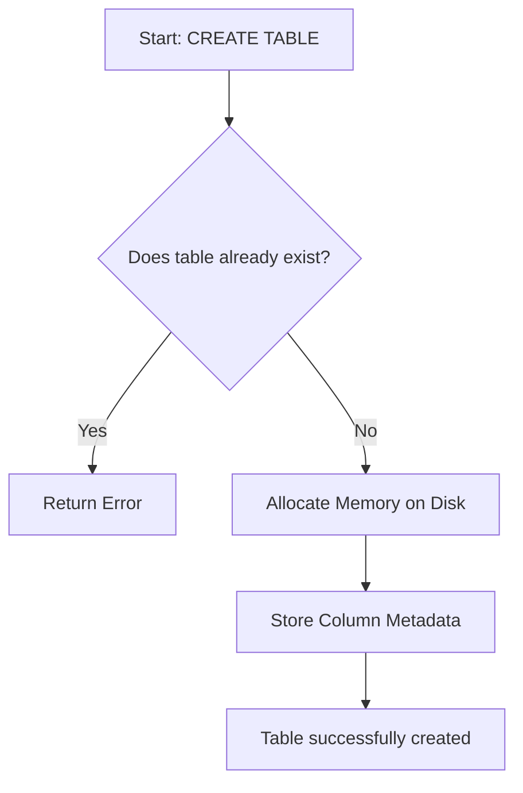
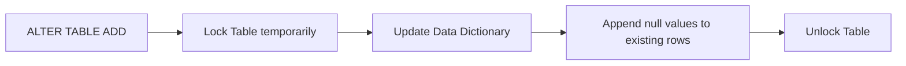
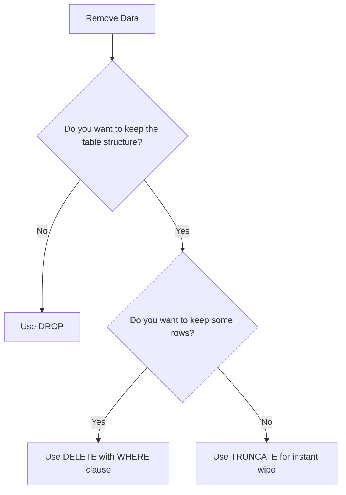

# Unit 2 Part 2: Data Definition Language (DDL) Commands

Welcome back! In Part 1, we learned the fundamentals of SQL and how it works internally. Now, it is time to take full control of the database structure using **DDL (Data Definition Language)** commands.

DDL commands act like the **Architects** of our database. They do not deal with the actual data (like inserting a student's name), but they define the structure (the blueprint) that holds the data.

Our ongoing project remains the **Student Management System**.

---

## What is DDL?

Data Definition Language (DDL) is a subset of SQL used to create, modify, and destroy the structure of database objects (like databases, tables, and views).

**Key characteristics of DDL:**
- DDL commands are **Auto-Committed**. This means the moment you run them, the change is permanent. You cannot undo (rollback) a DDL command!

---

## 1. The `CREATE` Command

### Definition & Purpose
The `CREATE` command is used to build a brand new database or a new table inside an existing database. 

### Real-World Example
When a university establishes a new department, the IT admin uses the `CREATE` command to set up a new table to store that department's data.

### Internal Working & Execution Process
1. The parser checks syntax.
2. The engine verifies you have permission to create objects.
3. The storage engine allocates physical space on the hard drive for the new table's metadata and data blocks.

### Flow Diagram


### Syntax
```sql
CREATE DATABASE database_name;

CREATE TABLE table_name (
    column1 datatype constraints,
    column2 datatype constraints
);
```

### Examples 1-15: Creating Databases and Tables

```sql
-- Ex 1: Creating the master database
CREATE DATABASE student_management_system;

-- Ex 2: Selecting the database
USE student_management_system;

-- Ex 3: Creating Departments Table
CREATE TABLE departments (
    dept_id INT,
    dept_name VARCHAR(100)
);

-- Ex 4: Creating Courses Table
CREATE TABLE courses (
    course_id INT,
    course_name VARCHAR(50),
    credits INT
);

-- Ex 5: Creating Students Table
CREATE TABLE students (
    student_id INT,
    first_name VARCHAR(50),
    last_name VARCHAR(50),
    dob DATE
);

-- Ex 6: Creating Faculty Table
CREATE TABLE faculty (
    faculty_id INT,
    faculty_name VARCHAR(100),
    specialization VARCHAR(50)
);

-- Ex 7: Creating Enrollments Table
CREATE TABLE enrollments (
    enrollment_id INT,
    student_id INT,
    course_id INT
);

-- Ex 8: Creating Marks Table
CREATE TABLE marks (
    mark_id INT,
    student_id INT,
    score DECIMAL(5,2)
);

-- Ex 9: Creating Attendance Table
CREATE TABLE attendance (
    date DATE,
    student_id INT,
    status CHAR(1)
);

-- Ex 10: Creating a Backup Table for old students
CREATE TABLE alumni (
    alumni_id INT,
    name VARCHAR(100),
    graduation_year INT
);

-- Ex 11: Creating a Library Table
CREATE TABLE library (
    book_id INT,
    book_name VARCHAR(100)
);

-- Ex 12: Creating an Events Table
CREATE TABLE events (
    event_id INT,
    event_name VARCHAR(100),
    event_date DATE
);

-- Ex 13: Creating a Hostels Table
CREATE TABLE hostels (
    hostel_id INT,
    hostel_name VARCHAR(50)
);

-- Ex 14: Creating a Transport Table
CREATE TABLE transport (
    bus_id INT,
    driver_name VARCHAR(50),
    route VARCHAR(100)
);

-- Ex 15: Creating an Exams Schedule Table
CREATE TABLE exam_schedule (
    exam_id INT,
    subject VARCHAR(50),
    exam_date DATE
);
```

---

## 2. The `ALTER` Command

### Definition & Purpose
The `ALTER` command is used to modify the structure of an existing table without dropping it. It is incredibly useful because requirements change over time.

You can use `ALTER` to:
1. Add a new column.
2. Drop (Delete) an existing column.
3. Modify the data type of a column.
4. Rename a column.

### Real-World Example
A year after the Student Management System was built, the university decides to collect the 'Blood Group' of every student for emergency purposes. Instead of deleting the table and recreating it (which would erase all data), the admin uses `ALTER` to add the `blood_group` column.

### Syntax
```sql
-- Adding a column
ALTER TABLE table_name ADD column_name datatype;

-- Dropping a column
ALTER TABLE table_name DROP COLUMN column_name;

-- Modifying a datatype
ALTER TABLE table_name MODIFY column_name new_datatype;

-- Renaming a column (MySQL 8.0+)
ALTER TABLE table_name RENAME COLUMN old_name TO new_name;
```

### Flow Diagram (Adding a Column)


### Examples 16-35: Using ALTER Command

#### Adding Columns
```sql
-- Ex 16: Add email to students
ALTER TABLE students ADD email VARCHAR(100);

-- Ex 17: Add phone number to students
ALTER TABLE students ADD phone_number VARCHAR(15);

-- Ex 18: Add blood group to students
ALTER TABLE students ADD blood_group VARCHAR(5);

-- Ex 19: Add room_number to hostels
ALTER TABLE hostels ADD room_number INT;

-- Ex 20: Add experience_years to faculty
ALTER TABLE faculty ADD experience_years INT;
```

#### Modifying Data Types
```sql
-- Ex 21: Change phone_number length from 15 to 20
ALTER TABLE students MODIFY phone_number VARCHAR(20);

-- Ex 22: Change blood_group to CHAR(3) for exact length
ALTER TABLE students MODIFY blood_group CHAR(3);

-- Ex 23: Change course_name in courses to allow 100 characters
ALTER TABLE courses MODIFY course_name VARCHAR(100);

-- Ex 24: Change score in marks to allow 3 decimal places
ALTER TABLE marks MODIFY score DECIMAL(6,3);

-- Ex 25: Modify specialization in faculty to TEXT
ALTER TABLE faculty MODIFY specialization TEXT;
```

#### Renaming Columns
```sql
-- Ex 26: Rename phone_number to contact_no
ALTER TABLE students RENAME COLUMN phone_number TO contact_no;

-- Ex 27: Rename dob to date_of_birth
ALTER TABLE students RENAME COLUMN dob TO date_of_birth;

-- Ex 28: Rename faculty_name to full_name
ALTER TABLE faculty RENAME COLUMN faculty_name TO full_name;

-- Ex 29: Rename score to marks_obtained
ALTER TABLE marks RENAME COLUMN score TO marks_obtained;

-- Ex 30: Rename driver_name to pilot_name in transport
ALTER TABLE transport RENAME COLUMN driver_name TO pilot_name;
```

#### Dropping Columns
```sql
-- Ex 31: Drop the email column (Maybe they decided to use university emails only)
ALTER TABLE students DROP COLUMN email;

-- Ex 32: Drop blood_group
ALTER TABLE students DROP COLUMN blood_group;

-- Ex 33: Drop specialization from faculty
ALTER TABLE faculty DROP COLUMN specialization;

-- Ex 34: Drop route from transport
ALTER TABLE transport DROP COLUMN route;

-- Ex 35: Drop graduation_year from alumni
ALTER TABLE alumni DROP COLUMN graduation_year;
```

---

## 3. The `DROP` Command

### Definition & Purpose
The `DROP` command completely destroys an object in the database. When you drop a table, the table structure AND all the data inside it are permanently deleted from the hard drive.

> [!CAUTION]
> **Extremely Dangerous!** There is no Recycle Bin in SQL for dropped tables. Once dropped, it is gone forever unless you have backups.

### Syntax
```sql
DROP TABLE table_name;
DROP DATABASE database_name;
```

### Examples 36-40: Dropping Tables

```sql
-- Ex 36: Drop the temporary events table
DROP TABLE events;

-- Ex 37: Drop the transport table
DROP TABLE transport;

-- Ex 38: Drop the hostels table
DROP TABLE hostels;

-- Ex 39: Drop the library table
DROP TABLE library;

-- Ex 40: Drop an entire database (Do not run in production!)
-- DROP DATABASE old_student_system;
```

---

## 4. The `TRUNCATE` Command

### Definition & Purpose
The `TRUNCATE` command is used to delete ALL the rows inside a table, but it **keeps the table structure intact**. It is like emptying a box without destroying the box itself.

### Internal Working (Why TRUNCATE is extremely fast)
Unlike `DELETE`, which removes rows one by one and logs each deletion (which is slow), `TRUNCATE` simply deallocates the data pages memory. It resets the table instantly.

### Flow Diagram: DROP vs TRUNCATE vs DELETE


### Syntax
```sql
TRUNCATE TABLE table_name;
```

### Examples 41-45: Truncating Tables

```sql
-- Ex 41: Empty all records from attendance at the end of the year
TRUNCATE TABLE attendance;

-- Ex 42: Clear all marks before a new semester begins
TRUNCATE TABLE marks;

-- Ex 43: Wipe the enrollments table
TRUNCATE TABLE enrollments;

-- Ex 44: Clear the alumni table
TRUNCATE TABLE alumni;

-- Ex 45: Truncate exam_schedule
TRUNCATE TABLE exam_schedule;
```

---

## 5. The `RENAME` Command

### Definition & Purpose
The `RENAME` command is used to change the name of an existing table.

### Syntax
```sql
RENAME TABLE old_table_name TO new_table_name;
```

### Examples 46-50: Renaming Tables

```sql
-- Ex 46: Rename alumni to graduates
RENAME TABLE alumni TO graduates;

-- Ex 47: Rename marks to exam_results
RENAME TABLE marks TO exam_results;

-- Ex 48: Rename enrollments to student_courses
RENAME TABLE enrollments TO student_courses;

-- Ex 49: Rename faculty to teachers
RENAME TABLE faculty TO teachers;

-- Ex 50: Rename exam_schedule to time_table
RENAME TABLE exam_schedule TO time_table;
```

---

## 6. Difference between DROP, TRUNCATE, and DELETE

This is the most frequently asked question in technical interviews and viva!

| Feature | `DROP` | `TRUNCATE` | `DELETE` |
| :--- | :--- | :--- | :--- |
| **Command Type** | DDL | DDL | DML |
| **What does it do?** | Deletes the table entirely (structure + data). | Deletes all rows, keeps structure. | Deletes specific rows (or all rows). |
| **WHERE clause** | Cannot use WHERE. | Cannot use WHERE. | Can use WHERE. |
| **Speed** | Very Fast. | Very Fast. | Slow (logs every row deletion). |
| **Rollback (Undo)**| Cannot be rolled back. | Cannot be rolled back. | Can be rolled back (if inside a transaction). |
| **Analogy** | Burning down the house. | Throwing all furniture out, keeping the house. | Taking out specific pieces of furniture. |

### Examples 51-60: Comparing the three

```sql
-- Ex 51: DML DELETE - Delete a specific student (Slow, log generated)
-- DELETE FROM students WHERE student_id = 101;

-- Ex 52: DML DELETE - Delete all students (Slower than truncate)
-- DELETE FROM students;

-- Ex 53: DDL TRUNCATE - Empty the table instantly (No log generated)
-- TRUNCATE TABLE students;

-- Ex 54: DDL DROP - Destroy the table
-- DROP TABLE students;

-- Let's create a temporary dummy table to test them
-- Ex 55: Create dummy
CREATE TABLE dummy_table (id INT, name VARCHAR(10));

-- Ex 56: Add data (Assume data is inserted here)

-- Ex 57: Attempting to truncate with a condition (WILL FAIL)
-- TRUNCATE TABLE dummy_table WHERE id = 1; -- Error! TRUNCATE doesn't support WHERE.

-- Ex 58: The correct way to remove specific row is DELETE
-- DELETE FROM dummy_table WHERE id = 1;

-- Ex 59: Truncating the rest
TRUNCATE TABLE dummy_table;

-- Ex 60: Dropping the dummy table to clean up
DROP TABLE dummy_table;
```

---

## Summary

- **DDL (Data Definition Language)** shapes the structure of the database.
- `CREATE` builds new structures.
- `ALTER` modifies existing structures (ADD, DROP, RENAME, MODIFY columns).
- `DROP` completely destroys a table and its data permanently.
- `TRUNCATE` quickly empties all data from a table, leaving the structure ready for new data.
- `RENAME` changes the name of a table.
- Remember: `DROP` is DDL, `TRUNCATE` is DDL, but `DELETE` is DML!

---

## End of Unit Assessments

### Multiple Choice Questions (20 MCQs)

1. **Which of the following is NOT a DDL command?**
   a) CREATE  
   b) ALTER  
   c) DELETE  
   d) DROP  
   *(Ans: c)*
2. **Which command removes all rows from a table but keeps the structure?**
   a) DROP  
   b) REMOVE  
   c) DELETE  
   d) TRUNCATE  
   *(Ans: d)*
3. **If you need to change the data type of a column, which command is used?**
   a) UPDATE TABLE  
   b) MODIFY TABLE  
   c) ALTER TABLE  
   d) CHANGE TABLE  
   *(Ans: c)*
4. **Is it possible to use a WHERE clause with the TRUNCATE command?**
   a) Yes  
   b) No  
   *(Ans: b)*
5. **Which command permanently destroys the table from the hard drive?**
   a) TRUNCATE  
   b) DELETE  
   c) DROP  
   d) ERASE  
   *(Ans: c)*
6. **To add a column named `email` to the `students` table, the correct syntax is:**
   a) ALTER TABLE students INSERT email VARCHAR(50);  
   b) UPDATE TABLE students ADD email VARCHAR(50);  
   c) ALTER TABLE students ADD email VARCHAR(50);  
   d) CREATE COLUMN email IN students;  
   *(Ans: c)*
7. **DDL commands are auto-committed.**
   a) True  
   b) False  
   *(Ans: a)*
8. **Which keyword is used to rename a column in MySQL 8.0?**
   a) CHANGE  
   b) REPLACE  
   c) RENAME COLUMN  
   d) MODIFY NAME  
   *(Ans: c)*
9. **Why is TRUNCATE faster than DELETE?**
   a) It deletes the table  
   b) It does not log individual row deletions  
   c) It runs on SSDs only  
   d) It skips the parser  
   *(Ans: b)*
10. **Which command is used to rename a table?**
    a) ALTER TABLE RENAME  
    b) RENAME TABLE  
    c) CHANGE TABLE NAME  
    d) UPDATE TABLE NAME  
    *(Ans: b)*
11. **Can we rollback a dropped table?**
    a) Yes  
    b) No  
    *(Ans: b)*
12. **Which of the following is a DML command?**
    a) DROP  
    b) TRUNCATE  
    c) ALTER  
    d) DELETE  
    *(Ans: d)*
13. **To drop a column `dob` from `students`, what is the query?**
    a) ALTER TABLE students DELETE dob;  
    b) DROP COLUMN dob FROM students;  
    c) ALTER TABLE students DROP COLUMN dob;  
    d) ALTER TABLE students REMOVE dob;  
    *(Ans: c)*
14. **What happens to the data when `ALTER TABLE` is used to add a new column?**
    a) The table is emptied  
    b) The new column is populated with NULLs for existing rows  
    c) The command fails if there is data  
    d) Existing rows are deleted  
    *(Ans: b)*
15. **Which object type does `CREATE` apply to?**
    a) Database  
    b) Table  
    c) Both a and b  
    d) Rows  
    *(Ans: c)*
16. **If you TRUNCATE a table, does the primary key counter (auto_increment) reset?**
    a) Yes  
    b) No  
    *(Ans: a)*
17. **If you DELETE all rows from a table, does the auto_increment counter reset?**
    a) Yes  
    b) No  
    *(Ans: b)*
18. **Which of these is the correct syntax to drop a database?**
    a) DELETE DATABASE db_name;  
    b) DROP DATABASE db_name;  
    c) TRUNCATE DATABASE db_name;  
    d) REMOVE DATABASE db_name;  
    *(Ans: b)*
19. **What represents the 'blueprint' of the database?**
    a) Data Rows  
    b) DML  
    c) Table Structure / Schema  
    d) Constraints  
    *(Ans: c)*
20. **In the diagram comparing DROP, TRUNCATE, and DELETE, which one is likened to "burning down the house"?**
    a) DELETE  
    b) TRUNCATE  
    c) DROP  
    d) None  
    *(Ans: c)*

---

### Viva Questions (20)

1. Explain the difference between DDL and DML.
2. Why is DDL auto-committed? What does auto-commit mean?
3. What is the syntax to create a table? Explain the parameters.
4. When would you use ALTER instead of DROP and CREATE?
5. What are the four main operations you can perform with the ALTER command?
6. Explain the difference between DROP and TRUNCATE.
7. Explain the difference between TRUNCATE and DELETE.
8. If you want to remove all students from a table but keep the table ready for next year, which command should you use and why?
9. Why is TRUNCATE considered faster than DELETE?
10. Can you use a WHERE clause with TRUNCATE? Why or why not?
11. What is the syntax to change a column's data type?
12. What happens to existing data in a column if you change its data type from INT to VARCHAR?
13. How do you add a new column to an existing table?
14. How do you rename a table in SQL?
15. What are the dangers of using the DROP command in a production environment?
16. Walk me through the execution flow of an ALTER TABLE command when adding a column.
17. What is a "schema" in relational databases?
18. Can you drop multiple tables in a single DROP command? (Answer: Yes, `DROP TABLE t1, t2;`)
19. If an ALTER command fails halfway through, what happens to the table?
20. Give a real-world scenario where you would need to rename a column.

---

### Practice Questions (20)

*Write the SQL commands for the following scenarios based on the Student Management System.*

1. Create a table `clubs` with columns `club_id` (INT) and `club_name` (VARCHAR 50).
2. Add a new column `established_year` (INT) to the `clubs` table.
3. Modify the `club_name` data type to VARCHAR(100).
4. Rename the column `club_name` to `name_of_club`.
5. Drop the `established_year` column from `clubs`.
6. Rename the `clubs` table to `student_organizations`.
7. Create a temporary table called `test_table` with `id` INT.
8. Truncate the `test_table`.
9. Drop the `test_table` completely.
10. Write the query to add a column `office_number` to `teachers` (formerly faculty).
11. The university wants to store emergency contacts. Add `emergency_phone` VARCHAR(15) to `students`.
12. Delete all records from `student_courses` (formerly enrollments) instantly using a DDL command.
13. Rename the column `score` to `final_score` in the `exam_results` table.
14. Create a database called `temp_university`.
15. Drop the database `temp_university`.
16. Alter the `students` table to drop the `contact_no` column.
17. Modify `date_of_birth` in `students` to be a `DATETIME` data type instead of `DATE`.
18. Rename the `departments` table to `academic_departments`.
19. Assume `academic_departments` has a column `dept_id`. Rename it to `department_id`.
20. Write a query to completely destroy the `exam_results` table.

---

### Assignment Questions (10)

1. **Theoretical Concept:** Draw a diagram highlighting the differences between DDL and DML. Explain why DDL commands do not use the `WHERE` clause.
2. **Analysis:** You have a table with 10 million rows. You need to clear the table. Compare the performance impact of using `DELETE FROM table;` vs `TRUNCATE TABLE table;`. Which is better and why?
3. **Syntax Validation:** Identify the errors in this query and fix them: `ALTER TABLE students INSERT COLUMN age INT;`
4. **Data Type Modification:** You have a column `phone_number` defined as `INT`. You realize phone numbers can have leading zeros (like `09876`). Write the command to fix this design flaw using `ALTER`.
5. **Practical Coding:** Write a script containing DDL commands that creates a database `Hospital_DB`, creates a `patients` table, adds a column `blood_group`, renames the table to `in_patients`, and then truncates it.
6. **System Design:** Design the DDL commands to create a `Library_System`. Include tables for `books`, `members`, and `borrow_records`. 
7. **Alter Scenarios:** A table `products` has a column `price` of type `INT`. You now need to store prices like `99.99`. Write the exact `ALTER` command to modify the datatype.
8. **Debugging:** A developer wrote `TRUNCATE TABLE employees WHERE department = 'HR';`. Explain why this generates an error and rewrite it using the correct DML command.
9. **Impact Analysis:** Explain what happens behind the scenes (internally in memory/disk) when a `DROP TABLE` command is executed.
10. **Final Project:** Recreate the entire schema for the Student Management System (7 tables) and apply 3 `ALTER` commands to improve the structure (e.g., adding constraints, changing lengths). Provide the full SQL script.
