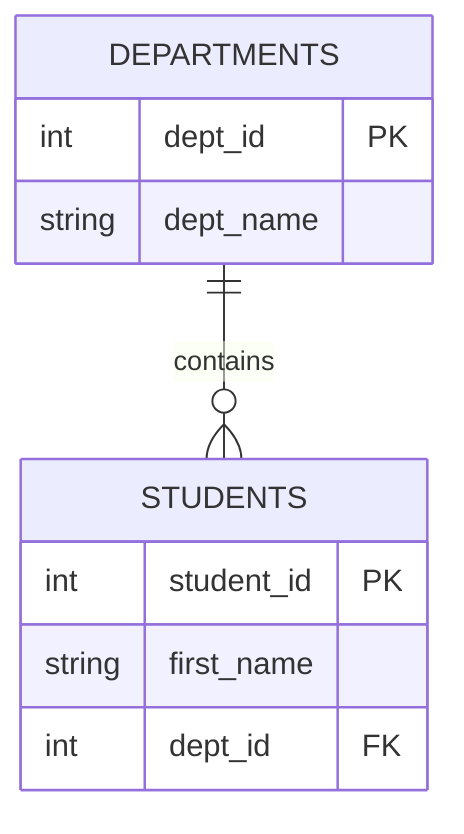

# Unit 2 Part 4: SQL Constraints & Referential Integrity

Welcome to Part 4! So far, we have learned how to create tables (DDL) and insert data (DML). However, what if a user accidentally types `-50` for a student's age? What if they enter a `department_id` that does not exist? 

A database is useless if the data inside it is garbage. This is where **SQL Constraints** come into play. Constraints act as the "Police" of the database, rejecting bad data and ensuring high database quality.

---

## 1. What are Constraints?

Constraints are rules applied to a table's columns to restrict the type of data that can go into that table. This ensures the accuracy and reliability of the data. 

**How Constraints Improve Database Quality:**
- They prevent human error (e.g., forgetting to enter a name).
- They enforce business logic (e.g., score cannot be greater than 100).
- They maintain relationships between tables (e.g., a student cannot be assigned to a non-existent course).

---

## 2. NOT NULL Constraint

### Definition
By default, any column can hold a `NULL` (empty) value. The `NOT NULL` constraint forces a column to always contain a value. You cannot insert or update a record without providing a value for this column.

### Syntax & Examples 1-5
```sql
-- Ex 1: Creating a table with NOT NULL
CREATE TABLE students (
    student_id INT,
    first_name VARCHAR(50) NOT NULL, -- Name is mandatory
    last_name VARCHAR(50)
);

-- Ex 2: Valid Insert
INSERT INTO students (student_id, first_name) VALUES (1, 'Rahul');

-- Ex 3: Constraint Violation! Will throw an error because first_name is missing.
-- ERROR: Column 'first_name' cannot be null.
-- INSERT INTO students (student_id, last_name) VALUES (2, 'Sharma');

-- Ex 4: Adding NOT NULL to an existing column using ALTER
ALTER TABLE students MODIFY last_name VARCHAR(50) NOT NULL;

-- Ex 5: Trying to update a NOT NULL column to NULL (Will fail)
-- ERROR: Column 'first_name' cannot be null.
-- UPDATE students SET first_name = NULL WHERE student_id = 1;
```

---

## 3. UNIQUE Constraint

### Definition
The `UNIQUE` constraint ensures that all values in a column are different. No two rows can have the same value in that column. 

*Note: A column can be UNIQUE but still accept `NULL` values (unless NOT NULL is also specified).*

### Syntax & Examples 6-10
```sql
-- Ex 6: Creating a table with UNIQUE constraint
CREATE TABLE faculty (
    faculty_id INT,
    email VARCHAR(100) UNIQUE -- Two teachers cannot have the same email
);

-- Ex 7: Valid Insert
INSERT INTO faculty (faculty_id, email) VALUES (1, 'smith@univ.edu');

-- Ex 8: Constraint Violation! Will throw an error because email already exists.
-- ERROR: Duplicate entry 'smith@univ.edu' for key 'email'.
-- INSERT INTO faculty (faculty_id, email) VALUES (2, 'smith@univ.edu');

-- Ex 9: Valid Insert with NULL (Because NULL is considered an unknown, multiple NULLs are allowed in some DBMS)
INSERT INTO faculty (faculty_id, email) VALUES (3, NULL);

-- Ex 10: Adding UNIQUE to an existing table
ALTER TABLE faculty ADD CONSTRAINT unique_email UNIQUE(email);
```

---

## 4. DEFAULT Constraint

### Definition
The `DEFAULT` constraint provides a default value for a column if the user does not specify a value during an `INSERT` statement.

### Syntax & Examples 11-15
```sql
-- Ex 11: Using DEFAULT in table creation
CREATE TABLE attendance (
    student_id INT,
    date DATE,
    status CHAR(1) DEFAULT 'P' -- Automatically mark Present if not specified
);

-- Ex 12: Insert without specifying status. It automatically becomes 'P'.
INSERT INTO attendance (student_id, date) VALUES (101, '2023-10-15');

-- Ex 13: Overriding the default value
INSERT INTO attendance (student_id, date, status) VALUES (102, '2023-10-15', 'A');

-- Ex 14: Adding DEFAULT to an existing column
ALTER TABLE attendance ALTER status SET DEFAULT 'A';

-- Ex 15: Dropping a DEFAULT constraint
ALTER TABLE attendance ALTER status DROP DEFAULT;
```

---

## 5. CHECK Constraint

### Definition
The `CHECK` constraint limits the value range that can be placed in a column. It enforces mathematical or logical rules.

### Syntax & Examples 16-20
```sql
-- Ex 16: Using CHECK to ensure age is positive and score is between 0 and 100
CREATE TABLE marks (
    student_id INT,
    score DECIMAL(5,2) CHECK (score >= 0 AND score <= 100),
    age INT CHECK (age >= 18)
);

-- Ex 17: Valid Insert
INSERT INTO marks (student_id, score, age) VALUES (1, 85.5, 20);

-- Ex 18: Constraint Violation! Score is over 100.
-- ERROR: Check constraint 'marks_chk_1' is violated.
-- INSERT INTO marks (student_id, score, age) VALUES (2, 105, 21);

-- Ex 19: Constraint Violation! Age is under 18.
-- ERROR: Check constraint 'marks_chk_2' is violated.
-- INSERT INTO marks (student_id, score, age) VALUES (3, 75, 17);

-- Ex 20: Adding a CHECK constraint via ALTER
ALTER TABLE marks ADD CONSTRAINT chk_score CHECK (score >= 35);
```

---

## 6. PRIMARY KEY Constraint

### Definition
The `PRIMARY KEY` (PK) uniquely identifies each row in a table. 
- It is a combination of `NOT NULL` and `UNIQUE`.
- A table can have **only one** Primary Key.

### Internal Working
When you create a Primary Key, the database engine automatically creates a **B-Tree Index** on that column behind the scenes. This index sorts the data physically, making lookups (using `WHERE PK = value`) incredibly fast.

### Syntax & Examples 21-25
```sql
-- Ex 21: Creating a Primary Key directly on the column
CREATE TABLE departments (
    dept_id INT PRIMARY KEY,
    dept_name VARCHAR(50)
);

-- Ex 22: Valid Insert
INSERT INTO departments (dept_id, dept_name) VALUES (1, 'Computer Science');

-- Ex 23: Constraint Violation! Duplicate PK.
-- ERROR: Duplicate entry '1' for key 'PRIMARY'
-- INSERT INTO departments (dept_id, dept_name) VALUES (1, 'Mechanical');

-- Ex 24: Constraint Violation! PK cannot be NULL.
-- ERROR: Column 'dept_id' cannot be null
-- INSERT INTO departments (dept_id, dept_name) VALUES (NULL, 'Civil');

-- Ex 25: Defining PK at the end of the table
CREATE TABLE courses (
    course_id INT,
    course_name VARCHAR(50),
    PRIMARY KEY (course_id)
);
```

---

## 7. COMPOSITE KEY & CANDIDATE KEY

### Composite Key
A Composite Key is a Primary Key that consists of **two or more columns** combined together to guarantee uniqueness. 

*Example:* In our `enrollments` table, a student can enroll in many courses, and a course can have many students. But a specific student cannot enroll in the exact same course twice. Therefore, `student_id` + `course_id` together make a unique combination.

### Candidate Key
A Candidate Key is any column (or set of columns) that *could* qualify as a primary key. For example, in a `students` table, `roll_number`, `aadhar_card_number`, and `email` are all Candidate Keys because they are all unique. The database designer picks one to be the actual `PRIMARY KEY`.

### Examples 26-30
```sql
-- Ex 26: Creating a Composite Primary Key
CREATE TABLE enrollments (
    student_id INT,
    course_id INT,
    enrollment_date DATE,
    PRIMARY KEY (student_id, course_id) -- The composite key!
);

-- Ex 27: Valid insert
INSERT INTO enrollments (student_id, course_id) VALUES (1, 101);

-- Ex 28: Valid insert (Same student, different course)
INSERT INTO enrollments (student_id, course_id) VALUES (1, 102);

-- Ex 29: Constraint Violation! Student 1 is already in Course 101.
-- ERROR: Duplicate entry '1-101' for key 'PRIMARY'
-- INSERT INTO enrollments (student_id, course_id) VALUES (1, 101);

-- Ex 30: Demonstrating candidate keys conceptually
CREATE TABLE students (
    student_id INT PRIMARY KEY,         -- Chosen PK
    email VARCHAR(100) UNIQUE,          -- Candidate Key 1
    aadhar_number VARCHAR(12) UNIQUE    -- Candidate Key 2
);
```

---

## 8. FOREIGN KEY Constraint & Referential Integrity

This is the most critical constraint in relational databases. It creates relationships between tables.

### Definition
A `FOREIGN KEY` (FK) is a column in one table that refers to the `PRIMARY KEY` in another table. 

### Referential Integrity
This is a rule that says: **"You cannot have an orphan child."** 
If Table A has a foreign key pointing to Table B, you cannot insert a value in Table A that does not exist in Table B.

### Parent Table vs Child Table
- **Parent Table:** The table containing the Primary Key. (e.g., `departments`)
- **Child Table:** The table containing the Foreign Key. (e.g., `students`)

### Relationship Entity-Relationship (ER) Diagram

*Read as: One Department contains zero or more Students.*

### Visualizing Constraint Violations
If we try to assign a student to `dept_id = 99`, but Department 99 does not exist in the `departments` table, the Foreign Key constraint will block it!

### Syntax & Examples 31-40
```sql
-- Ex 31: Creating Parent Table
CREATE TABLE departments (
    dept_id INT PRIMARY KEY,
    dept_name VARCHAR(50)
);

-- Ex 32: Creating Child Table with Foreign Key
CREATE TABLE students (
    student_id INT PRIMARY KEY,
    first_name VARCHAR(50),
    dept_id INT,
    FOREIGN KEY (dept_id) REFERENCES departments(dept_id)
);

-- Ex 33: Insert valid parent record
INSERT INTO departments (dept_id, dept_name) VALUES (1, 'Computer Science');

-- Ex 34: Insert valid child record (Dept 1 exists!)
INSERT INTO students (student_id, first_name, dept_id) VALUES (101, 'Rahul', 1);

-- Ex 35: Constraint Violation! Trying to insert orphan child (Dept 99 does not exist)
-- ERROR: Cannot add or update a child row: a foreign key constraint fails.
-- INSERT INTO students (student_id, first_name, dept_id) VALUES (102, 'Priya', 99);

-- Ex 36: Constraint Violation! Trying to delete a parent that has children!
-- ERROR: Cannot delete or update a parent row: a foreign key constraint fails.
-- DELETE FROM departments WHERE dept_id = 1;

-- Ex 37: How to safely delete a parent? Delete children first!
DELETE FROM students WHERE dept_id = 1;

-- Ex 38: Now the parent has no children, it can be deleted safely.
DELETE FROM departments WHERE dept_id = 1;

-- Ex 39: Adding Foreign Key via ALTER table
ALTER TABLE students 
ADD CONSTRAINT fk_dept 
FOREIGN KEY (dept_id) REFERENCES departments(dept_id);

-- Ex 40: Dropping a Foreign Key
ALTER TABLE students DROP FOREIGN KEY fk_dept;
```

---

## 9. Advanced Foreign Key Actions (ON DELETE CASCADE)

What if you want the database to automatically delete the children when you delete the parent? You use `ON DELETE CASCADE`.

### Examples 41-50
```sql
-- Ex 41: Creating table with Cascade Delete
CREATE TABLE enrollments (
    student_id INT,
    course_id INT,
    FOREIGN KEY (student_id) REFERENCES students(student_id) ON DELETE CASCADE
);

-- Ex 42: Insert parent
INSERT INTO students (student_id, first_name) VALUES (101, 'Rahul');

-- Ex 43: Insert child
INSERT INTO enrollments (student_id, course_id) VALUES (101, 5001);

-- Ex 44: Delete parent. The database will automatically look for and delete the child in enrollments!
DELETE FROM students WHERE student_id = 101;

-- Ex 45: ON DELETE SET NULL. If parent is deleted, child's FK column becomes NULL instead of deleting the child.
CREATE TABLE faculty (
    faculty_id INT PRIMARY KEY,
    dept_id INT,
    FOREIGN KEY (dept_id) REFERENCES departments(dept_id) ON DELETE SET NULL
);

-- Ex 46: Insert Parent & Child
INSERT INTO departments (dept_id, dept_name) VALUES (2, 'Mechanical');
INSERT INTO faculty (faculty_id, dept_id) VALUES (1, 2);

-- Ex 47: Delete Parent. Faculty record remains, but dept_id becomes NULL.
DELETE FROM departments WHERE dept_id = 2;

-- Ex 48: Create table with multiple Foreign keys
CREATE TABLE marks (
    mark_id INT PRIMARY KEY,
    student_id INT,
    course_id INT,
    FOREIGN KEY (student_id) REFERENCES students(student_id),
    FOREIGN KEY (course_id) REFERENCES courses(course_id)
);

-- Ex 49: Adding ON UPDATE CASCADE (If parent ID changes, child ID updates automatically)
ALTER TABLE enrollments
ADD CONSTRAINT fk_update 
FOREIGN KEY (student_id) REFERENCES students(student_id) ON UPDATE CASCADE;

-- Ex 50: Update parent ID. The child ID changes instantly!
UPDATE students SET student_id = 999 WHERE student_id = 101;
```

---

## End of Unit Assessments

### Multiple Choice Questions (20 MCQs)

1. **Which constraint uniquely identifies each record in a table?**
   a) UNIQUE  
   b) NOT NULL  
   c) PRIMARY KEY  
   d) CHECK  
   *(Ans: c)*
2. **A table can have multiple Primary Keys.**
   a) True  
   b) False  
   *(Ans: b)*
3. **Which constraint prevents a column from having a `NULL` value?**
   a) UNIQUE  
   b) DEFAULT  
   c) NOT NULL  
   d) FOREIGN KEY  
   *(Ans: c)*
4. **What happens if you try to insert a duplicate value into a column with a UNIQUE constraint?**
   a) It overwrites the old value  
   b) It generates an error  
   c) It inserts NULL  
   d) It ignores the insert  
   *(Ans: b)*
5. **Which constraint enforces Referential Integrity?**
   a) PRIMARY KEY  
   b) CHECK  
   c) UNIQUE  
   d) FOREIGN KEY  
   *(Ans: d)*
6. **In a relationship, the table containing the Foreign Key is called the:**
   a) Parent Table  
   b) Child Table  
   c) Master Table  
   d) Reference Table  
   *(Ans: b)*
7. **Can a PRIMARY KEY accept NULL values?**
   a) Yes  
   b) No  
   *(Ans: b)*
8. **Can a UNIQUE constraint column accept NULL values?**
   a) Yes  
   b) No  
   *(Ans: a)*
9. **What is a Composite Key?**
   a) A key linking two tables  
   b) A Primary Key made of multiple columns  
   c) A Foreign Key made of multiple columns  
   d) A key that auto-increments  
   *(Ans: b)*
10. **Which constraint would you use to ensure age is greater than 18?**
    a) NOT NULL  
    b) DEFAULT  
    c) UNIQUE  
    d) CHECK  
    *(Ans: d)*
11. **If a Parent record is deleted, what clause automatically deletes the related Child records?**
    a) ON DELETE NULL  
    b) ON DROP CASCADE  
    c) ON DELETE CASCADE  
    d) CASCADE REMOVE  
    *(Ans: c)*
12. **Which of these is a Candidate Key?**
    a) Any Foreign Key  
    b) Any column that could be a Primary Key  
    c) A column with a CHECK constraint  
    d) A column with a DEFAULT constraint  
    *(Ans: b)*
13. **Behind the scenes, what does a database engine automatically create for a Primary Key?**
    a) A View  
    b) A Trigger  
    c) A B-Tree Index  
    d) A Backup  
    *(Ans: c)*
14. **What does `ON DELETE SET NULL` do?**
    a) Deletes the child  
    b) Sets the parent to NULL  
    c) Sets the child's Foreign Key value to NULL when parent is deleted  
    d) Throws an error  
    *(Ans: c)*
15. **If `student_id` in `marks` table points to `student_id` in `students` table, `students` is the:**
    a) Child Table  
    b) Parent Table  
    c) Dependent Table  
    d) Composite Table  
    *(Ans: b)*
16. **How do you provide a default status of 'Pending' in a column?**
    a) `status VARCHAR SET 'Pending'`  
    b) `status VARCHAR DEFAULT 'Pending'`  
    c) `status VARCHAR CHECK 'Pending'`  
    d) `status VARCHAR = 'Pending'`  
    *(Ans: b)*
17. **If you try to insert an orphan child record (Foreign Key value doesn't exist in Parent), the database will:**
    a) Create the parent automatically  
    b) Throw a Constraint Violation Error  
    c) Insert it anyway  
    d) Set it to NULL  
    *(Ans: b)*
18. **Can a table have multiple Foreign Keys?**
    a) Yes  
    b) No  
    *(Ans: a)*
19. **If you need to make sure `phone_number` is different for everyone, you use:**
    a) PRIMARY KEY  
    b) NOT NULL  
    c) UNIQUE  
    d) CHECK  
    *(Ans: c)*
20. **Referential Integrity ensures that:**
    a) All primary keys are numbers  
    b) Relationships between tables remain consistent  
    c) Data is backed up  
    d) Tables are linked alphabetically  
    *(Ans: b)*

---

### Viva Questions (20)

1. What is the main purpose of constraints in a database?
2. Explain the difference between PRIMARY KEY and UNIQUE constraints.
3. Does a UNIQUE constraint allow NULL values? Why?
4. What is a Candidate Key? How is it different from a Primary Key?
5. Explain what a Composite Key is and give an example.
6. What is Referential Integrity? Give a real-world example.
7. Explain the Parent-Child table relationship.
8. What happens if you try to delete a Parent record that has associated Child records?
9. What does the `ON DELETE CASCADE` rule do?
10. What does the `ON DELETE SET NULL` rule do?
11. How does a CHECK constraint improve database quality?
12. Can a table have multiple PRIMARY KEYS? Can it have multiple UNIQUE keys?
13. If you want to automatically set the `joining_date` to today if the user forgets, which constraint do you use?
14. Explain what an "orphan child" means in database terminology.
15. Internally, what data structure is created when you define a Primary Key?
16. Why is it dangerous to design a database without Foreign Keys?
17. If you have an `enrollments` table linking `students` and `courses`, which are the parents and which is the child?
18. What is the difference between a Foreign Key and a Candidate Key?
19. What error message do you get if you violate a NOT NULL constraint?
20. How do you add a constraint to a table that has already been created?

---

### University Assignment Questions

1. **Theoretical Concept:** Draw an ER Diagram showing the relationships between `Departments`, `Faculty`, `Courses`, and `Students`. Explicitly mention the Primary Keys and Foreign Keys for each entity.
2. **Analysis:** Compare `ON DELETE CASCADE` with `ON DELETE SET NULL`. Provide a scenario in a Hospital Management System where you would use CASCADE, and a scenario where you would use SET NULL.
3. **Database Design:** Design a `Vehicles` table and a `Drivers` table. Ensure that: 
   - A driver must have a unique license number.
   - A vehicle must belong to a driver.
   - The age of a driver must be over 18.
   - The default color of a vehicle is 'White'.
   Write the exact `CREATE TABLE` scripts with all constraints.
4. **Debugging:** You have a parent table `Categories` and child table `Products`. A user runs `DELETE FROM Categories WHERE cat_id = 5;` and gets a Foreign Key constraint violation. Explain why this happens and write two different ways to resolve the issue.
5. **Practical Implementation:** Write a script to create an `orders` table with a Composite Primary Key made of `order_id` and `product_id`. Add a CHECK constraint to ensure `quantity` is always greater than 0. 
