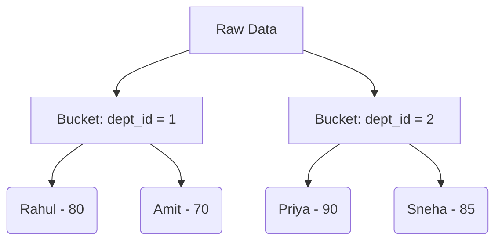

# Unit 2 Part 6: Sorting and Grouping Data

Welcome to Part 6! In the last unit, we learned how to use Built-in functions. Now, it is time to take our data analysis to the next level. 

What if you want to see a list of top-performing students ranked from highest to lowest? What if you want to find the average marks **per department** instead of the whole university? To answer these questions, we need three powerful clauses: `ORDER BY`, `GROUP BY`, and `HAVING`.

---

## 1. The `ORDER BY` Clause

### Definition & Purpose
By default, when you use a `SELECT` statement, the database returns rows in whatever order it found them on the hard drive (usually insertion order). The `ORDER BY` clause allows you to sort your result set in ascending (`ASC`) or descending (`DESC`) order.

### Syntax
```sql
SELECT column1, column2 
FROM table_name 
ORDER BY column1 [ASC|DESC];
```
*(Note: If you do not specify ASC or DESC, SQL defaults to ASC).*

---

### Examples 1-20: Using ORDER BY

#### Basic Sorting
```sql
-- Ex 1: Sort students by first name alphabetically (A to Z)
SELECT * FROM students ORDER BY first_name ASC;

-- Ex 2: Sort students by first name (ASC is implied)
SELECT * FROM students ORDER BY first_name;

-- Ex 3: Sort courses by credits highest to lowest
SELECT * FROM courses ORDER BY credits DESC;

-- Ex 4: Sort faculty by experience, most experienced first
SELECT * FROM faculty ORDER BY experience_years DESC;

-- Ex 5: Sort students by date of birth (Oldest to youngest)
SELECT * FROM students ORDER BY dob ASC;
```

#### Sorting by Multiple Columns
If two students have the same first name, how should we sort them? We can sort by multiple columns!

```sql
-- Ex 6: Sort by first name. If names match, sort by last name A-Z.
SELECT * FROM students ORDER BY first_name ASC, last_name ASC;

-- Ex 7: Sort by department ID ascending, then by score descending
SELECT * FROM marks ORDER BY dept_id ASC, score DESC;

-- Ex 8: Sort by gender first, then by date of birth
SELECT * FROM students ORDER BY gender ASC, dob DESC;

-- Ex 9: Sort by course credits (Highest first), then alphabetically by name
SELECT * FROM courses ORDER BY credits DESC, course_name ASC;

-- Ex 10: Sort by faculty department, then by experience
SELECT * FROM faculty ORDER BY dept_id ASC, experience_years DESC;
```

#### Sorting by Calculated Columns and Aliases
```sql
-- Ex 11: Sort by an alias
SELECT first_name, (score + 10) AS final_score FROM marks ORDER BY final_score DESC;

-- Ex 12: Sort by mathematical calculation directly
SELECT * FROM marks ORDER BY (score / max_score) * 100 DESC;

-- Ex 13: Sort students by age in days
SELECT first_name, DATEDIFF(CURRENT_DATE(), dob) AS age_days 
FROM students ORDER BY age_days DESC;

-- Ex 14: Sort courses by name length (Shortest names first)
SELECT course_name FROM courses ORDER BY LENGTH(course_name) ASC;

-- Ex 15: Sort by string function (Sort by last 3 digits of phone number)
SELECT phone_number FROM students ORDER BY SUBSTRING(phone_number, 8, 3) ASC;
```

#### Advanced Sorting Scenarios
```sql
-- Ex 16: Sort using column numbers (Not recommended, but works. '2' means the 2nd column in SELECT)
SELECT first_name, last_name FROM students ORDER BY 2 ASC;

-- Ex 17: Sort NULL values (In MySQL, NULLs come first in ASC sorting)
SELECT * FROM faculty ORDER BY experience_years ASC;

-- Ex 18: Put NULL values last manually (Advanced trick)
SELECT * FROM faculty ORDER BY IF(experience_years IS NULL, 1, 0), experience_years ASC;

-- Ex 19: Randomly sort rows (Great for picking a random winner)
SELECT * FROM students ORDER BY RAND();

-- Ex 20: Combine WHERE with ORDER BY
SELECT * FROM students WHERE dept_id = 1 ORDER BY last_name ASC;
```

---

## 2. The Real SQL Execution Order

Before we jump into `GROUP BY`, you MUST understand how SQL reads your query. Humans read SQL top-to-bottom, but the Database Engine reads it completely differently!

**The Syntax Order (How we type it):**
1. `SELECT`
2. `FROM`
3. `WHERE`
4. `GROUP BY`
5. `HAVING`
6. `ORDER BY`

**The Execution Order (How the Engine processes it):**
1. `FROM` (Goes to the table on the hard drive)
2. `WHERE` (Filters the raw rows)
3. `GROUP BY` (Splits the remaining rows into buckets/groups)
4. `HAVING` (Filters the groups)
5. `SELECT` (Picks the columns to show and calculates aggregates)
6. `ORDER BY` (Sorts the final output)

*Crucial Rule: Because `SELECT` happens AFTER `WHERE` and `GROUP BY`, you cannot use an Alias created in the `SELECT` clause inside a `WHERE` or `GROUP BY` clause in standard SQL!*

---

## 3. The `GROUP BY` Clause

### Definition & Purpose
The `GROUP BY` clause groups rows that have the same values in specified columns into summary rows (or "buckets"). It is almost always used alongside Aggregate Functions (`COUNT`, `SUM`, `AVG`, `MAX`, `MIN`).

### Visualizing Grouping
Imagine a table of students:

**Raw Table:**
| student_id | name | dept_id | gender | score |
| :--- | :--- | :--- | :--- | :--- |
| 1 | Rahul | 1 | M | 80 |
| 2 | Priya | 2 | F | 90 |
| 3 | Amit | 1 | M | 70 |
| 4 | Sneha | 2 | F | 85 |

If we run: `SELECT dept_id, AVG(score) FROM students GROUP BY dept_id;`

**Step 1: Grouping (Bucketing)**
The engine physically separates the rows based on `dept_id`.


**Step 2: Aggregating**
The engine calculates `AVG(score)` for each bucket.
- Dept 1 Bucket: (80 + 70) / 2 = 75
- Dept 2 Bucket: (90 + 85) / 2 = 87.5

**Final Output:**
| dept_id | AVG(score) |
| :--- | :--- |
| 1 | 75 |
| 2 | 87.5 |

---

### Examples 21-45: Using GROUP BY

#### Grouping with COUNT
```sql
-- Ex 21: Count how many students are in each department
SELECT dept_id, COUNT(*) AS total_students 
FROM students 
GROUP BY dept_id;

-- Ex 22: Count how many male and female students there are
SELECT gender, COUNT(*) 
FROM students 
GROUP BY gender;

-- Ex 23: Count how many courses are offered by each faculty
SELECT faculty_id, COUNT(*) 
FROM courses 
GROUP BY faculty_id;

-- Ex 24: Count total enrollments per course
SELECT course_id, COUNT(*) 
FROM enrollments 
GROUP BY course_id;

-- Ex 25: Count how many students were born in each year
SELECT YEAR(dob) AS birth_year, COUNT(*) 
FROM students 
GROUP BY YEAR(dob);
```

#### Grouping with AVG, SUM, MAX, MIN
```sql
-- Ex 26: Average score per department
SELECT dept_id, AVG(score) FROM marks GROUP BY dept_id;

-- Ex 27: Total credits taught by each faculty
SELECT faculty_id, SUM(credits) FROM courses GROUP BY faculty_id;

-- Ex 28: Highest score in each department
SELECT dept_id, MAX(score) FROM marks GROUP BY dept_id;

-- Ex 29: Lowest experience years per department
SELECT dept_id, MIN(experience_years) FROM faculty GROUP BY dept_id;

-- Ex 30: Total fees collected per department (Assuming a fee column)
SELECT dept_id, SUM(fee_amount) FROM students GROUP BY dept_id;
```

#### Multiple Aggregates at Once
```sql
-- Ex 31: Get count, avg, max, and min score per department
SELECT dept_id, 
       COUNT(*) AS total_students,
       AVG(score) AS avg_score, 
       MAX(score) AS highest_score, 
       MIN(score) AS lowest_score
FROM marks 
GROUP BY dept_id;

-- Ex 32: Get total courses and total credits per faculty
SELECT faculty_id, COUNT(*), SUM(credits) FROM courses GROUP BY faculty_id;

-- Ex 33: Analyze attendance statuses (Count of P and A)
SELECT status, COUNT(*) FROM attendance GROUP BY status;

-- Ex 34: Analyze faculty experience distribution
SELECT experience_years, COUNT(*) FROM faculty GROUP BY experience_years;

-- Ex 35: Department-wise score variance (Max - Min)
SELECT dept_id, (MAX(score) - MIN(score)) AS score_gap FROM marks GROUP BY dept_id;
```

#### Grouping by Multiple Columns
You can create sub-buckets! (e.g., Group by Department, and INSIDE that, group by Gender).
```sql
-- Ex 36: Count students by department AND gender
SELECT dept_id, gender, COUNT(*) 
FROM students 
GROUP BY dept_id, gender;

-- Ex 37: Average score per course AND per exam type
SELECT course_id, exam_type, AVG(score) 
FROM marks 
GROUP BY course_id, exam_type;

-- Ex 38: Total attendance per student AND per month
SELECT student_id, MONTH(date), COUNT(*) 
FROM attendance 
GROUP BY student_id, MONTH(date);

-- Ex 39: Faculty count per department AND per specialization
SELECT dept_id, specialization, COUNT(*) 
FROM faculty 
GROUP BY dept_id, specialization;

-- Ex 40: Course enrollments by year and semester
SELECT YEAR(enrollment_date), semester, COUNT(*) 
FROM enrollments 
GROUP BY YEAR(enrollment_date), semester;
```

#### Grouping with WHERE (Filtering BEFORE Grouping)
```sql
-- Ex 41: Average score per dept, ONLY looking at passing scores (> 40)
SELECT dept_id, AVG(score) 
FROM marks 
WHERE score > 40 
GROUP BY dept_id;

-- Ex 42: Count of female students per department
SELECT dept_id, COUNT(*) 
FROM students 
WHERE gender = 'F' 
GROUP BY dept_id;

-- Ex 43: Sum of credits per faculty, excluding short courses (< 2 credits)
SELECT faculty_id, SUM(credits) 
FROM courses 
WHERE credits >= 2 
GROUP BY faculty_id;

-- Ex 44: Max score per department, only for exams taken in 2023
SELECT dept_id, MAX(score) 
FROM marks 
WHERE YEAR(exam_date) = 2023 
GROUP BY dept_id;

-- Ex 45: Count enrollments per course, excluding student 101
SELECT course_id, COUNT(*) 
FROM enrollments 
WHERE student_id != 101 
GROUP BY course_id;
```

---

## 4. The `HAVING` Clause

### Definition & Purpose
The `WHERE` clause filters individual rows *before* grouping. 
But what if you want to filter the **Groups themselves** *after* they are formed? That is what `HAVING` is for! 

You **cannot** use aggregate functions like `COUNT()` in a `WHERE` clause. You MUST use them in a `HAVING` clause.

### Filtering Before vs After Grouping


---

### Examples 46-70: Using HAVING

#### Basic HAVING
```sql
-- Ex 46: Find departments that have MORE than 50 students
SELECT dept_id, COUNT(*) 
FROM students 
GROUP BY dept_id 
HAVING COUNT(*) > 50;

-- Ex 47: Find courses where the average score is less than 40 (Needs attention!)
SELECT course_id, AVG(score) 
FROM marks 
GROUP BY course_id 
HAVING AVG(score) < 40;

-- Ex 48: Find faculty who teach more than 3 courses
SELECT faculty_id, COUNT(*) 
FROM courses 
GROUP BY faculty_id 
HAVING COUNT(*) > 3;

-- Ex 49: Find departments where the highest score is a perfect 100
SELECT dept_id, MAX(score) 
FROM marks 
GROUP BY dept_id 
HAVING MAX(score) = 100;

-- Ex 50: Find birth years that have more than 100 students born
SELECT YEAR(dob), COUNT(*) 
FROM students 
GROUP BY YEAR(dob) 
HAVING COUNT(*) > 100;
```

#### Combining WHERE and HAVING
This is where SQL gets truly powerful. Filter rows first, group them, then filter the groups.

```sql
-- Ex 51: Average score per dept for female students, BUT only show depts where the avg is > 75
SELECT dept_id, AVG(score) 
FROM students
WHERE gender = 'F'           -- (Filter rows: Only Females)
GROUP BY dept_id             -- (Bucket by Dept)
HAVING AVG(score) > 75;      -- (Filter groups: Avg > 75)

-- Ex 52: Count of 4-credit courses per faculty, showing only faculty with 2+ such courses
SELECT faculty_id, COUNT(*) 
FROM courses 
WHERE credits = 4 
GROUP BY faculty_id 
HAVING COUNT(*) >= 2;

-- Ex 53: Total marks for exams taken in 2023 per student, only if total is > 400
SELECT student_id, SUM(score) 
FROM marks 
WHERE YEAR(exam_date) = 2023 
GROUP BY student_id 
HAVING SUM(score) > 400;

-- Ex 54: Number of Present days per student, only for students with perfect attendance (> 30 days)
SELECT student_id, COUNT(*) 
FROM attendance 
WHERE status = 'P' 
GROUP BY student_id 
HAVING COUNT(*) > 30;

-- Ex 55: Depts with minimum experience > 5 years, excluding dept 1
SELECT dept_id, MIN(experience_years) 
FROM faculty 
WHERE dept_id != 1 
GROUP BY dept_id 
HAVING MIN(experience_years) > 5;
```

#### The Ultimate Combo: WHERE + GROUP BY + HAVING + ORDER BY
```sql
-- Ex 56: Top 3 departments by average score (for male students), having an avg > 60
SELECT dept_id, AVG(score) AS average_score
FROM marks
WHERE gender = 'M'
GROUP BY dept_id
HAVING AVG(score) > 60
ORDER BY average_score DESC
LIMIT 3;

-- Ex 57: Most difficult courses (Lowest average score, but must have at least 10 students taken it)
SELECT course_id, AVG(score) 
FROM marks 
GROUP BY course_id 
HAVING COUNT(student_id) >= 10 
ORDER BY AVG(score) ASC;

-- Ex 58: Busiest faculty (Highest total credits, must be > 10 credits)
SELECT faculty_id, SUM(credits) 
FROM courses 
GROUP BY faculty_id 
HAVING SUM(credits) > 10 
ORDER BY SUM(credits) DESC;

-- Ex 59: Month with the highest absenteeism
SELECT MONTH(date), COUNT(*) AS absences 
FROM attendance 
WHERE status = 'A' 
GROUP BY MONTH(date) 
HAVING COUNT(*) > 50 
ORDER BY absences DESC;

-- Ex 60: Year with the highest birth rate among current students
SELECT YEAR(dob), COUNT(*) AS births 
FROM students 
GROUP BY YEAR(dob) 
ORDER BY births DESC;
```

#### Edge Cases and Strict SQL Mode
In Strict SQL mode, any column in your `SELECT` statement that is NOT inside an aggregate function MUST be listed in the `GROUP BY` clause.

```sql
-- Ex 61: Incorrect Query (Strict Mode will fail this because first_name is not grouped)
-- SELECT dept_id, first_name, COUNT(*) FROM students GROUP BY dept_id;

-- Ex 62: Correct way: Group by both
SELECT dept_id, first_name, COUNT(*) 
FROM students 
GROUP BY dept_id, first_name;

-- Ex 63: Filtering by a non-selected aggregate
-- You can filter by an aggregate in HAVING even if you don't SELECT it!
SELECT dept_id 
FROM marks 
GROUP BY dept_id 
HAVING AVG(score) > 80;

-- Ex 64: Grouping by an alias (Supported in MySQL, but not in strict standard SQL)
SELECT YEAR(dob) AS birth_year, COUNT(*) 
FROM students 
GROUP BY birth_year; 

-- Ex 65: Having by an alias (Supported in MySQL)
SELECT dept_id, AVG(score) AS avg_s 
FROM marks 
GROUP BY dept_id 
HAVING avg_s > 50;

-- Ex 66: Grouping by a constant (Useless, treats everything as one group)
SELECT COUNT(*) FROM students GROUP BY 1;

-- Ex 67: Grouping empty tables (Returns no rows, not 0)
SELECT dept_id, COUNT(*) FROM temporary_empty_table GROUP BY dept_id;

-- Ex 68: Multiple HAVING conditions
SELECT dept_id 
FROM marks 
GROUP BY dept_id 
HAVING AVG(score) > 60 AND MAX(score) = 100;

-- Ex 69: HAVING without GROUP BY (Acts exactly like WHERE for aggregates on the whole table)
SELECT AVG(score) FROM marks HAVING AVG(score) > 50;

-- Ex 70: Order By an aggregate function directly
SELECT dept_id FROM marks GROUP BY dept_id ORDER BY SUM(score) DESC;
```

---

## Conclusion & Summary

1. **ORDER BY:** Sorts the final output (Ascending or Descending).
2. **GROUP BY:** Smashes multiple rows sharing the same value into a single bucket to perform math on them.
3. **WHERE:** Throws away raw rows *before* they get bucketed.
4. **HAVING:** Throws away whole buckets *after* the math is done.

Understanding the execution order (`FROM` -> `WHERE` -> `GROUP BY` -> `HAVING` -> `SELECT` -> `ORDER BY`) is the secret to mastering complex SQL queries!
