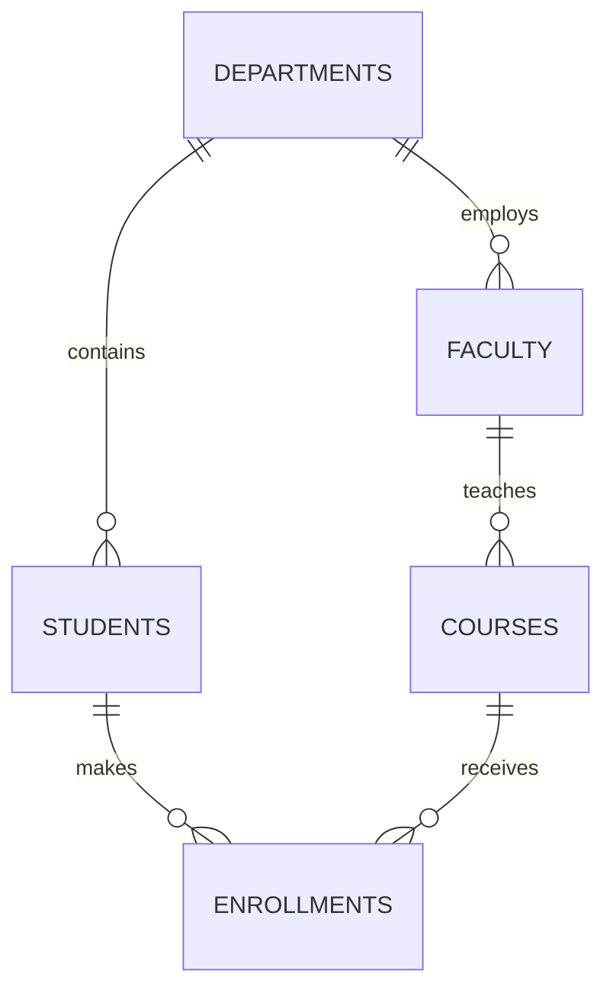

# Unit 2 Part 7: SQL Joins

Welcome to Part 7! Up until now, we have been retrieving and analyzing data from **one table at a time**. But in a relational database, data is intentionally split into multiple tables to avoid duplication (Normalization).

What if you want to print a Student's Name and their Department Name?
- The student's name is in the `students` table.
- The department name is in the `departments` table.

To combine them into one output, you need a **JOIN**. Joins act as the "bridge" connecting tables using their Primary Key and Foreign Key relationships.

---

## The Database Relationship Map

Before we join, let us look at how our tables are connected:


*(Every line represents a PK-FK relationship!)*

---

## 1. INNER JOIN

### Definition & Purpose
An `INNER JOIN` returns records that have **matching values in BOTH tables**. If a student has not been assigned a department, they will NOT show up. If a department has no students, it will NOT show up.

### Conceptual Venn Diagram
```text
      Table A (Students)       Table B (Departments)
         _______                  _______
        /       \                /       \
       /         \   MATCHES    /         \
      |   Left    |   (INNER)  |   Right   |
      |   Only    |XXXXXXXXXXXX|   Only    |
       \         / XXXXXXXXXXXX \         /
        \_______/                \_______/
```
*(Only the overlapping 'X' section is returned).*

### Visual Table Example
**Students Table (Table A)**
| id | name | dept_id |
| :--- | :--- | :--- |
| 1 | Rahul | 10 |
| 2 | Priya | NULL |

**Departments Table (Table B)**
| dept_id | dept_name |
| :--- | :--- |
| 10 | Computer Science |
| 20 | Mechanical |

**Result of INNER JOIN:**
| name | dept_name |
| :--- | :--- |
| Rahul | Computer Science |
*(Priya is excluded because she has no department. Mechanical is excluded because it has no students).*

### Examples 1-15: INNER JOIN

```sql
-- Ex 1: Basic Inner Join between Students and Departments
SELECT students.first_name, departments.dept_name 
FROM students
INNER JOIN departments ON students.dept_id = departments.dept_id;

-- Ex 2: Using table aliases to make the query shorter (s and d)
SELECT s.first_name, d.dept_name 
FROM students s
INNER JOIN departments d ON s.dept_id = d.dept_id;

-- Ex 3: Join Faculty and Departments
SELECT f.full_name, d.dept_name 
FROM faculty f
INNER JOIN departments d ON f.dept_id = d.dept_id;

-- Ex 4: Join Enrollments and Students
SELECT s.first_name, e.enrollment_date 
FROM students s
INNER JOIN enrollments e ON s.student_id = e.student_id;

-- Ex 5: Join Courses and Faculty (Who teaches what?)
SELECT c.course_name, f.full_name 
FROM courses c
INNER JOIN faculty f ON c.faculty_id = f.faculty_id;

-- Ex 6: Inner Join with a WHERE clause
SELECT s.first_name, d.dept_name 
FROM students s
INNER JOIN departments d ON s.dept_id = d.dept_id
WHERE d.dept_name = 'Computer Science';

-- Ex 7: Inner Join with ORDER BY
SELECT s.first_name, d.dept_name 
FROM students s
INNER JOIN departments d ON s.dept_id = d.dept_id
ORDER BY s.first_name ASC;

-- Ex 8: Inner join showing all columns
SELECT * 
FROM marks m
INNER JOIN students s ON m.student_id = s.student_id;

-- Ex 9: Inner join selecting specific columns from both
SELECT m.score, s.first_name, s.last_name 
FROM marks m
INNER JOIN students s ON m.student_id = s.student_id;

-- Ex 10: Find students who took an exam and scored over 80
SELECT s.first_name, m.score 
FROM students s
INNER JOIN marks m ON s.student_id = m.student_id
WHERE m.score > 80;

-- Ex 11: Join using the USING keyword (If column names are exactly the same in both tables)
SELECT s.first_name, d.dept_name 
FROM students s
INNER JOIN departments d USING(dept_id);

-- Ex 12: Inner join with GROUP BY (Average score per department)
SELECT d.dept_name, AVG(m.score) 
FROM departments d
INNER JOIN students s ON d.dept_id = s.dept_id
INNER JOIN marks m ON s.student_id = m.student_id
GROUP BY d.dept_name;

-- Ex 13: Inner Join with HAVING
SELECT d.dept_name, COUNT(s.student_id) 
FROM departments d
INNER JOIN students s ON d.dept_id = s.dept_id
GROUP BY d.dept_name
HAVING COUNT(s.student_id) > 10;

-- Ex 14: Join Attendance and Students
SELECT s.first_name, a.date, a.status 
FROM students s
INNER JOIN attendance a ON s.student_id = a.student_id;

-- Ex 15: Find all passing students (Score > 40)
SELECT s.first_name, m.score 
FROM students s
INNER JOIN marks m ON s.student_id = m.student_id
WHERE m.score > 40;
```

---

## 2. LEFT JOIN (Left Outer Join)

### Definition & Purpose
Returns **ALL records from the Left table**, and the matched records from the Right table. If there is no match, the result is `NULL` on the right side.

### Conceptual Venn Diagram
```text
      Table A (Students)       Table B (Departments)
         _______                  _______
        /       \                /       \
       /         \   MATCHES    /         \
      |XXXXXXXXXXX|   (INNER)  |           |
      |XXXXXXXXXXX|XXXXXXXXXXXX|           |
       \XXXXXXXXX/ XXXXXXXXXXXX \         /
        \_______/                \_______/
```
*(The entire left circle + overlapping section).*

### Visual Table Example
**Result of LEFT JOIN (Students left, Depts right):**
| name | dept_name |
| :--- | :--- |
| Rahul | Computer Science |
| Priya | NULL |
*(Priya is included because she is in the left table, even though she has no department. Mechanical is excluded).*

### Examples 16-30: LEFT JOIN

```sql
-- Ex 16: Basic Left Join (Show all students, and their dept if they have one)
SELECT s.first_name, d.dept_name 
FROM students s
LEFT JOIN departments d ON s.dept_id = d.dept_id;

-- Ex 17: Show all departments, and the faculty in them
SELECT d.dept_name, f.full_name 
FROM departments d
LEFT JOIN faculty f ON d.dept_id = f.dept_id;

-- Ex 18: Show all courses, and the faculty teaching them (even if no faculty is assigned yet)
SELECT c.course_name, f.full_name 
FROM courses c
LEFT JOIN faculty f ON c.faculty_id = f.faculty_id;

-- Ex 19: Find students who have NOT been assigned a department
SELECT s.first_name 
FROM students s
LEFT JOIN departments d ON s.dept_id = d.dept_id
WHERE d.dept_id IS NULL;

-- Ex 20: Show all students and their marks (even if they didn't take an exam)
SELECT s.first_name, m.score 
FROM students s
LEFT JOIN marks m ON s.student_id = m.student_id;

-- Ex 21: Find students who have NOT taken any exams
SELECT s.first_name 
FROM students s
LEFT JOIN marks m ON s.student_id = m.student_id
WHERE m.mark_id IS NULL;

-- Ex 22: Show all faculty and their taught courses
SELECT f.full_name, c.course_name 
FROM faculty f
LEFT JOIN courses c ON f.faculty_id = c.faculty_id;

-- Ex 23: Find faculty who are NOT teaching any courses
SELECT f.full_name 
FROM faculty f
LEFT JOIN courses c ON f.faculty_id = c.faculty_id
WHERE c.course_id IS NULL;

-- Ex 24: Left join with GROUP BY (Total enrollments per student, including 0)
SELECT s.first_name, COUNT(e.course_id) 
FROM students s
LEFT JOIN enrollments e ON s.student_id = e.student_id
GROUP BY s.first_name;

-- Ex 25: Show all hostels and assigned students
SELECT h.hostel_name, s.first_name 
FROM hostels h
LEFT JOIN students s ON h.hostel_id = s.hostel_id;

-- Ex 26: Find empty hostels
SELECT h.hostel_name 
FROM hostels h
LEFT JOIN students s ON h.hostel_id = s.hostel_id
WHERE s.student_id IS NULL;

-- Ex 27: Left join using USING
SELECT s.first_name, d.dept_name 
FROM students s
LEFT JOIN departments d USING(dept_id);

-- Ex 28: Left join with multiple conditions
SELECT s.first_name, a.status 
FROM students s
LEFT JOIN attendance a ON s.student_id = a.student_id AND a.date = CURRENT_DATE();

-- Ex 29: Find students absent today (Using Left Join to see all students)
SELECT s.first_name, IFNULL(a.status, 'Not Logged') 
FROM students s
LEFT JOIN attendance a ON s.student_id = a.student_id AND a.date = CURRENT_DATE();

-- Ex 30: Left Join order matters! (Depts Left, Students Right = completely different result than Ex 16)
SELECT d.dept_name, s.first_name 
FROM departments d
LEFT JOIN students s ON d.dept_id = s.dept_id;
```

---

## 3. RIGHT JOIN (Right Outer Join)

### Definition & Purpose
Returns **ALL records from the Right table**, and the matched records from the Left table. It is the exact mirror image of a LEFT JOIN. 

*(Business Tip: Right joins are rarely used because you can just write a Left Join and swap the table order!)*

### Examples 31-40: RIGHT JOIN

```sql
-- Ex 31: Show all departments (Right), and any students in them
SELECT s.first_name, d.dept_name 
FROM students s
RIGHT JOIN departments d ON s.dept_id = d.dept_id;

-- Ex 32: Find departments with NO students
SELECT d.dept_name 
FROM students s
RIGHT JOIN departments d ON s.dept_id = d.dept_id
WHERE s.student_id IS NULL;

-- Ex 33: Show all faculty (Right), and their courses
SELECT c.course_name, f.full_name 
FROM courses c
RIGHT JOIN faculty f ON c.faculty_id = f.faculty_id;

-- Ex 34: Find all exams in marks (Right), and link to students
SELECT s.first_name, m.score 
FROM students s
RIGHT JOIN marks m ON s.student_id = m.student_id;

-- Ex 35: Show all courses (Right) and enrollments
SELECT e.enrollment_date, c.course_name 
FROM enrollments e
RIGHT JOIN courses c ON e.course_id = c.course_id;

-- Ex 36: Find courses with zero enrollments
SELECT c.course_name 
FROM enrollments e
RIGHT JOIN courses c ON e.course_id = c.course_id
WHERE e.student_id IS NULL;

-- Ex 37: Right Join with Aggregate
SELECT d.dept_name, COUNT(s.student_id) 
FROM students s
RIGHT JOIN departments d ON s.dept_id = d.dept_id
GROUP BY d.dept_name;

-- Ex 38: Right Join with Order By
SELECT s.first_name, h.hostel_name 
FROM students s
RIGHT JOIN hostels h ON s.hostel_id = h.hostel_id
ORDER BY h.hostel_name;

-- Ex 39: Right Join Using keyword
SELECT s.first_name, d.dept_name 
FROM students s
RIGHT JOIN departments d USING(dept_id);

-- Ex 40: Right Join combining with WHERE
SELECT s.first_name, d.dept_name 
FROM students s
RIGHT JOIN departments d ON s.dept_id = d.dept_id
WHERE d.dept_name != 'Computer Science';
```

---

## 4. FULL OUTER JOIN

### Definition & Purpose
Returns **ALL records when there is a match in either Left or Right table**. 
If a student has no department, they show up (with NULL dept). If a department has no students, it shows up (with NULL student).

*(Note: MySQL does not natively support `FULL OUTER JOIN`. We simulate it using a `LEFT JOIN` combined with a `RIGHT JOIN` using the `UNION` operator).*

### Conceptual Venn Diagram
```text
      Table A (Students)       Table B (Departments)
         _______                  _______
        /       \                /       \
       /         \   MATCHES    /         \
      |XXXXXXXXXXX|   (INNER)  |XXXXXXXXXXX|
      |XXXXXXXXXXX|XXXXXXXXXXXX|XXXXXXXXXXX|
       \XXXXXXXXX/ XXXXXXXXXXXX \XXXXXXXXX/
        \_______/                \_______/
```
*(Both circles completely filled).*

### Examples 41-50: FULL OUTER JOIN (Simulated with UNION)

```sql
-- Ex 41: Full Outer Join: All students AND all departments
SELECT s.first_name, d.dept_name FROM students s
LEFT JOIN departments d ON s.dept_id = d.dept_id
UNION
SELECT s.first_name, d.dept_name FROM students s
RIGHT JOIN departments d ON s.dept_id = d.dept_id;

-- Ex 42: Full Outer Join: All faculty AND all courses
SELECT f.full_name, c.course_name FROM faculty f
LEFT JOIN courses c ON f.faculty_id = c.faculty_id
UNION
SELECT f.full_name, c.course_name FROM faculty f
RIGHT JOIN courses c ON f.faculty_id = c.faculty_id;

-- Ex 43: Find orphans on BOTH sides (Students with no dept + Depts with no students)
SELECT s.first_name, d.dept_name FROM students s
LEFT JOIN departments d ON s.dept_id = d.dept_id WHERE d.dept_id IS NULL
UNION
SELECT s.first_name, d.dept_name FROM students s
RIGHT JOIN departments d ON s.dept_id = d.dept_id WHERE s.student_id IS NULL;

-- Ex 44: Full Outer Join with standard syntax (Works in PostgreSQL/SQL Server, not MySQL)
-- SELECT s.first_name, d.dept_name FROM students s FULL OUTER JOIN departments d ON s.dept_id = d.dept_id;

-- Ex 45: Full Outer Join on Hostels and Students
SELECT s.first_name, h.hostel_name FROM students s
LEFT JOIN hostels h ON s.hostel_id = h.hostel_id
UNION
SELECT s.first_name, h.hostel_name FROM students s
RIGHT JOIN hostels h ON s.hostel_id = h.hostel_id;

-- Ex 46-50: (Conceptually applying Full Outer to various tables. The MySQL UNION pattern is the same).
```

---

## 5. CROSS JOIN

### Definition & Purpose
A `CROSS JOIN` creates a **Cartesian Product**. It multiplies every row of Table A with every row of Table B.
If you have 10 students and 5 courses, a cross join returns 50 rows (10 * 5). 

It does NOT use an `ON` clause because there is no matching condition.

### Examples 51-60: CROSS JOIN

```sql
-- Ex 51: Cross Join students and courses (Every student paired with every course)
SELECT s.first_name, c.course_name 
FROM students s
CROSS JOIN courses c;

-- Ex 52: Implicit Cross Join (Old syntax using commas)
SELECT s.first_name, c.course_name 
FROM students s, courses c;

-- Ex 53: Business Example - Creating a matrix of all possible dates (from a dates table) and all students to initialize an attendance sheet
-- SELECT s.student_id, d.calendar_date FROM students s CROSS JOIN academic_calendar d;

-- Ex 54: Pair every department with every hostel
SELECT d.dept_name, h.hostel_name FROM departments d CROSS JOIN hostels h;

-- Ex 55: Generate testing data (Multiplying tables to create bulk rows)
SELECT s.student_id, f.faculty_id FROM students s CROSS JOIN faculty f;

-- Ex 56: Cross Join with a WHERE clause (effectively turning it into an Inner Join)
SELECT s.first_name, d.dept_name 
FROM students s CROSS JOIN departments d 
WHERE s.dept_id = d.dept_id;

-- Ex 57-60: (Cross join scales exponentially, use with extreme caution in large databases!)
```

---

## 6. SELF JOIN

### Definition & Purpose
A `SELF JOIN` is a regular join, but the table is joined with itself! 
This is used for hierarchical data. For example, if a `students` table has a column called `mentor_id` that points to another student in the same table.

### Visual Table Example
| student_id | name | mentor_id |
| :--- | :--- | :--- |
| 1 | Rahul | NULL |
| 2 | Priya | 1 |
| 3 | Amit | 1 |

### Examples 61-70: SELF JOIN

```sql
-- Ex 61: Find the name of the student AND the name of their mentor
SELECT s1.first_name AS "Student", s2.first_name AS "Mentor"
FROM students s1
INNER JOIN students s2 ON s1.mentor_id = s2.student_id;

-- Ex 62: Use Left Join so students without mentors still show up
SELECT s1.first_name AS "Student", s2.first_name AS "Mentor"
FROM students s1
LEFT JOIN students s2 ON s1.mentor_id = s2.student_id;

-- Ex 63: Find courses and their prerequisite courses (Assuming a prereq_id column in courses)
SELECT c1.course_name AS "Course", c2.course_name AS "Prerequisite"
FROM courses c1
LEFT JOIN courses c2 ON c1.prereq_id = c2.course_id;

-- Ex 64: Find all pairs of students belonging to the same department
SELECT a.first_name, b.first_name, a.dept_id
FROM students a, students b
WHERE a.dept_id = b.dept_id AND a.student_id != b.student_id;

-- Ex 65: Faculty hierarchy (Head of Department vs Junior Faculty)
SELECT f1.full_name AS "Junior", f2.full_name AS "HOD"
FROM faculty f1
INNER JOIN faculty f2 ON f1.hod_id = f2.faculty_id;

-- Ex 66-70: Self joins are heavily reliant on table aliases (s1, s2). You MUST use aliases or SQL gets confused.
```

---

## 7. Multiple Joins (Joining 3 or more tables)

Real-world queries often pull data from 4 or 5 tables simultaneously.

### Examples 71-80: Multiple Joins

```sql
-- Ex 71: Get Student Name, Course Name, and Enrollment Date (Students -> Enrollments -> Courses)
SELECT s.first_name, c.course_name, e.enrollment_date
FROM students s
INNER JOIN enrollments e ON s.student_id = e.student_id
INNER JOIN courses c ON e.course_id = c.course_id;

-- Ex 72: Get Student Name, Department Name, and Marks
SELECT s.first_name, d.dept_name, m.score
FROM students s
INNER JOIN departments d ON s.dept_id = d.dept_id
INNER JOIN marks m ON s.student_id = m.student_id;

-- Ex 73: Get Student Name, Course Name, and Faculty Name teaching it
SELECT s.first_name, c.course_name, f.full_name
FROM students s
INNER JOIN enrollments e ON s.student_id = e.student_id
INNER JOIN courses c ON e.course_id = c.course_id
INNER JOIN faculty f ON c.faculty_id = f.faculty_id;

-- Ex 74: Average score per Course Name
SELECT c.course_name, AVG(m.score)
FROM courses c
INNER JOIN marks m ON c.course_id = m.course_id
GROUP BY c.course_name;

-- Ex 75: Average score per Department Name
SELECT d.dept_name, AVG(m.score)
FROM departments d
INNER JOIN students s ON d.dept_id = s.dept_id
INNER JOIN marks m ON s.student_id = m.student_id
GROUP BY d.dept_name;

-- Ex 76: Find the faculty name for the student who scored the highest mark in the university
SELECT f.full_name, m.score
FROM marks m
INNER JOIN enrollments e ON m.student_id = e.student_id AND m.course_id = e.course_id
INNER JOIN courses c ON e.course_id = c.course_id
INNER JOIN faculty f ON c.faculty_id = f.faculty_id
ORDER BY m.score DESC LIMIT 1;

-- Ex 77: Left Join cascading (Show all students, their courses if any, and faculty if any)
SELECT s.first_name, c.course_name, f.full_name
FROM students s
LEFT JOIN enrollments e ON s.student_id = e.student_id
LEFT JOIN courses c ON e.course_id = c.course_id
LEFT JOIN faculty f ON c.faculty_id = f.faculty_id;

-- Ex 78: Multi-join with HAVING (Depts where the average score is > 75)
SELECT d.dept_name, AVG(m.score)
FROM departments d
INNER JOIN students s ON d.dept_id = s.dept_id
INNER JOIN marks m ON s.student_id = m.student_id
GROUP BY d.dept_name
HAVING AVG(m.score) > 75;

-- Ex 79: Full Academic Transcript Query (Student, Course, Credits, Score)
SELECT s.first_name, s.last_name, c.course_name, c.credits, m.score
FROM students s
INNER JOIN marks m ON s.student_id = m.student_id
INNER JOIN courses c ON m.course_id = c.course_id
ORDER BY s.first_name;

-- Ex 80: Multi-join finding absentees and their HODs
SELECT s.first_name, d.dept_name, f.full_name AS HOD
FROM attendance a
INNER JOIN students s ON a.student_id = s.student_id
INNER JOIN departments d ON s.dept_id = d.dept_id
INNER JOIN faculty f ON d.dept_id = f.dept_id AND f.is_hod = 1
WHERE a.status = 'A';
```

---

## Summary Difference Table

| Join Type | What it returns | Use Case |
| :--- | :--- | :--- |
| **INNER JOIN** | Matches ONLY. | I only want students who *actually* have a department. |
| **LEFT JOIN** | All Left, matched Right. | I want a list of ALL students, and their department if they have one. |
| **RIGHT JOIN** | All Right, matched Left. | I want a list of ALL departments, and any students inside them. |
| **FULL JOIN** | Everything. | I want to see all orphans in the database on both sides. |
| **CROSS JOIN** | Cartesian Product. | I need every combination of Table A and Table B. |
| **SELF JOIN** | A table joined to itself. | I have hierarchical data (Mentor/Mentee) in one table. |
