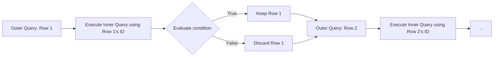

# Unit 2 Part 8: Set Operators and Subqueries

Welcome to Part 8! Up until now, we have been combining tables horizontally using JOINS. But what if you want to combine tables vertically? What if you want to use the result of one query as the filter for another query? 

In this unit, we will explore **Set Operators** (combining results vertically) and **Subqueries** (queries inside queries).

---

## 1. Set Operators: UNION, UNION ALL, INTERSECT, MINUS

Set operators combine the results of two or more independent `SELECT` statements into a single result set.

**Golden Rules for Set Operators:**
1. Every `SELECT` statement must have the **same number of columns**.
2. The columns must have **similar data types**.
3. The columns must be in the **same order**.

### A. UNION & UNION ALL
- `UNION` combines two results and **removes duplicates**.
- `UNION ALL` combines two results and **keeps duplicates** (It is much faster!).

### Conceptual Venn Diagram
```text
  Query A (Students)       Query B (Faculty)
    _______                  _______
   /       \                /       \
  | XXXXXXX |    UNION     | XXXXXXX |
  | XXXXXXX |   ========>  | XXXXXXX |
   \_______/                \_______/
 (Stacks vertically, removing duplicate rows if any)
```

### Examples 1-15: UNION and UNION ALL
```sql
-- Ex 1: Basic UNION: List all unique emails in the university (Students + Faculty)
SELECT email FROM students
UNION
SELECT email FROM faculty;

-- Ex 2: UNION ALL: List all emails, keeping duplicates (Faster)
SELECT email FROM students
UNION ALL
SELECT email FROM faculty;

-- Ex 3: List all full names (Requires matching column numbers and types)
SELECT first_name AS name FROM students
UNION
SELECT full_name AS name FROM faculty;

-- Ex 4: Adding a hardcoded tag to distinguish rows
SELECT first_name, 'Student' AS role FROM students
UNION
SELECT full_name, 'Teacher' AS role FROM faculty;

-- Ex 5: UNION with ORDER BY (Order By is applied to the final result, not individual queries)
SELECT first_name FROM students
UNION
SELECT full_name FROM faculty
ORDER BY first_name ASC;

-- Ex 6: Combining results from the same table (e.g., getting top and bottom scores)
(SELECT student_id, score FROM marks ORDER BY score DESC LIMIT 3)
UNION
(SELECT student_id, score FROM marks ORDER BY score ASC LIMIT 3);

-- Ex 7: UNION with 3 queries (Students, Faculty, Alumni)
SELECT first_name FROM students
UNION
SELECT full_name FROM faculty
UNION
SELECT name FROM alumni;

-- Ex 8: UNION ALL with 3 queries
SELECT first_name FROM students
UNION ALL
SELECT full_name FROM faculty
UNION ALL
SELECT name FROM alumni;

-- Ex 9: UNION with WHERE conditions
SELECT first_name FROM students WHERE gender = 'M'
UNION
SELECT full_name FROM faculty WHERE experience_years > 10;

-- Ex 10: Combining dates
SELECT dob AS significant_date FROM students
UNION
SELECT enrollment_date FROM enrollments;

-- Ex 11: Error example - Mismatched columns (This will fail!)
-- SELECT first_name, last_name FROM students UNION SELECT full_name FROM faculty;

-- Ex 12: Fixing the above by adding a dummy column
SELECT first_name, last_name FROM students
UNION
SELECT full_name, NULL FROM faculty;

-- Ex 13: Finding students enrolled in Course 101 OR Course 102
SELECT student_id FROM enrollments WHERE course_id = 101
UNION
SELECT student_id FROM enrollments WHERE course_id = 102;

-- Ex 14: Using UNION to simulate a FULL OUTER JOIN (MySQL trick)
SELECT s.first_name, d.dept_name FROM students s LEFT JOIN departments d ON s.dept_id = d.dept_id
UNION
SELECT s.first_name, d.dept_name FROM students s RIGHT JOIN departments d ON s.dept_id = d.dept_id;

-- Ex 15: Find all unique IDs used anywhere in the system
SELECT student_id AS id FROM students
UNION
SELECT faculty_id FROM faculty
UNION
SELECT course_id FROM courses;
```

> [!TIP]
> **Optimization Tip:** Always use `UNION ALL` unless you specifically need to remove duplicates. `UNION` forces the database to run a costly distinct sort across the entire combined dataset.

---

### B. INTERSECT
`INTERSECT` returns only the rows that are present in **both** query results. (Like the overlapping part of a Venn Diagram).

*(Note: MySQL does not natively support `INTERSECT`. We simulate it using an `INNER JOIN` or a subquery with `IN`).*

### Examples 16-25: INTERSECT
```sql
-- Ex 16: Standard INTERSECT (Works in PostgreSQL/Oracle/SQL Server)
-- SELECT student_id FROM enrollments WHERE course_id = 101
-- INTERSECT
-- SELECT student_id FROM enrollments WHERE course_id = 102;

-- Ex 17: Simulating INTERSECT in MySQL using INNER JOIN
SELECT a.student_id 
FROM (SELECT student_id FROM enrollments WHERE course_id = 101) a
INNER JOIN (SELECT student_id FROM enrollments WHERE course_id = 102) b 
ON a.student_id = b.student_id;

-- Ex 18: Simulating INTERSECT using IN
SELECT student_id FROM enrollments WHERE course_id = 101 
AND student_id IN (SELECT student_id FROM enrollments WHERE course_id = 102);

-- Ex 19: Find names that exist in both Students and Faculty
SELECT first_name FROM students 
WHERE first_name IN (SELECT full_name FROM faculty);

-- Ex 20: Students who are also alumni (assuming ID remains the same)
SELECT student_id FROM students 
WHERE student_id IN (SELECT alumni_id FROM alumni);

-- Ex 21-25: (Conceptual variations of intersection finding overlaps in data).
```

---

### C. MINUS (or EXCEPT)
`MINUS` (Oracle) or `EXCEPT` (SQL Server/PostgreSQL) returns rows from the first query that are **NOT** present in the second query. 

*(Note: MySQL simulates this using `LEFT JOIN` where the right side is `NULL`, or `NOT IN`).*

### Examples 26-35: MINUS / EXCEPT
```sql
-- Ex 26: Standard EXCEPT (Find students enrolled in 101 but NOT in 102)
-- SELECT student_id FROM enrollments WHERE course_id = 101
-- EXCEPT
-- SELECT student_id FROM enrollments WHERE course_id = 102;

-- Ex 27: Simulating EXCEPT in MySQL using NOT IN
SELECT student_id FROM enrollments WHERE course_id = 101 
AND student_id NOT IN (SELECT student_id FROM enrollments WHERE course_id = 102);

-- Ex 28: Simulating EXCEPT using LEFT JOIN (The most optimized way in MySQL!)
SELECT a.student_id 
FROM (SELECT student_id FROM enrollments WHERE course_id = 101) a
LEFT JOIN (SELECT student_id FROM enrollments WHERE course_id = 102) b ON a.student_id = b.student_id
WHERE b.student_id IS NULL;

-- Ex 29: Find Students who have NOT taken any exams
SELECT student_id FROM students
WHERE student_id NOT IN (SELECT student_id FROM marks);

-- Ex 30: Find Departments that have NO faculty
SELECT dept_id FROM departments
WHERE dept_id NOT IN (SELECT dept_id FROM faculty);

-- Ex 31-35: (Finding differences between sets using EXCEPT concepts).
```

---

## 2. Subqueries (Nested Queries)

A **Subquery** is a query nested inside another query. 
- The outer query is called the **Main Query**.
- The inner query is called the **Subquery**.

Subqueries can be placed inside the `SELECT`, `FROM`, `WHERE`, or `HAVING` clauses!

### A. Independent (Nested) Subqueries
An independent subquery can run on its own without relying on the outer query. 

**Execution Process:**
1. The Database engine executes the **Inner Query** first.
2. It passes the result to the **Outer Query**.
3. The Outer Query executes using that result.

**Execution Flow Diagram:**
```mermaid
flowchart TD
    A[Engine Starts Execution] --> B{Subquery inside WHERE}
    B --> C[Execute Inner: 'SELECT AVG(score) FROM marks']
    C -->|Returns '75'| D[Substitute '75' into Outer Query]
    D --> E[Execute Outer: 'SELECT * FROM marks WHERE score > 75']
    E --> F[Return Final Result Set]
```

### Examples 36-55: Independent Subqueries

```sql
-- Ex 36: Find students who scored higher than the university average
SELECT student_id, score 
FROM marks 
WHERE score > (SELECT AVG(score) FROM marks);

-- Ex 37: Find the student who scored the maximum mark
SELECT student_id 
FROM marks 
WHERE score = (SELECT MAX(score) FROM marks);

-- Ex 38: Find students belonging to the 'Computer Science' department
SELECT first_name 
FROM students 
WHERE dept_id = (SELECT dept_id FROM departments WHERE dept_name = 'Computer Science');

-- Ex 39: Subquery returning multiple rows using IN (Find students taught by Dr. Smith)
SELECT first_name 
FROM students 
WHERE dept_id IN (SELECT dept_id FROM faculty WHERE full_name = 'Dr. Smith');

-- Ex 40: Find courses that have no enrollments (Using NOT IN)
SELECT course_name 
FROM courses 
WHERE course_id NOT IN (SELECT course_id FROM enrollments);

-- Ex 41: Subquery inside the SELECT clause (Calculates for every row!)
SELECT first_name, 
       (SELECT AVG(score) FROM marks) AS university_avg 
FROM students;

-- Ex 42: Showing the difference between student score and university avg
SELECT student_id, 
       score, 
       score - (SELECT AVG(score) FROM marks) AS difference_from_avg 
FROM marks;

-- Ex 43: Subquery inside the FROM clause (Derived Tables - MUST have an alias)
SELECT avg_s 
FROM (SELECT AVG(score) AS avg_s FROM marks GROUP BY dept_id) AS dept_averages;

-- Ex 44: Find departments whose average score is greater than the overall university average
SELECT dept_id, AVG(score) 
FROM marks 
GROUP BY dept_id 
HAVING AVG(score) > (SELECT AVG(score) FROM marks);

-- Ex 45: Subquery with ALL operator (Score must be > than ALL scores in dept 2)
SELECT student_id, score 
FROM marks 
WHERE score > ALL (SELECT score FROM marks WHERE dept_id = 2);

-- Ex 46: Subquery with ANY operator (Score > than at least one score in dept 2)
SELECT student_id, score 
FROM marks 
WHERE score > ANY (SELECT score FROM marks WHERE dept_id = 2);

-- Ex 47: Delete students who have never enrolled (Using subquery in DELETE)
DELETE FROM students 
WHERE student_id NOT IN (SELECT student_id FROM enrollments);

-- Ex 48: Update marks for students in Dept 1
UPDATE marks 
SET score = score + 5 
WHERE student_id IN (SELECT student_id FROM students WHERE dept_id = 1);

-- Ex 49: Insert using subquery
INSERT INTO elite_students (student_id) 
SELECT student_id FROM marks WHERE score = (SELECT MAX(score) FROM marks);

-- Ex 50: Finding the second highest score (Classic Interview Question)
SELECT MAX(score) 
FROM marks 
WHERE score < (SELECT MAX(score) FROM marks);

-- Ex 51-55: Various nested depths (A subquery inside a subquery inside a subquery!)
```

---

### B. Correlated Subqueries
A correlated subquery **depends on the outer query for its values**. 
It CANNOT run independently. 

**Execution Process:**
1. The engine fetches the **first row** from the Outer Query.
2. It passes a value from that row into the Inner Query.
3. The Inner Query executes.
4. The Outer Query evaluates the WHERE condition.
5. The engine moves to the **next row** in the Outer Query and repeats the process. (Row-by-Row Execution).

**Execution Flow Diagram:**


> [!WARNING]
> **Performance Impact:** Because a correlated subquery executes once for **EVERY SINGLE ROW** in the outer table, it can be extremely slow on large databases. Avoid them if an `INNER JOIN` can achieve the same result!

### Examples 56-75: Correlated Subqueries

```sql
-- Ex 56: Find students who scored higher than the average score OF THEIR OWN DEPARTMENT
SELECT s1.first_name, m1.score 
FROM students s1
INNER JOIN marks m1 ON s1.student_id = m1.student_id
WHERE m1.score > (
    -- Inner query relies on s1.dept_id from the outer query!
    SELECT AVG(m2.score) 
    FROM marks m2 
    INNER JOIN students s2 ON m2.student_id = s2.student_id 
    WHERE s2.dept_id = s1.dept_id
);

-- Ex 57: Count the number of enrollments FOR EACH student directly in SELECT
SELECT s.first_name, 
       (SELECT COUNT(*) FROM enrollments e WHERE e.student_id = s.student_id) AS total_courses 
FROM students s;

-- Ex 58: Find courses where at least 10 students are enrolled
SELECT c.course_name 
FROM courses c 
WHERE 10 <= (
    SELECT COUNT(*) 
    FROM enrollments e 
    WHERE e.course_id = c.course_id
);

-- Ex 59: Find the highest scoring student per department
SELECT m1.student_id, m1.score 
FROM marks m1 
INNER JOIN students s1 ON m1.student_id = s1.student_id
WHERE m1.score = (
    SELECT MAX(m2.score) 
    FROM marks m2 
    INNER JOIN students s2 ON m2.student_id = s2.student_id
    WHERE s2.dept_id = s1.dept_id
);

-- Ex 60: Find faculty who earn more than average in their specific department (Assume salary column)
SELECT full_name 
FROM faculty f1 
WHERE salary > (SELECT AVG(salary) FROM faculty f2 WHERE f1.dept_id = f2.dept_id);

-- Ex 61-75: (Variations of row-by-row comparisons mimicking Joins and aggregations).
```

---

### C. EXISTS vs IN (Optimization Tricks)

`EXISTS` is a special operator used heavily with Correlated Subqueries. It returns `TRUE` the moment it finds at least one matching row in the inner query, and stops searching.

> [!TIP]
> **Optimization Rule:** 
> - If the Outer Table is LARGE and Inner Table is SMALL -> Use `IN`.
> - If the Outer Table is SMALL and Inner Table is LARGE -> Use `EXISTS`.

### Examples 76-80: EXISTS / NOT EXISTS

```sql
-- Ex 76: Find students who have taken at least one exam using EXISTS (Highly optimized)
SELECT first_name 
FROM students s 
WHERE EXISTS (
    SELECT 1 
    FROM marks m 
    WHERE m.student_id = s.student_id
);
-- Note: 'SELECT 1' is a trick. EXISTS doesn't care what you select, it just checks if the row exists!

-- Ex 77: Find students who have NEVER taken an exam (NOT EXISTS)
SELECT first_name 
FROM students s 
WHERE NOT EXISTS (
    SELECT 1 
    FROM marks m 
    WHERE m.student_id = s.student_id
);

-- Ex 78: Find departments that have faculty assigned to them
SELECT dept_name 
FROM departments d 
WHERE EXISTS (
    SELECT 1 
    FROM faculty f 
    WHERE f.dept_id = d.dept_id
);

-- Ex 79: Using EXISTS for complex multi-table checks (Find students who took 'Advanced AI' course)
SELECT first_name 
FROM students s 
WHERE EXISTS (
    SELECT 1 
    FROM enrollments e 
    INNER JOIN courses c ON e.course_id = c.course_id
    WHERE c.course_name = 'Advanced AI' AND e.student_id = s.student_id
);

-- Ex 80: UPDATE using EXISTS
UPDATE students s 
SET status = 'Active' 
WHERE EXISTS (
    SELECT 1 
    FROM enrollments e 
    WHERE e.student_id = s.student_id
);
```

---

## Conclusion & Summary

1. **Set Operators (`UNION`)**: Combine rows from multiple queries vertically. Ensure column count and types match.
2. **Independent Subquery**: Executes once. Evaluates from inside -> out.
3. **Correlated Subquery**: Executes repeatedly (row-by-row). Depends on the outer query.
4. **EXISTS**: Stops searching as soon as a match is found. Excellent for performance tuning!

Congratulations! You now have a solid grasp of some of the most advanced querying techniques in SQL.
