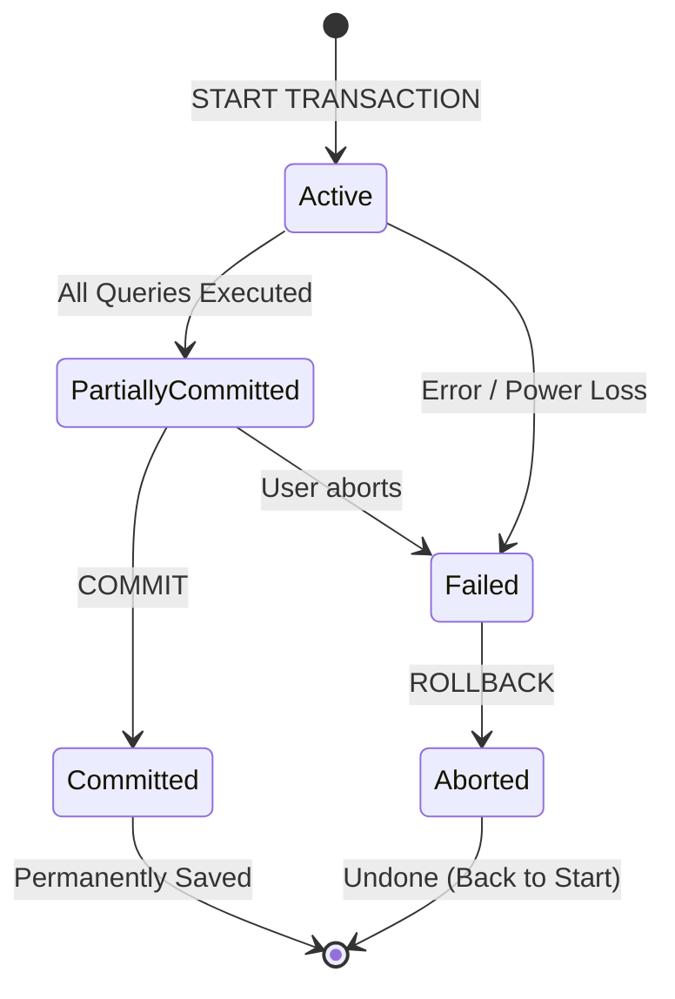

# Unit 2 Part 9: Views and Transaction Control (TCL)

Welcome to Part 9! In this unit, we will cover two incredibly important concepts for enterprise databases: **Views** (Virtual Tables for security and simplicity) and **Transactions** (TCL - ensuring our database never gets corrupted during power failures).

---

## 1. Views

### Definition & Purpose
A **View** is a virtual table based on the result-set of an SQL statement. 
Unlike a regular table, a standard view does not store any physical data on the hard drive. It simply stores the SQL query. Every time you query a view, the database engine runs the underlying SQL query to fetch the data.

**Why use Views?**
1. **Security:** Hide sensitive columns (like `salary` or `passwords`) from certain users by giving them access to a view that excludes those columns.
2. **Simplicity:** Hide complex `JOIN` queries behind a simple virtual table so junior developers can query it easily.

### A. Simple View
A Simple View is created from a **single base table** and does not contain any functions or grouping. 
Because it maps directly to one table, **you can perform DML (INSERT, UPDATE, DELETE)** on a Simple View, and it will modify the original base table!

### Examples 1-10: Simple Views
```sql
-- Ex 1: Create a Simple View to hide sensitive faculty info (e.g., salary)
CREATE VIEW public_faculty_info AS
SELECT faculty_id, full_name, dept_id 
FROM faculty;

-- Ex 2: Querying the view (Acts exactly like a table!)
SELECT * FROM public_faculty_info;

-- Ex 3: Create a Simple View for active students only
CREATE VIEW active_students AS
SELECT student_id, first_name, last_name 
FROM students 
WHERE status = 'Active';

-- Ex 4: Updating through a Simple View (This actually updates the 'students' table!)
UPDATE active_students 
SET last_name = 'Sharma' 
WHERE student_id = 101;

-- Ex 5: Create a Simple View for female students
CREATE VIEW female_students AS
SELECT * FROM students WHERE gender = 'F';

-- Ex 6: Inserting through a Simple View
INSERT INTO female_students (student_id, first_name, gender) 
VALUES (500, 'Kavita', 'F');

-- Ex 7: Create view with check option (Prevents inserting data that violates the view's WHERE clause)
CREATE VIEW male_students AS
SELECT * FROM students WHERE gender = 'M'
WITH CHECK OPTION;

-- Ex 8: This insert will FAIL because of WITH CHECK OPTION (Gender is not 'M')
-- INSERT INTO male_students (student_id, first_name, gender) VALUES (501, 'Neha', 'F');

-- Ex 9: Modifying an existing view
CREATE OR REPLACE VIEW active_students AS
SELECT student_id, first_name, email FROM students WHERE status = 'Active';

-- Ex 10: Dropping a view
DROP VIEW active_students;
```

---

### B. Complex View
A Complex View is created from **multiple tables** (using JOINS), or contains aggregate functions (`GROUP BY`, `COUNT`, `MAX`). 
Because the data is combined or summarized, **you CANNOT perform DML (INSERT/UPDATE/DELETE)** on a Complex View. It is read-only.

### Examples 11-20: Complex Views
```sql
-- Ex 11: Create a view combining Students and Departments
CREATE VIEW student_department_view AS
SELECT s.first_name, s.last_name, d.dept_name
FROM students s
INNER JOIN departments d ON s.dept_id = d.dept_id;

-- Ex 12: Query the complex view
SELECT * FROM student_department_view WHERE dept_name = 'Computer Science';

-- Ex 13: Trying to UPDATE a complex view (This will FAIL)
-- UPDATE student_department_view SET first_name = 'Raj' WHERE last_name = 'Singh';

-- Ex 14: Create a view with Aggregate Functions (Department Statistics)
CREATE VIEW dept_stats AS
SELECT dept_id, COUNT(*) AS total_students, AVG(score) AS avg_score
FROM marks
GROUP BY dept_id;

-- Ex 15: Create a view generating the Academic Transcript
CREATE VIEW student_transcripts AS
SELECT s.first_name, c.course_name, m.score
FROM students s
INNER JOIN marks m ON s.student_id = m.student_id
INNER JOIN courses c ON m.course_id = c.course_id;

-- Ex 16: Finding top students easily using the view
SELECT * FROM student_transcripts WHERE score > 90;

-- Ex 17: Create a view for Faculty Workload
CREATE VIEW faculty_workload AS
SELECT f.full_name, COUNT(c.course_id) AS total_courses
FROM faculty f
LEFT JOIN courses c ON f.faculty_id = c.faculty_id
GROUP BY f.full_name;

-- Ex 18: Drop the faculty workload view
DROP VIEW faculty_workload;

-- Ex 19: View masking phone numbers (Showing only last 4 digits)
CREATE VIEW secure_contact_info AS
SELECT first_name, CONCAT('******', SUBSTRING(phone_number, 7, 4)) AS safe_phone
FROM students;

-- Ex 20: Selecting from a view inside another query
SELECT COUNT(*) FROM student_department_view WHERE dept_name = 'Mechanical';
```

---

### C. Materialized View
A **Materialized View** does NOT compute the query on the fly. It actually runs the query and **stores the physical result data on the hard drive**. 
- **Pros:** Incredibly fast for complex calculations on millions of rows.
- **Cons:** The data can become stale. It needs to be "refreshed" periodically.

*(Note: Oracle and PostgreSQL support `MATERIALIZED VIEW` natively. MySQL simulates this using event schedulers that physically update a regular table).*

### Examples 21-25: Materialized Views (PostgreSQL Syntax)
```sql
-- Ex 21: Create a Materialized View for heavy reporting
-- CREATE MATERIALIZED VIEW mv_university_stats AS
-- SELECT dept_id, AVG(score), COUNT(*) FROM marks GROUP BY dept_id;

-- Ex 22: Querying the Materialized View (Lightning fast!)
-- SELECT * FROM mv_university_stats;

-- Ex 23: Refreshing the data when the underlying tables change
-- REFRESH MATERIALIZED VIEW mv_university_stats;

-- Ex 24: Dropping the Materialized View
-- DROP MATERIALIZED VIEW mv_university_stats;

-- Ex 25: (In MySQL, this is just creating a real table and inserting data into it via a scheduled job).
```

---

## 2. Transaction Control Language (TCL) and ACID

Imagine a student paying university fees. 
1. Money is deducted from the Student's Bank Account.
2. *POWER GOES OUT.*
3. Money is NOT added to the University's Bank Account.

The money disappeared! This is a database nightmare. To prevent this, SQL uses **Transactions**. A transaction treats multiple SQL statements as a **single unit of work**. Either ALL statements succeed, or NONE of them succeed.

### The ACID Properties
Every modern relational database guarantees ACID:
- **A - Atomicity:** "All or Nothing." If one step fails, the entire transaction rolls back.
- **C - Consistency:** The database moves from one valid state to another. Constraints (like ensuring account balance doesn't go below 0) are strictly enforced.
- **I - Isolation:** Transactions happening at the same time do not interfere with each other.
- **D - Durability:** Once a transaction is `COMMIT`ted, it is permanently saved to the hard drive, even if the server crashes immediately after.

### Transaction Life Cycle Diagram


---

## 3. Transaction Control Commands

1. **START TRANSACTION** (or `BEGIN`): Starts the transaction block.
2. **COMMIT**: Permanently saves the transaction to the disk.
3. **ROLLBACK**: Undoes all changes made since the transaction started.
4. **SAVEPOINT**: Sets a checkpoint inside a transaction so you can roll back to a specific point instead of undoing everything.

*(Important: DDL commands like `CREATE TABLE` and `DROP TABLE` are auto-committed. You cannot roll them back. TCL only applies to DML commands like `INSERT`, `UPDATE`, `DELETE`).*

---

### Examples 26-60: Banking and Transaction Scenarios

Let's assume a table: `accounts (account_id, name, balance)`

```sql
-- Ex 26: Create the accounts table
CREATE TABLE accounts (
    account_id INT PRIMARY KEY,
    name VARCHAR(50),
    balance DECIMAL(10,2) CHECK (balance >= 0) -- Consistency rule!
);

-- Ex 27: Insert initial data
INSERT INTO accounts VALUES (1, 'Student', 5000);
INSERT INTO accounts VALUES (2, 'University', 100000);
```

#### Successful Transaction (COMMIT)
```sql
-- Ex 28: Start Transaction
START TRANSACTION;

-- Ex 29: Step 1: Deduct 1000 from Student
UPDATE accounts SET balance = balance - 1000 WHERE account_id = 1;

-- Ex 30: Step 2: Add 1000 to University
UPDATE accounts SET balance = balance + 1000 WHERE account_id = 2;

-- Ex 31: Both steps succeeded. Save it!
COMMIT;

-- Ex 32: Check final balances
SELECT * FROM accounts;
```

#### Failed Transaction (ROLLBACK)
```sql
-- Ex 33: Start Transaction
START TRANSACTION;

-- Ex 34: Deduct 2000 from Student
UPDATE accounts SET balance = balance - 2000 WHERE account_id = 1;

-- Ex 35: Oh no! We realize the University account ID is wrong, or the server crashed. Undo!
ROLLBACK;

-- Ex 36: Check balances. The student got their money back. It was never permanently saved!
SELECT * FROM accounts;
```

#### Constraint Violation Triggering Rollback
```sql
-- Ex 37: Start Transaction
START TRANSACTION;

-- Ex 38: Student tries to pay 10000, but they only have 4000.
-- This query FAILS immediately because of the CHECK (balance >= 0) constraint (Consistency!).
-- UPDATE accounts SET balance = balance - 10000 WHERE account_id = 1;

-- Ex 39: Because Step 1 failed, we MUST abort the transaction.
ROLLBACK;
```

#### Using SAVEPOINT
Sometimes a transaction is very long (e.g., 10 inserts). If the 10th one fails, you don't want to undo the first 9. You use a Savepoint.

```sql
-- Ex 40: Start Transaction
START TRANSACTION;

-- Ex 41: Insert student 1
INSERT INTO students (student_id, first_name) VALUES (901, 'John');

-- Ex 42: Create a checkpoint
SAVEPOINT sp1;

-- Ex 43: Insert student 2
INSERT INTO students (student_id, first_name) VALUES (902, 'Alice');

-- Ex 44: Create another checkpoint
SAVEPOINT sp2;

-- Ex 45: Insert student 3 with a mistake!
INSERT INTO students (student_id, first_name) VALUES (903, NULL); -- Fails due to NOT NULL!

-- Ex 46: Rollback just the mistake, back to checkpoint 2
ROLLBACK TO sp2;

-- Ex 47: Fix the mistake and insert correctly
INSERT INTO students (student_id, first_name) VALUES (903, 'Bob');

-- Ex 48: Commit the transaction. John, Alice, and Bob are saved.
COMMIT;
```

#### More Rollback and Commit Examples
```sql
-- Ex 49: Bulk update marks
START TRANSACTION;
UPDATE marks SET score = score + 5 WHERE dept_id = 1;

-- Ex 50: Verify the update looks correct
SELECT * FROM marks WHERE dept_id = 1;

-- Ex 51: Looks good, lock it in.
COMMIT;

-- Ex 52: Accidental Delete Without WHERE
START TRANSACTION;
DELETE FROM enrollments;

-- Ex 53: Rollback to save the day!
ROLLBACK;

-- Ex 54: Nested Savepoints
START TRANSACTION;
UPDATE accounts SET balance = 100 WHERE account_id = 1;
SAVEPOINT a;
UPDATE accounts SET balance = 200 WHERE account_id = 1;
SAVEPOINT b;
UPDATE accounts SET balance = 300 WHERE account_id = 1;

-- Ex 55: Rollback to 'a'. The balance reverts to 100.
ROLLBACK TO a;
COMMIT;

-- Ex 56: Dropping a Savepoint if no longer needed
-- RELEASE SAVEPOINT sp1;

-- Ex 57: Attempting to rollback DDL (Fails! The table is still gone)
START TRANSACTION;
DROP TABLE unused_table;
ROLLBACK; 

-- Ex 58: Using transactions in stored procedures (Concepts for later)
-- A procedure can automatically ROLLBACK if a SQLException is caught.

-- Ex 59: Implicit Commit (Running a DDL command inside an active transaction auto-commits the DML above it!)
START TRANSACTION;
UPDATE students SET status = 'Graduated' WHERE student_id = 101;
CREATE TABLE temp (id INT); -- This auto-commits the UPDATE above!
ROLLBACK; -- This does nothing now.

-- Ex 60: Turning Auto-Commit off globally (Requires explicit COMMIT for everything)
SET autocommit = 0;
```

---

## End of Unit Assignments

1. **Theoretical Concept:** Explain the difference between Atomicity and Isolation in the ACID properties. Give an example where Isolation fails (e.g., Dirty Read).
2. **View Creation:** Write a query to create a Simple View called `exam_schedule_view` that only shows exams occurring in November 2026. Can you run an `UPDATE` on this view? Why or why not?
3. **Complex View:** Create a view `student_gpa` that joins `students` and `marks` to calculate the Average Score per student. 
4. **Transaction Script:** Write a SQL script using `START TRANSACTION`, `UPDATE`, and `COMMIT` that moves a student (ID 101) from Department 1 to Department 2, and simultaneously updates their hostel room allocation in the `hostels` table.
5. **Savepoint Debugging:** A developer starts a transaction, deletes 5 rows, sets a savepoint `S1`, deletes 5 more rows, and types `ROLLBACK TO S1; COMMIT;`. How many rows were permanently deleted?
