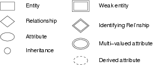
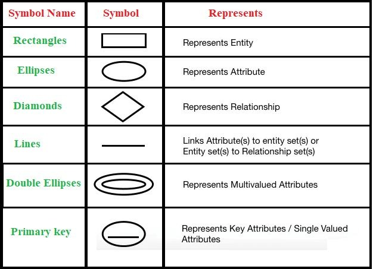
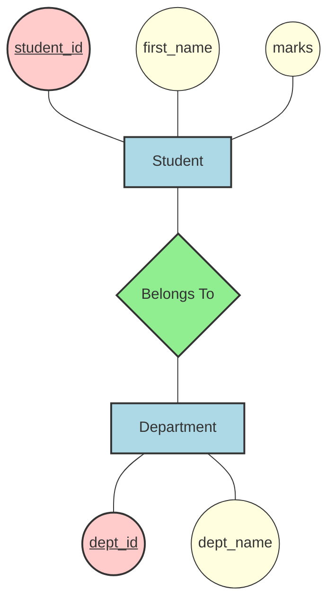
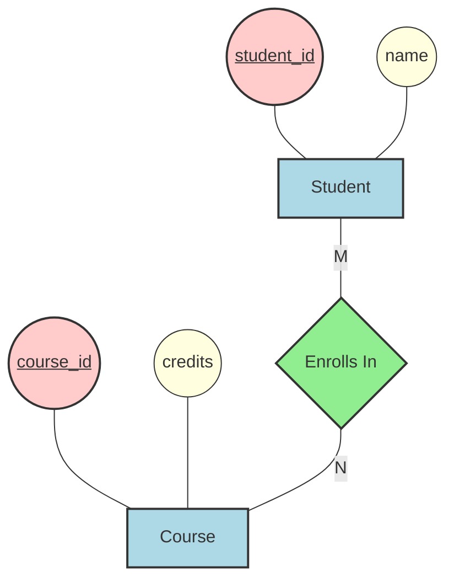
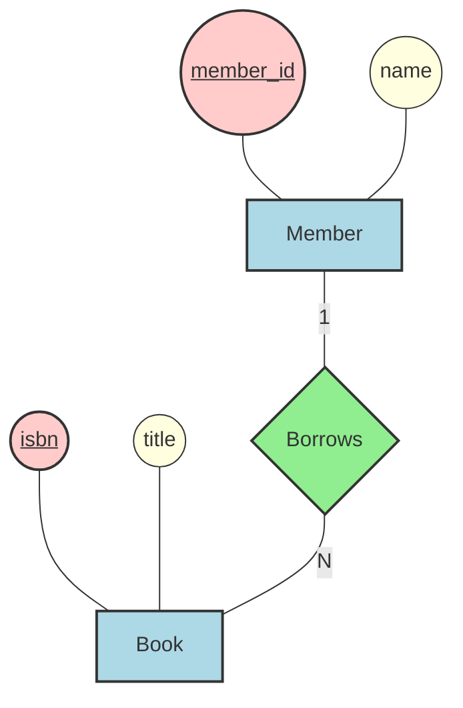
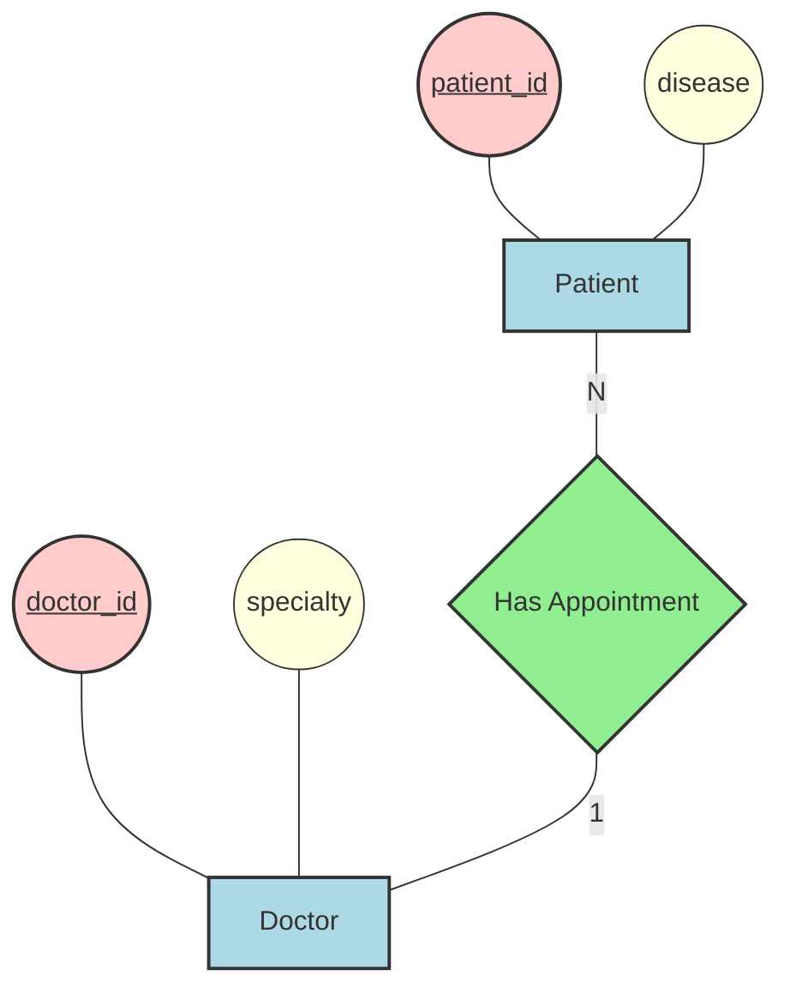
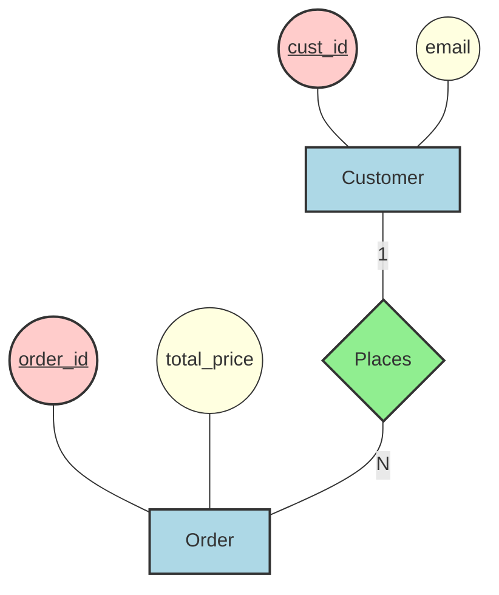
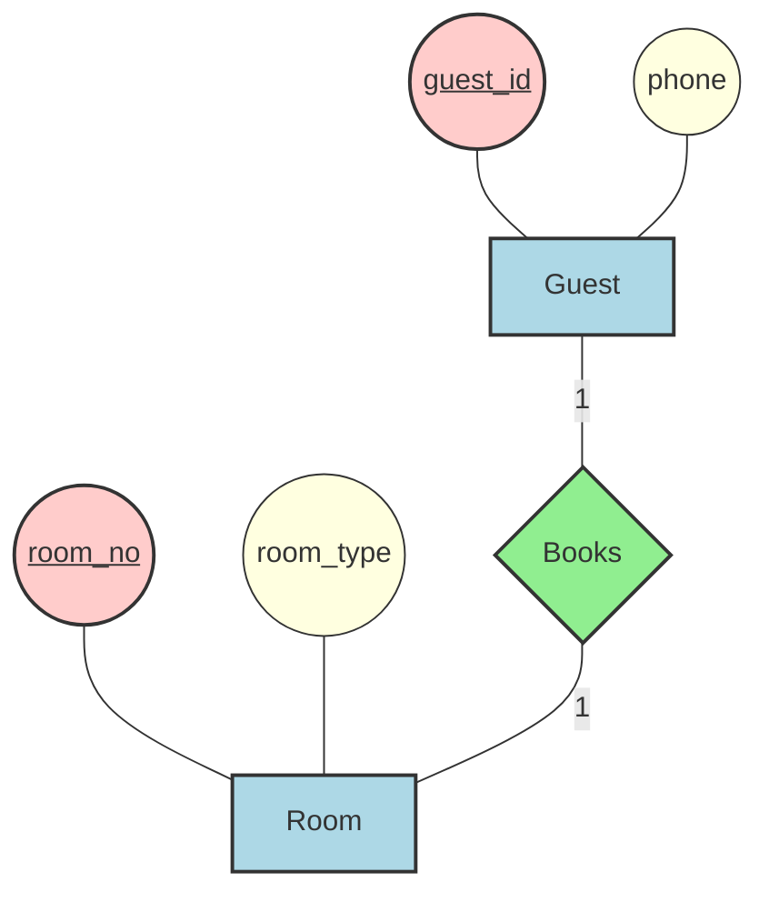

# Unit 3 Part 4: Entity-Relationship (ER) Diagrams

Welcome to the final part of Unit 3!

Before a civil engineer builds a house, they draw a blueprint. Before a software engineer builds a database, they draw an **Entity-Relationship (ER) Diagram**.

An ER Diagram is a visual map of your database. It shows what data we are storing and how the different pieces of data connect to each other.

---

# 1. The Symbols (Chen Notation)

To read a database blueprint, you only need to know a few basic shapes. This is a very common exam question!

Here are the standard symbols used in ER Diagrams:

### Quick Summary of Symbols:

| Shape | Name | What it means | Example in our database |
|---|---|---|---|
| 🟦 **Rectangle** | **Entity** | A real-world object or thing. (Becomes a Table). | `Student`, `Department` |
| 🟡 **Oval** | **Attribute** | A property of the entity. (Becomes a Column). | `first_name`, `marks` |
| 🔴 **Underlined Oval** | **Key Attribute** | The unique identifier. (Becomes Primary Key). | `student_id` |
| 🟩 **Diamond** | **Relationship** | How two entities connect. (Verb). | `Belongs To`, `Enrolls In` |
| 🔲 **Double Rectangle**| **Weak Entity** | An entity that cannot exist without another entity. | `Room Number` (needs a Building) |
| ⭕ **Double Oval** | **Multivalued Attribute**| An attribute that can have multiple values. | `Phone Numbers` (Student has many) |

---

# 2. Visualizing Our Classroom Database!

Let's use these exact shapes to draw the ER diagram for our `students` and `departments` tables.

*Note: In the diagram below, blue rectangles are Entities, yellow ovals are Attributes (pink is the Key), and the green diamond is the Relationship!*

---

# 3. Cardinality (Types of Relationships)

When we connect `Student` and `Department` with a diamond, we also need to specify **Cardinality**. Cardinality asks: *"How many of Entity A can connect to Entity B?"*

There are 3 main types:

### 1. One-to-One (1:1)
- **Rule:** One A connects to exactly One B.
- **Example:** One `Student` has exactly One `ID Card`. One `ID Card` belongs to exactly One `Student`.

### 2. One-to-Many (1:N)
- **Rule:** One A can connect to Many B's.
- **Example:** This is our classroom! One `Department` (like PIET) can have **Many** `Students` (Rahul, Yamini, m_Ramya). 

### 3. Many-to-Many (M:N)
- **Rule:** Many A's can connect to Many B's.
- **Example:** `Students` and `Classes`. One student can take many classes. And one class can have many students inside it.

### 🎮 Interactive Question 1

Ask the students:
> "If we create a new entity called `Teacher`, and a teacher can teach multiple subjects, but a subject is only taught by one teacher... what kind of cardinality is this?"

Expected answer:
> "One-to-Many (1:N)!"

**Teacher responds:**
"Exactly! One Teacher connects to Many Subjects."

---

# 4. Extended E-R Features

As databases get more complex, we need more advanced drawing tools.

## Generalization (Bottom-Up)
Imagine we have two entities: `Teacher` and `Student`. 
Both of them have a `Name`, an `Age`, and an `Address`. 

Instead of drawing those ovals twice, we can create a general `Person` entity at the top, and put all the common attributes there. `Teacher` and `Student` are then created at the bottom, inheriting from `Person`. This is called **Generalization** (moving from specific to general).

## Specialization (Top-Down)
This is the exact opposite. We start with a big `Person` entity, and then we decide to break it down into specialized groups like `Teacher` and `Student` because Teachers have a `Salary` attribute, but Students have a `Marks` attribute. This is called **Specialization** (moving from general to specific).

---

# 5. Real-World ER Diagram Examples

To help you practice, here are 5 real-world systems drawn using the standard Chen ER Notation. Notice how each one uses Rectangles for Entities, Ovals for Attributes, and Diamonds for Relationships!

## Example 1: Student Management System
A system to manage student enrollments, courses, and teachers.

## Example 2: Library Management System
A system to track books, members, and book loans.

## Example 3: Hospital Management System
A system to manage patients, doctors, and appointments.

## Example 4: Online Shopping (E-Commerce) System
A system for customers to place orders for products.

## Example 5: Hotel Management System
A system to manage guests and room bookings.

